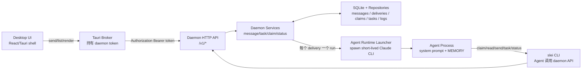
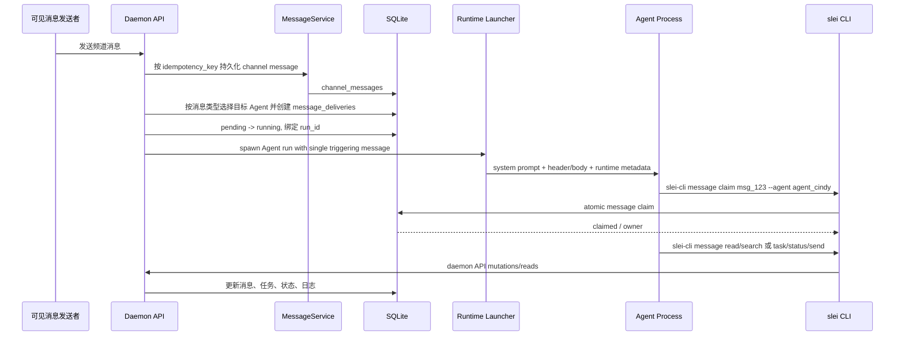

# ADR 0005: 频道广播、Agent Claim 与 Multi-Agent 核心流转

## 状态

已接受，作为频道消息、Agent claim 与多 Agent 流转的实现 guardrail。

## Context

Slei 的频道不是前端本地聊天室，而是由 daemon 驱动的多 Agent 协作工作区。频道中的可见消息写入后，daemon 必须负责消息落库、广播投递、原子 claim、任务流转、状态日志、诊断、幂等、reset 和恢复。UI 只展示 daemon 返回的数据，并触发 daemon API。

新流转不再依赖中心角色输出中心化 JSON 来决定频道消息交给谁。daemon 对包含有效显式 `@handle` 的 human 频道消息只投递给被 mention 的频道 Agent；无有效 mention 的 human 频道消息才广播投递给频道内所有 Agent 成员。Agent 频道消息同样只投递给正文中显式 `@handle` 的目标成员。Agent 根据自己的 system prompt、角色、消息 header、`@mention`、职责和按需拉取的历史，自主判断是否通过 `slei-cli message claim` 认领。

旧 coordinator 控制面已删除，不是兼容保留：生产代码中不得再创建 `agent_global_coordinator`、不得启动 coordinator runtime、不得解析 coordinator JSON、不得写入 `channel_coordinators` / `coordinator_decisions` / `coordinator_runtime_runs` 表，也不得使用 `request_agent_reply` 作为频道消息结果。历史 `docs/superpowers/specs` 或 `docs/superpowers/plans` 中的 coordinator 方案只作为历史资料，本 ADR 优先生效。

## 核心原则

- daemon 是业务控制面：消息、投递、claim、Agent 消息待办、任务、状态、日志、诊断、reset 防护、幂等和 SQLite 持久化都必须在 daemon 内完成。
- UI shell 只调用 daemon API、显示 loading/error/empty 状态、渲染 daemon DTO。UI 不得自行决定消息应该交给哪个 Agent。
- 新频道消息流转是 daemon 投递 + Agent 自主 claim；不得新增 UI 路由、daemon 关键词兜底或中心化 JSON 路由作为新架构入口。
- Human 频道消息中，有效显式 `@handle` 的投递优先级高于默认广播，只投递给被 mention 的目标 Agent；无有效 mention 时才广播。Agent 频道消息默认不触发 claim，只有显式 `@handle` 才投递给目标 Agent。Agent 后续协作靠可见 `@mention` 接力，不依赖隐藏路由。
- 所有投递都必须排除消息作者，避免自唤醒和无意义 self-run。
- `@mention` 只按 handle 解析，不按 display name 解析。Agent handle 必须全局大小写不敏感唯一，例如 `@Coda` 与 `@coda` 冲突；历史重复 handle 必须阻止启动或迁移，不得随机选人。
- 旧 coordinator runtime、coordinator JSON、coordinator agent 和 coordinator SQLite 表不得作为 fallback、diagnostics、mock 或兼容路径恢复。
- `slei-cli message claim` 是消息独占处理的唯一入口。claim 必须是 daemon/SQLite 原子操作；claim 失败的 Agent 默认静默退出；若失败 Agent 对该消息已有 delivery，daemon 可以记录 `agent_message_todos`，供后续同频道可见消息串行唤醒。
- `slei-cli task claim` 是任务维度的原子锁，独立于 message claim。
- 可见频道发言、任务回复、任务创建、任务状态更新和 Agent 状态上报都必须通过 `slei-cli` CLI 进入 daemon API。
- Agent runtime 的普通 stdout 不会自动变成可见频道消息；可见产品动作必须来自 `slei-cli message send` 或任务相关 API/CLI。
- 每次 `slei-cli agent status` 上报都写入最新状态，并追加 Agent 操作日志；daemon 启动频道/任务线程 Agent run 时也必须写入当前 `working` 状态，run 完成或失败后回到 `idle`；daemon 观察到的 `run` / `input` / `output` / `tool` / `completed` / `failed` 诊断事件也追加到同一张活动日志。每个 Agent 只保留最近 200 条，超过后删除最旧记录。
- 所有可变生产状态使用 SQLite repository，不用 JSON、前端 fixture、localStorage 或 mock 数据作为生产状态来源。

## 总体架构



边界要求：

- Desktop JavaScript 不直接访问 Agent runtime、不持有 daemon token、不写生产路由规则。
- Tauri Broker 只做安全 transport 和离线/error 展示所需的薄桥接，不成为路由控制面。
- Agent runtime 只处理一次唤醒中的工作。产品状态变更必须通过 `slei-cli` CLI 回到 daemon。
- 当前 cwd 选择逻辑不因 runtime 从 SDK 迁移到 spawn CLI 而改变。

## Runtime Contract

daemon 负责为每次 Agent run 生成完整 Slei system prompt，并通过 worker RPC 的 `input.system_prompt` 传给 Claude worker。worker 不自行拼装产品规则，也不读取 UI 状态来决定 claim、任务或路由。

worker 当前通过 spawn Claude CLI 执行：

```text
claude --print --output-format stream-json
```

执行约束：

- `input.prompt` 是 Markdown 格式的本次运行包，只包含当前触发消息、统一 header、claim 命令、按需读历史入口、可见回复入口，以及当前 Agent 在当前频道的最多 5 条 Pending Message Todos；不注入完整频道历史。
- `input.context` 在频道 broadcast/task handoff 路径保持为空；需要历史时由 Agent 主动调用 `slei-cli message read/search` 或 `slei-cli task thread/list`。
- 任务线程 reply 唤醒的 Agent run 例外携带同一任务线程内当前触发回复之前最近 3 条历史消息，且只来自 `task root + task_replies`；当前触发 reply 单独作为 triggering message，不得在历史区重复出现，也不得混入其他频道消息或其他 task thread。
- `input.system_prompt` 承载 Slei 合同：身份、角色、CLI 用法、header 规范、claim 规则、任务规则、MEMORY/Active Context 约定和运行时元数据。
- `input.system_prompt` 必须根据 daemon settings 当前语言动态加入回复语言规则，例如中文设置下注入“使用简体中文回复”，英文设置下注入“使用 English 回复”。
- `input.system_prompt` 必须要求 Agent 直接输出实际用户可见内容，禁止“已回复到任务线程”“先认领消息”“我会先搜索”这类旁白式流程说明，除非用户明确要求解释过程。
- worker 使用 `--append-system-prompt` 注入 daemon 生成的 prompt。
- worker 为本次 run 生成临时 MCP config，把 Slei product tools 暴露给 Claude CLI；tool 调用再回到 daemon API。
- worker 解析 CLI `stream-json` 输出，并归一化为 daemon 稳定 runtime event；daemon 不依赖 CLI 原始事件结构。
- 当前权限模型是静态 CLI 权限：允许读取/搜索/编辑类基础工具和 Slei MCP product tools，禁用 `Task`、插件通配和高风险网络命令；除非未来实现 CLI permission bridge，否则不要恢复 SDK permission controller 作为生产路径。

## 消息格式

Agent 看到的频道消息必须带统一 header，便于判断 target、claim id、时间和类型：

```text
[target=#all msg=msg_123 time=2026-06-15T10:00:00Z type=human] @lei-lee 请 @coda-win 看一下实现
```

字段含义：

| 字段 | 含义 |
| --- | --- |
| `target` | 频道或线程目标，例如 `#all`、`#dev`、`#all:msg_123` |
| `msg` | 当前消息稳定 ID，用于 claim、around context 和线程引用 |
| `time` | daemon 持久化的消息时间 |
| `type` | `human`、`agent`、`system`、`tombstone` 等消息类型；新增任务不写 `task_card` 消息 |

正文中的可见 `@handle` 是协作接力信号。Agent 判断是否参与时必须以 header + 正文 + system prompt 规则为准。display name 可以重复，不能作为 mention 解析依据。

## Agent System Prompt 必须包含

每个 Agent 被唤醒时，system prompt 至少包含：

- 角色定义，例如 `Cindy，onboarding 助手`。
- 所有 `slei-cli` CLI 命令的用法说明和失败语义。
- 消息 header 格式规范和字段含义。
- 行为约定：什么时候 claim、什么时候静默、如何处理任务、如何使用 `MEMORY.md`。
- 当前运行时上下文：Agent ID、Server ID、Computer 信息、频道 ID、消息 ID 等元数据。

Agent 判断规则由 system prompt 注入到每个 Agent 上下文中，不由中心路由 JSON 决定。

基础判断规则按 Markdown 的 Claim Intent Classes 注入：

- Direct Address：消息通过稳定 `@handle` 明确委派给某个 Agent。若明确 `@我`，应尝试 `slei-cli message claim <msg-id> --agent <agent-id>`；claim 失败则静默退出。若明确 `@别人` 且没有 `@我`，不应 claim，除非这条可见消息同时属于频道群体发言、当前 active task 或明确 handoff 给自己。
- Agent-authored message：`type=agent` 的消息默认静默。只有正文显式 `@我` 且分配了具体后续任务、决策或 handoff 时才 claim。Agent 普通回复不会唤醒上一个 Agent；A `@B` 后，B 普通回复不唤醒 A，只有 B 显式 `@A` 才会唤醒 A。
- Channel Group Address：消息面向频道群体发起互动、问候、咨询、要求或协调，即使没有显式群体词也成立。`@all` 永远表示 Channel Group Address，不是单个 Agent 的 Direct Address。例子包括 `大家`、`各位`、`我们`、`谁来`、`有人吗`、`早上好`、`怎么看`、`报数`、`每个人说一下`、开放咨询、群体请求和轻量社交互动。
- Channel Group Address 是串行群体参与流：每个频道 Agent 最多参与一次；只 claim 当前最新相关消息；不要 claim 自己刚发出的频道消息；不要 claim 其他 Agent 的普通回复；若流程需要顺序，按可见历史继续序列。若别人已经 claim 当前最新消息，当前 Agent 默认静默退出；daemon 会在满足 delivery + failed claim 条件时记录待办，由后续同频道可见消息重新唤醒。
- Channel Group Address 可以按需向上检索历史：当需要判断原始群体问题、当前顺序、哪些 Agent 已参与、最新消息是否属于同一群体流或用户是否换题时，用 `slei-cli message read --channel "#channel" --around <msgId>`、小窗口 `--limit 20`，或待办区间 `--from-message <msgA> --to-message <msgB>` 读取；简单独立问候无需为了回复而读历史。
- Specialized Work Request：消息要求具体工作但不是面向全频道群体。只有工作符合自身角色、active task 或 prior handoff 时才 claim；如果另一个 Agent 更合适或已经 claim，则静默退出。
- 如果 claim 成功，先根据需要调用 `slei-cli agent status` 上报阶段，再读取历史或执行任务。
- 需要历史、普通消息子线程或任务上下文时，主动用 `slei-cli message read/search`、消息线程 API 和 `slei-cli task thread/list` 拉取，不要求 daemon 在初始 prompt 注入完整频道历史。
- 处理长任务、等待用户确认、交接给其他 Agent、遇到 blocker、完成阶段性工作或即将退出前，应判断是否更新 `MEMORY.md` 的 `Active Context`。

## `slei-cli` CLI 合同

Agent 可调用的核心命令包括：

```sh
slei-cli message claim <msg-id> --agent <agent-id>
printf "回复正文" | slei-cli message send --target "#channel" --agent <agent-id>
slei-cli message read --channel "#channel" --limit 20
slei-cli message read --channel "#channel:msgId"
slei-cli message read --channel "#channel" --after <seqNo>
slei-cli message read --channel "#channel" --before <seqNo>
slei-cli message read --channel "#channel" --around <msgId>
slei-cli message read --channel "#channel" --from-message <msgA> --to-message <msgB>
slei-cli message search --query "关键词"

slei-cli task create --source-message <msg-id> --agent <agent-id>
slei-cli task claim <task-id> --agent <agent-id>
printf "任务回复" | slei-cli task reply <task-id> --agent <agent-id>
slei-cli task update <task-id> --status in_review
slei-cli task list --channel "#channel"
slei-cli task thread <task-id>

slei-cli agent status --agent <agent-id> --state working --phase reading_history
slei-cli agent status --agent <agent-id> --state working --phase checking_tasks
slei-cli agent status --agent <agent-id> --state working --phase updating_memory
slei-cli agent status --agent <agent-id> --state idle
slei-cli agent status --agent <agent-id> --state blocked --reason "等待用户确认"
```

CLI 约束：

- 写命令必须发送 `idempotency-key` header；CLI 未显式传入时为本次调用生成 UUID，并把 debug 信息写 stderr。
- 成功时 stdout 只输出 daemon JSON，便于 Agent 解析。
- claim 返回 `claimed=false` 时仍输出 JSON，但进程退出码为 2。
- 网络、daemon 和参数错误退出码为 1。
- `SLEI_DAEMON_URL` 默认 `http://127.0.0.1:41273`；`SLEI_DAEMON_TOKEN` 作为 Bearer token 发送。
- Agent 可以在先写入任务线程回复后，使用 `slei-cli task update <task-id> --status in_review` 主动把自己完成的任务推进到待评审；若任务线程 0 回复，daemon 必须拒绝改为 `in_review`。Agent 不得主动设置 `done`、`pending_assignment` 或 `in_progress`。`done` 只能由用户/UI 明确操作，且同样要求任务线程已有回复。

## 频道消息端到端流转



投递与过滤规则：

- Human 消息包含一个或多个有效显式 `@handle` 时，只为被 mention 的频道 Agent 创建 delivery；没有解析到有效频道 Agent 时，才为频道内所有 Agent 成员创建 delivery，包括 guide 这类 `system_owned` Agent。`@all` 表示频道群体，不作为单 Agent handle 过滤目标。
- Agent 消息只为正文中显式 `@handle` 的频道成员创建 delivery；没有 mention 时不创建普通 delivery、不启动普通 claim run。
- Agent 无显式 mention 的顶层频道消息可以作为同频道 `agent_message_todos` 的串行推进触发器；daemon 每次最多额外唤醒一个有 pending 待办的频道成员。
- 任何消息都必须排除 author；Agent mention 自己时忽略自己。
- 排除非频道成员、已删除 Agent 或历史内部路由 Agent；不得因为 `system_owned = true` 排除当前频道成员。
- delivery 写入使用唯一约束保证同一 `(message_id, agent_id)` 不重复。
- delivery 从 `pending` 原子切换到 `running` 后才绑定 run id；run 启动失败必须回滚为 `pending`，允许 retry。
- 已 `done` 的任务仍允许任务线程 reply 通过显式 `@handle` 或无 `@` follow-up 唤醒 Agent；done 只表示当前验收状态，不阻止追问、返工或补充上下文。

## Agent 消息待办

`agent_message_todos` 是 daemon/SQLite 管理的补充参与状态，用来修复群体消息中“多个 Agent 都应参与，但只有第一个 claim 成功”的断点。它不是 coordinator 决策，不是 UI 路由，也不是关键词兜底；待办只能来自已经存在的 delivery 和真实 failed claim。

创建规则：

- 当 `slei-cli message claim` 因消息已被其他 Agent claim 而失败，且失败 Agent 对原始消息已有 delivery，daemon 为失败 Agent 幂等创建一条 pending 待办。
- 原始消息必须是可处理的频道消息，且未删除；可处理消息不限定 human，agent-authored 消息只要存在 delivery 且通过同样 failed-claim 条件，也可以创建待办。
- `task_card`、`tombstone`、旧任务控制消息和 deleted 消息不创建待办。
- 同一 `(agent_id, message_id)` 只保留一条待办；自动路径不重开 `done` 或 `deleted` 待办。

调度规则：

- 顶层频道消息有有效显式 `@handle` 时，mention 唤醒优先于默认广播。daemon 只启动被 mention Agent 的 run，并把该 Agent 当前频道的 pending 待办注入本次 prompt、标记为 `running`。
- Human 无有效 mention 消息保持频道 broadcast：为成员创建 delivery 并启动普通 run；这些普通 run 可以注入各自待办，但 daemon 不为同一 human 消息额外启动 todo-only run。
- Agent 无 mention 顶层频道消息不会走普通 delivery/claim 广播，但可以额外串行推进一个 pending todo Agent。任务回复和普通消息子线程回复不触发 todo-only 推进。
- 若 Agent 无 mention 消息首次推进时，pending 待办所属 Agent 仍在执行原 broadcast run，daemon 必须在这些 run 的 `completed` 事件后重新检查同频道队列；不得因为首次扫描跳过 busy Agent 而永久遗留 pending 待办。
- 同一频道同时最多存在一个绑定 `running` 待办的 todo-only run。每个 completed run 都可基于“不早于本次 run source”的最新一条 Agent 无 mention 顶层消息继续推进下一名 pending Agent，从而形成持久化、串行的待办消费链；不得复用上一轮群体问题留下的旧 Agent 消息作为触发器。failed/cancelled 只恢复 pending，不立即自旋重试。
- 每次 run 最多注入 5 条当前频道、当前 Agent 的 pending 待办，按稳定创建顺序选择。无效、已删除或不可处理的 source message 不会阻塞队列，应被终止或跳过。

Prompt 规则：

- 出现 `## Pending Message Todos` 时，Agent 应优先处理这些待办；即使当前触发消息不可 claim 或普通规则要求静默，也不要因此忽略待办。
- Agent 不要为了处理待办而 claim 当前触发消息，也不要重新 claim 待办源消息；源消息的独占 claim 已属于第一个成功 claim 的 Agent。
- 若待办上下文不足，Agent 可以用 `slei-cli message read --channel "#channel" --from-message <todoMsg> --to-message <triggerMsg>` 读取包含端点的区间消息。
- 若待办源消息已关联 task，prompt 必须注入 task id，并明确要求 Agent 使用 `slei-cli task reply <task-id> --agent <agent-id>` 把进展、结果和 handoff 写回任务线程；不得用顶层 `slei-cli message send` 代替任务线程回复。
- Agent system prompt 只暴露待办处理规则，不暴露 `slei-cli todo update/delete/clear/reopen` 等管理命令；待办完成、恢复和删除由 daemon 生命周期或人工 CLI 管理。

生命周期：

- `pending -> running`：注入 prompt 前绑定本次 `run_id`，写入 `last_prompted_at`。
- `running -> done`：worker completed 后，daemon 将本次 `run_id` 绑定的待办标记完成并清空 `run_id`，随后在串行闸门内检查是否可以推进下一名 pending Agent。
- `running -> pending`：worker 启动失败、run failed 或 cancelled 时恢复 pending 并清空 `run_id`。
- `* -> deleted`：人工 CLI/API 软删除，或 daemon 发现 source message 缺失、删除、空正文或不可处理时终止。

## 可见 @mention 协作链

协作链由可见消息驱动：

```text
@lei-lee -> @alice-win claim 并出方案
@alice-win -> @coda-win claim 并编码
@coda-win -> @nancy-win claim 并审查
@nancy-win -> @lei-lee 请求确认
```

每一跳都只是频道或任务线程中的新可见消息。daemon 不隐藏插入路由决策；被 mention 的 Agent 在自己的下一次唤醒中根据 prompt 规则决定是否 claim。不存在自动转发或隐式流水线，所有 Agent-to-Agent 协作都必须通过显式 `@handle`。

任务线程允许一个受限的 follow-up 唤醒规则：当任务线程新回复没有显式 `@handle` 时，daemon 从该任务线程已落库回复中查找曾经回复过的 Agent，按最近回复优先去重唤醒这些仍属于源频道的 Agent，并排除当前发送者。这个规则只基于 SQLite 中真实任务线程参与记录，不使用 UI 本地状态、关键词兜底或 assignee 兼容字段。若回复包含显式 `@handle`，显式 handoff 优先，不再额外触发无 `@` follow-up。`done` 任务仍允许显式 handoff 和无 `@` follow-up 唤醒，以支持完成后的追问、返工和补充上下文。

daemon 成功新增任务线程回复后必须追加 `task_thread.updated` 事件，payload 至少包含 `taskId`、`replyId`、`channelId` 和 `senderId`。Desktop 打开的任务线程只能根据 daemon event replay 定位需要刷新的 thread，再调用 `getTaskThread` 合并 daemon DTO；不得改为按打开线程定时轮询任务内容，也不得在 UI 本地拼接 Agent 回复作为生产状态。

## 进程生命周期与并发

每次被唤醒处理一条新消息时，daemon 启动一个新的短生命周期 Agent 进程。进程处理完本次消息后退出；下一条新消息到达时重新启动新进程。

```text
消息 1 到达 -> spawn 进程 A -> 处理消息 1 -> 退出
消息 2 到达 -> spawn 进程 B -> 处理消息 2 -> 退出
消息 3 到达 -> spawn 进程 C -> 处理消息 3 -> 退出
```

同一次唤醒内部可以有多轮工具调用。Agent 可以在同一个进程内读取历史、读写文件、执行命令、claim、发消息、创建任务、更新任务状态和更新 `MEMORY.md`，这些工具调用不会导致重复 spawn。

并发处理：

- 多条新消息短时间到达时，每条消息都有独立 delivery、run 和 claim。
- 普通消息逐条独立 claim 和回复。
- 普通消息可手动打开子线程；子线程回复写入 `message_thread_replies` 并聚合展示，不写入主 timeline。子线程回复中的可见 `@agent` 仍由 daemon 创建对应 Agent run，但回复本身不允许继续嵌套开启子线程。
- 同一任务的多条消息应在同一任务线程里回复，天然去重。
- 任务 claim 竞争由 SQLite 原子操作保证只有第一个成功。
- 长任务跨多轮时，Agent 处理完当前一步后退出；下一次用户或 Agent 回复到达时，通过线程历史和 `MEMORY.md` 的 `Active Context` 恢复上下文。

## Agent 状态与操作日志

Agent 应在耗时或用户可感知阶段调用 `slei-cli agent status`，例如：

- `reading_history`：正在阅读历史。
- `checking_tasks`：正在查询任务或线程。
- `claiming_message`：正在认领消息。
- `claiming_task`：正在认领任务。
- `updating_memory`：正在更新记忆。
- `working` / `blocked` / `idle`：当前运行状态。

daemon 必须持久化最新状态，并把每次状态上报追加到 `agent_activity_logs`。同一张活动日志还记录 daemon 观察到的 runtime 诊断事件，包括 `run`、`input`、`output`、`tool`、`completed` 和 `failed`。该日志用于 debug 和最近活动展示，不参与路由决策、claim 判断或任务调度。每个 Agent 只保留最近 200 条，超过后删除最旧记录。

Desktop 的频道 Agent 活动卡必须以 daemon Agent 状态和 runtime 诊断为事实源：只有 daemon 明确返回失败诊断时才显示“运行报错”，不得由 UI 根据固定运行时长把 `pending` / `running` 本地改写为 `failed`。UI 可以在存在 pending 活动时定期重拉 Agent 状态；daemon 仍为 busy 时保留活动卡，daemon 回到 idle/offline 时清理尚未收到完成事件的临时活动卡。这样既允许长时间运行，也能在完成诊断漏收时收敛旧卡片，而不会伪造错误 toast。

## MEMORY 与 Active Context

`MEMORY.md` 的 `Active Context` 是短生命周期进程恢复当前工作的核心机制：

- 最多记录 3 个频道/事项。
- 每项包含频道、时间、当前处理事项和进展。
- 新频道或新事项超过 3 项时淘汰最旧项。
- 不记录聊天流水、完整历史或可通过 `slei-cli message read/search` 便宜恢复的信息。
- 不在 `MEMORY.md` 维护频道列表、成员表、关联项目或交接关系；这些频道事实统一写入并读取 `notes/channels.md`，其中 `#all` 作为第一条频道信息。
- 开始长任务、等待用户确认、交接给其他 Agent、完成阶段性工作、遇到 blocker 或即将退出前，Agent 应判断是否更新。

## 持久化对象

必须使用 SQLite repository 持久化：

| 对象 | 用途 |
| --- | --- |
| `channel_messages` | 人类和 Agent 可见频道消息 |
| `message_deliveries` | 每条消息投递给哪些 Agent、delivery state、run id |
| `message_claims` | 消息 claim 锁、owner、状态 |
| `agent_message_todos` | failed claim 后的 Agent 补充参与待办、状态、run id 和 source message |
| `task_claims` | 任务 claim 锁、owner、状态 |
| `message_threads` / `message_thread_replies` | 普通消息子线程与聚合回复；任务可通过 `tasks.thread_id` 复用同一源消息 thread |
| `tasks` / `task_replies` | 任务和任务线程 |
| `agent_statuses` | Agent 最新状态 |
| `agent_activity_logs` | Agent 最近 200 条状态上报和 daemon 观察到的 runtime 诊断事件 |
| `interactive_cards` | product tool 产生的交互卡片 |
| `diagnostic_events` | runtime started/completed/failed、reset、失败诊断 |

禁止新增或恢复历史 coordinator 持久化对象。`channel_coordinators`、`coordinator_decisions` 和 `coordinator_runtime_runs` 已从 schema 删除；已有开发库只能通过破坏性 migration/drop 或 dev reset 清掉，不做生产兼容读取。

## Reset Policy

开发 reset 的目标是清空产品状态和运行期 Agent workspace，让系统从全新状态重新开始：

- 清空 messages、tasks、task replies、claims、deliveries、agent message todos、statuses、activity logs、diagnostics 等可变业务表。
- 删除旧 coordinator 表和旧 coordinator agent workspace；允许开发环境直接丢弃 `~/.slei/slei.sqlite` 和运行期 `agents/` workspace。
- 删除运行期生成的 `agents/` workspace。
- 保留代码内置资源、SQLite schema migration 和必要空目录。

不得为了旧数据恢复中心路由、旧 task_card control message 或前端 mock 兼容。

## Drift Guardrails

后续实现改动前必须检查：

- 频道消息是否仍先落 daemon message，再由 daemon 创建 broadcast delivery。
- UI 是否没有新增 route、assign、claim、任务判断或 mock 回复。
- 普通新消息是否仍走 broadcast + claim，而不是中心化 JSON、关键词或第一个 ready Agent。
- failed claim 待办是否只在“已有 delivery + 真实 failed claim + 可处理频道消息”时由 daemon/SQLite 创建；UI、mock、diagnostics 或 Agent workspace 是否没有写待办状态。
- mention 唤醒是否仍优先，并且只给被唤醒 Agent 注入当前频道、属于该 Agent 的 pending todos。
- Human 无有效 mention 消息是否仍只走 broadcast，不额外启动 todo-only run；Agent 无 mention 顶层频道消息是否每次最多串行推进一个 pending todo Agent；首次因原 broadcast run 仍 active 而跳过时，completed 事件是否会重新检查并继续串行消费。
- 任务回复和普通消息子线程回复是否不会触发 pending todo-only 推进。
- Pending Message Todos prompt 是否仍明确：可处理待办而不 claim 当前触发消息、不 claim 待办源消息，必要时用 `slei-cli message read --from-message --to-message` 查区间；若待办源消息有关联 task，是否明确要求用 `slei-cli task reply` 写回任务线程，而不是顶层频道 `message send`。
- Agent system prompt 是否仍根据 daemon settings 注入回复语言规则，并禁止旁白式流程回复或暴露系统提示词/隐藏路由痕迹。
- 生产代码、Tauri broker、React UI、mock 和 diagnostics 是否仍没有 `CoordinatorService`、`coordinator_runtime_runs`、`coordinator_decisions`、`channel_coordinators`、`agent_global_coordinator`、`agent_coordinator_*`、`request_agent_reply` 或 `coordinator_routing`。
- `slei-cli message claim` 是否仍是唯一消息独占入口。
- Agent stdout 是否仍不会自动生成可见频道消息；可见动作是否来自 `slei-cli` CLI/API。
- `slei-cli agent status` 是否仍写最新状态并追加最近 200 条操作日志；daemon 启动频道/任务线程 Agent run 时是否仍写入当前 `working` 状态并在结束时回到 `idle`；daemon 观察到的 `run` / `input` / `output` / `tool` / `completed` / `failed` 事件是否仍追加到同一张活动日志，且不参与路由、claim 或任务调度决策。
- 任务消息是否仍遵守 `docs/architecture/0006-task-source-message-card.md`：源消息原地升级，新增路径不写 `task_card` 消息。
- 任务状态更新是否仍由 daemon 校验：0 回复待指派任务不能向前迁移，`in_review`/`done` 必须已有任务线程回复。
- 任务线程回复是否仍由可见 `@agent` 创建 handoff；无 `@` follow-up 是否只基于 SQLite 中真实历史 Agent 回复者，不能因为 task 有兼容 assignee 字段就隐式转给该 Agent；被任务线程唤醒的 Agent 是否会立即写入当前 `working` 状态，使 sidebar 重拉 daemon agents 后能显示忙碌。
- 普通消息子线程回复是否仍聚合在 thread 中，不进入主 timeline，且不可嵌套继续开子线程。
- 频道/私聊消息列表是否默认加载最新 50 条，并通过 `before` cursor 每次向上加载 30 条；UI 可用虚拟列表渲染大消息量，但分页、顺序和 source of truth 仍由 daemon DTO 决定。
- reset 期间是否阻止旧 run 写入状态。
- 新增生产状态是否写 SQLite repository，而不是 JSON/mock/localStorage。

## Verification Checklist

修改这条线路后至少运行：

```sh
cargo fmt --check
cargo test -p slei-storage
cargo test -p slei-daemon --test channel_orchestration_flow
cargo test -p slei-daemon --test broadcast_claim_api
cargo test -p slei-cli
```

涉及桌面 bridge 或 UI 展示时再补充：

```sh
pnpm --filter @slei/desktop typecheck
```

手工验证建议：

1. Human 发送未解析到有效频道 Agent mention 的频道消息，应为频道内所有 Agent 成员创建 delivery，并启动对应短生命周期 Agent run；不应出现新的中心路由 runtime。
2. Human 发送包含有效 `@agent` 的频道消息，只应为被 mention 的频道 Agent 创建 delivery 和启动 run；未被 mention 的频道成员不得收到该消息的 delivery，也不能参与 claim 竞态。
3. 多个 Agent 对同一群体消息尝试 claim 时，第一个成功 claim；其他已有 delivery 且 claim 失败的 Agent 应产生 pending `agent_message_todos`。
4. Agent 通过 `slei-cli message send` 发言且没有显式 mention 时，不应创建普通 delivery；若当前频道有 pending todo，应最多串行唤醒一个待办 Agent。若待办 Agent 当时仍在原 broadcast run 中，run completed 后必须重新检查；一个 todo-only run 完成后才可继续下一名 Agent。
5. Agent 通过 `slei-cli message send` 显式 `@handle` 时，只应投递给被 mention 的频道成员，并排除作者；被 mention Agent 的 prompt 可包含自己的当前频道 pending todos。
6. 停掉 daemon 后发送频道消息，UI 应显示 daemon unavailable/offline，不得启用本地 mock 回复。
