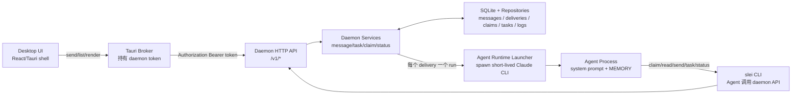
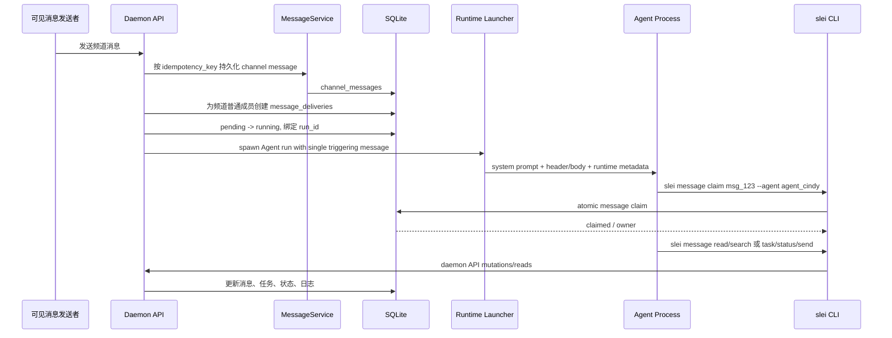

# ADR 0005: 频道广播、Agent Claim 与 Multi-Agent 核心流转

## 状态

已接受，作为频道消息、Agent claim 与多 Agent 流转的实现 guardrail。

## Context

Slei 的频道不是前端本地聊天室，而是由 daemon 驱动的多 Agent 协作工作区。频道中的可见消息写入后，daemon 必须负责消息落库、广播投递、原子 claim、任务流转、状态日志、诊断、幂等、reset 和恢复。UI 只展示 daemon 返回的数据，并触发 daemon API。

新流转不再依赖中心角色输出中心化 JSON 来决定普通频道消息交给谁。daemon 把新消息广播投递给频道内普通 Agent；Agent 根据自己的 system prompt、角色、消息 header、`@mention`、职责和按需拉取的历史，自主判断是否通过 `slei message claim` 认领。

## 核心原则

- daemon 是业务控制面：消息、投递、claim、任务、状态、日志、诊断、reset 防护、幂等和 SQLite 持久化都必须在 daemon 内完成。
- UI shell 只调用 daemon API、显示 loading/error/empty 状态、渲染 daemon DTO。UI 不得自行决定消息应该交给哪个 Agent。
- 新频道消息流转是广播投递 + Agent 自主 claim；不得新增 UI 路由、daemon 关键词兜底或中心化 JSON 路由作为新架构入口。
- 频道内可见消息写入后都触发同一广播机制。Agent 后续协作靠可见 `@mention` 接力，不依赖隐藏路由。
- `slei message claim` 是消息独占处理的唯一入口。claim 必须是 daemon/SQLite 原子操作；claim 失败的 Agent 静默退出。
- `slei task claim` 是任务维度的原子锁，独立于 message claim。
- 可见频道发言、任务回复、任务创建、任务状态更新和 Agent 状态上报都必须通过 `slei` CLI 进入 daemon API。
- Agent runtime 的普通 stdout 不会自动变成可见频道消息；可见产品动作必须来自 `slei message send` 或任务相关 API/CLI。
- 每次 `slei agent status` 上报都写入最新状态，并追加 Agent 操作日志；daemon 观察到的 `run` / `input` / `output` / `tool` / `completed` / `failed` 诊断事件也追加到同一张活动日志。每个 Agent 只保留最近 200 条，超过后删除最旧记录。
- 所有可变生产状态使用 SQLite repository，不用 JSON、前端 fixture、localStorage 或 mock 数据作为生产状态来源。

## 总体架构



边界要求：

- Desktop JavaScript 不直接访问 Agent runtime、不持有 daemon token、不写生产路由规则。
- Tauri Broker 只做安全 transport 和离线/error 展示所需的薄桥接，不成为路由控制面。
- Agent runtime 只处理一次唤醒中的工作。产品状态变更必须通过 `slei` CLI 回到 daemon。
- 当前 cwd 选择逻辑不因 runtime 从 SDK 迁移到 spawn CLI 而改变。

## Runtime Contract

daemon 负责为每次 Agent run 生成完整 Slei system prompt，并通过 worker RPC 的 `input.system_prompt` 传给 Claude worker。worker 不自行拼装产品规则，也不读取 UI 状态来决定 claim、任务或路由。

worker 当前通过 spawn Claude CLI 执行：

```text
claude --print --output-format stream-json --include-partial-messages
```

执行约束：

- `input.prompt` 是 Markdown 格式的本次运行包，只包含当前触发消息、统一 header、claim 命令、按需读历史入口和可见回复入口，不注入完整频道历史。
- `input.context` 在频道 broadcast/task handoff 路径保持为空；需要历史时由 Agent 主动调用 `slei message read/search` 或 `slei task thread/list`。
- `input.system_prompt` 承载 Slei 合同：身份、角色、CLI 用法、header 规范、claim 规则、任务规则、MEMORY/Active Context 约定和运行时元数据。
- worker 使用 `--append-system-prompt` 注入 daemon 生成的 prompt。
- worker 为本次 run 生成临时 MCP config，把 Slei product tools 暴露给 Claude CLI；tool 调用再回到 daemon API。
- worker 解析 CLI `stream-json` 输出，并归一化为 daemon 稳定 runtime event；daemon 不依赖 CLI 原始事件结构。
- 当前权限模型是静态 CLI 权限：允许读取/搜索/编辑类基础工具和 Slei MCP product tools，禁用 `Task`、插件通配和高风险网络命令；除非未来实现 CLI permission bridge，否则不要恢复 SDK permission controller 作为生产路径。

## 消息格式

Agent 看到的频道消息必须带统一 header，便于判断 target、claim id、时间和类型：

```text
[target=#all msg=msg_123 time=2026-06-15T10:00:00Z type=human] @lei-lee 请 @coda-win 看一下实现
```

字段含义：

| 字段 | 含义 |
| --- | --- |
| `target` | 频道或线程目标，例如 `#all`、`#dev`、`#all:msg_123` |
| `msg` | 当前消息稳定 ID，用于 claim、around context 和线程引用 |
| `time` | daemon 持久化的消息时间 |
| `type` | `human`、`agent`、`system`、`tombstone` 等消息类型；新增任务不写 `task_card` 消息 |

正文中的可见 `@handle` 是协作接力信号。Agent 判断是否参与时必须以 header + 正文 + system prompt 规则为准。

## Agent System Prompt 必须包含

每个 Agent 被唤醒时，system prompt 至少包含：

- 角色定义，例如 `Cindy，onboarding 助手`。
- 所有 `slei` CLI 命令的用法说明和失败语义。
- 消息 header 格式规范和字段含义。
- 行为约定：什么时候 claim、什么时候静默、如何处理任务、如何使用 `MEMORY.md`。
- 当前运行时上下文：Agent ID、Server ID、Computer 信息、频道 ID、消息 ID 等元数据。

Agent 判断规则由 system prompt 注入到每个 Agent 上下文中，不由中心路由 JSON 决定。

基础判断规则按 Markdown 的 Claim Intent Classes 注入：

- Direct Address：消息明确点名或委派给某个 Agent。若明确 `@我`，应尝试 `slei message claim <msg-id> --agent <agent-id>`；claim 失败则静默退出。若明确 `@别人` 且没有 `@我`，不应 claim，除非这条可见消息同时属于频道群体发言、当前 active task 或明确 handoff 给自己。
- Channel Group Address：消息面向频道群体发起互动、问候、咨询、要求或协调，即使没有显式群体词也成立。`@all` 永远表示 Channel Group Address，不是单个 Agent 的 Direct Address。例子包括 `大家`、`各位`、`我们`、`谁来`、`有人吗`、`早上好`、`怎么看`、`报数`、`每个人说一下`、开放咨询、群体请求和轻量社交互动。
- Channel Group Address 是串行群体参与流：每个普通 Agent 最多参与一次；只 claim 当前最新相关消息；不要 claim 自己刚发出的频道消息；若流程需要顺序，按可见历史继续序列；若别人已经 claim 当前最新消息，静默退出，等待下一条可见消息触发。
- Channel Group Address 可以按需向上检索历史：当需要判断原始群体问题、当前顺序、哪些 Agent 已参与、最新消息是否属于同一群体流或用户是否换题时，用 `slei message read --channel "#channel" --around <msgId>` 或小窗口 `--limit 20` 读取；简单独立问候无需为了回复而读历史。
- Specialized Work Request：消息要求具体工作但不是面向全频道群体。只有工作符合自身角色、active task 或 prior handoff 时才 claim；如果另一个 Agent 更合适或已经 claim，则静默退出。
- 如果 claim 成功，先根据需要调用 `slei agent status` 上报阶段，再读取历史或执行任务。
- 需要历史、普通消息子线程或任务上下文时，主动用 `slei message read/search`、消息线程 API 和 `slei task thread/list` 拉取，不要求 daemon 在初始 prompt 注入完整频道历史。
- 处理长任务、等待用户确认、交接给其他 Agent、遇到 blocker、完成阶段性工作或即将退出前，应判断是否更新 `MEMORY.md` 的 `Active Context`。

## `slei` CLI 合同

Agent 可调用的核心命令包括：

```sh
slei message claim <msg-id> --agent <agent-id>
printf "回复正文" | slei message send --target "#channel" --agent <agent-id>
slei message read --channel "#channel" --limit 20
slei message read --channel "#channel:msgId"
slei message read --channel "#channel" --after <seqNo>
slei message read --channel "#channel" --before <seqNo>
slei message read --channel "#channel" --around <msgId>
slei message search --query "关键词"

slei task create --source-message <msg-id> --agent <agent-id>
slei task claim <task-id> --agent <agent-id>
printf "任务回复" | slei task reply <task-id> --agent <agent-id>
slei task update <task-id> --status in_progress
slei task list --channel "#channel"
slei task thread <task-id>

slei agent status --agent <agent-id> --state working --phase reading_history
slei agent status --agent <agent-id> --state working --phase checking_tasks
slei agent status --agent <agent-id> --state working --phase updating_memory
slei agent status --agent <agent-id> --state idle
slei agent status --agent <agent-id> --state blocked --reason "等待用户确认"
```

CLI 约束：

- 写命令必须发送 `idempotency-key` header；CLI 未显式传入时为本次调用生成 UUID，并把 debug 信息写 stderr。
- 成功时 stdout 只输出 daemon JSON，便于 Agent 解析。
- claim 返回 `claimed=false` 时仍输出 JSON，但进程退出码为 2。
- 网络、daemon 和参数错误退出码为 1。
- `SLEI_DAEMON_URL` 默认 `http://127.0.0.1:41273`；`SLEI_DAEMON_TOKEN` 作为 Bearer token 发送。

## 频道消息端到端流转



过滤规则：

- 只为普通 Agent 创建 delivery。
- 排除系统内置或非普通成员 Agent，例如 `system_owned = true`、internal system id 或历史内部路由 Agent。
- delivery 写入使用唯一约束保证同一 `(message_id, agent_id)` 不重复。
- delivery 从 `pending` 原子切换到 `running` 后才绑定 run id；run 启动失败必须回滚为 `pending`，允许 retry。

## 可见 @mention 协作链

协作链由可见消息驱动：

```text
@lei-lee -> @alice-win claim 并出方案
@alice-win -> @coda-win claim 并编码
@coda-win -> @nancy-win claim 并审查
@nancy-win -> @lei-lee 请求确认
```

每一跳都只是频道或任务线程中的新可见消息。daemon 不隐藏插入路由决策；被 mention 的 Agent 在自己的下一次唤醒中根据 prompt 规则决定是否 claim。

## 进程生命周期与并发

每次被唤醒处理一条新消息时，daemon 启动一个新的短生命周期 Agent 进程。进程处理完本次消息后退出；下一条新消息到达时重新启动新进程。

```text
消息 1 到达 -> spawn 进程 A -> 处理消息 1 -> 退出
消息 2 到达 -> spawn 进程 B -> 处理消息 2 -> 退出
消息 3 到达 -> spawn 进程 C -> 处理消息 3 -> 退出
```

同一次唤醒内部可以有多轮工具调用。Agent 可以在同一个进程内读取历史、读写文件、执行命令、claim、发消息、创建任务、更新任务状态和更新 `MEMORY.md`，这些工具调用不会导致重复 spawn。

并发处理：

- 多条新消息短时间到达时，每条消息都有独立 delivery、run 和 claim。
- 普通消息逐条独立 claim 和回复。
- 普通消息可手动打开子线程；子线程回复写入 `message_thread_replies` 并聚合展示，不写入主 timeline。子线程回复中的可见 `@agent` 仍由 daemon 创建对应 Agent run，但回复本身不允许继续嵌套开启子线程。
- 同一任务的多条消息应在同一任务线程里回复，天然去重。
- 任务 claim 竞争由 SQLite 原子操作保证只有第一个成功。
- 长任务跨多轮时，Agent 处理完当前一步后退出；下一次用户或 Agent 回复到达时，通过线程历史和 `MEMORY.md` 的 `Active Context` 恢复上下文。

## Agent 状态与操作日志

Agent 应在耗时或用户可感知阶段调用 `slei agent status`，例如：

- `reading_history`：正在阅读历史。
- `checking_tasks`：正在查询任务或线程。
- `claiming_message`：正在认领消息。
- `claiming_task`：正在认领任务。
- `updating_memory`：正在更新记忆。
- `working` / `blocked` / `idle`：当前运行状态。

daemon 必须持久化最新状态，并把每次状态上报追加到 `agent_activity_logs`。同一张活动日志还记录 daemon 观察到的 runtime 诊断事件，包括 `run`、`input`、`output`、`tool`、`completed` 和 `failed`。该日志用于 debug 和最近活动展示，不参与路由决策、claim 判断或任务调度。每个 Agent 只保留最近 200 条，超过后删除最旧记录。

## MEMORY 与 Active Context

`MEMORY.md` 的 `Active Context` 是短生命周期进程恢复当前工作的核心机制：

- 最多记录 3 个频道/事项。
- 每项包含频道、时间、当前处理事项和进展。
- 新频道或新事项超过 3 项时淘汰最旧项。
- 不记录聊天流水、完整历史或可通过 `slei message read/search` 便宜恢复的信息。
- 开始长任务、等待用户确认、交接给其他 Agent、完成阶段性工作、遇到 blocker 或即将退出前，Agent 应判断是否更新。

## 持久化对象

必须使用 SQLite repository 持久化：

| 对象 | 用途 |
| --- | --- |
| `channel_messages` | 人类和 Agent 可见频道消息 |
| `message_deliveries` | 每条消息投递给哪些 Agent、delivery state、run id |
| `message_claims` | 消息 claim 锁、owner、状态 |
| `task_claims` | 任务 claim 锁、owner、状态 |
| `message_threads` / `message_thread_replies` | 普通消息子线程与聚合回复；任务可通过 `tasks.thread_id` 复用同一源消息 thread |
| `tasks` / `task_replies` | 任务和任务线程 |
| `agent_statuses` | Agent 最新状态 |
| `agent_activity_logs` | Agent 最近 200 条状态上报和 daemon 观察到的 runtime 诊断事件 |
| `interactive_cards` | product tool 产生的交互卡片 |
| `diagnostic_events` | runtime started/completed/failed、reset、失败诊断 |

如果代码里暂时仍存在历史内部路由表，只能作为待清理遗留结构；新普通频道消息路径不得依赖它们。

## Reset Policy

开发 reset 的目标是清空产品状态和运行期 Agent workspace，让系统从全新状态重新开始：

- 清空 messages、tasks、task replies、claims、deliveries、statuses、activity logs、diagnostics 等可变业务表。
- 清空历史内部路由相关运行数据。
- 删除运行期生成的 `agents/` workspace。
- 保留代码内置资源、SQLite schema migration 和必要空目录。

不得为了旧数据恢复中心路由、旧 task_card control message 或前端 mock 兼容。

## Drift Guardrails

后续实现改动前必须检查：

- 频道消息是否仍先落 daemon message，再由 daemon 创建 broadcast delivery。
- UI 是否没有新增 route、assign、claim、任务判断或 mock 回复。
- 普通新消息是否仍走 broadcast + claim，而不是中心化 JSON、关键词或第一个 ready Agent。
- `slei message claim` 是否仍是唯一消息独占入口。
- Agent stdout 是否仍不会自动生成可见频道消息；可见动作是否来自 `slei` CLI/API。
- `slei agent status` 是否仍写最新状态并追加最近 200 条操作日志；daemon 观察到的 `run` / `input` / `output` / `tool` / `completed` / `failed` 事件是否仍追加到同一张活动日志，且不参与路由、claim 或任务调度决策。
- 任务消息是否仍遵守 `docs/architecture/0006-task-source-message-card.md`：源消息原地升级，新增路径不写 `task_card` 消息。
- 任务线程回复是否仍只有可见 `@agent` 才创建 handoff；不能因为 task 有兼容 assignee 字段就隐式转给该 Agent。
- 普通消息子线程回复是否仍聚合在 thread 中，不进入主 timeline，且不可嵌套继续开子线程。
- 频道/私聊消息列表是否默认加载最新 50 条，并通过 `before` cursor 每次向上加载 30 条；UI 可用虚拟列表渲染大消息量，但分页、顺序和 source of truth 仍由 daemon DTO 决定。
- reset 期间是否阻止旧 run 写入状态。
- 新增生产状态是否写 SQLite repository，而不是 JSON/mock/localStorage。

## Verification Checklist

修改这条线路后至少运行：

```sh
cargo fmt --check
cargo test -p slei-storage
cargo test -p slei-daemon --test channel_orchestration_flow
cargo test -p slei-daemon --test broadcast_claim_api
```

涉及桌面 bridge 或 UI 展示时再补充：

```sh
pnpm --filter @slei/desktop typecheck
```

手工验证建议：

1. 发送无显式 mention 的频道消息，应创建普通 Agent delivery，并启动对应短生命周期 Agent run；不应出现新的中心路由 runtime。
2. 发送包含 `@agent` 的频道消息，也应走同一广播机制；只有被 prompt 规则允许的 Agent 才 claim。
3. Agent 通过 `slei message send` 发言后，新消息应再次广播并触发下一轮 claim。
4. 停掉 daemon 后发送频道消息，UI 应显示 daemon unavailable/offline，不得启用本地 mock 回复。
