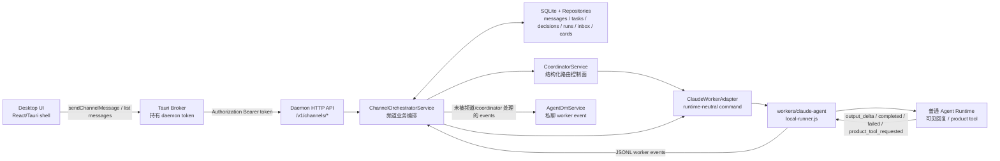
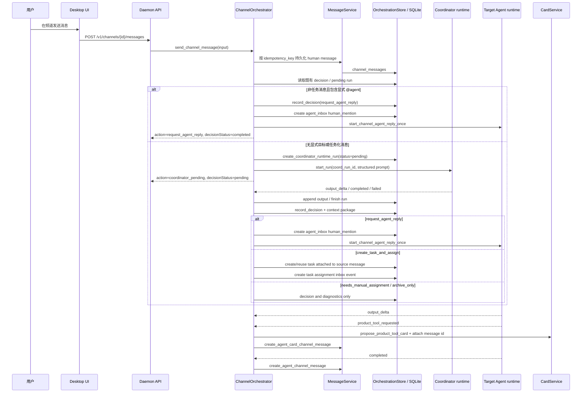
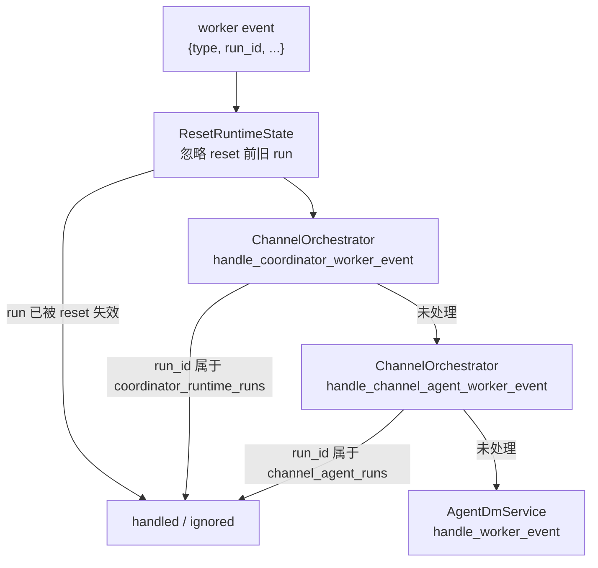
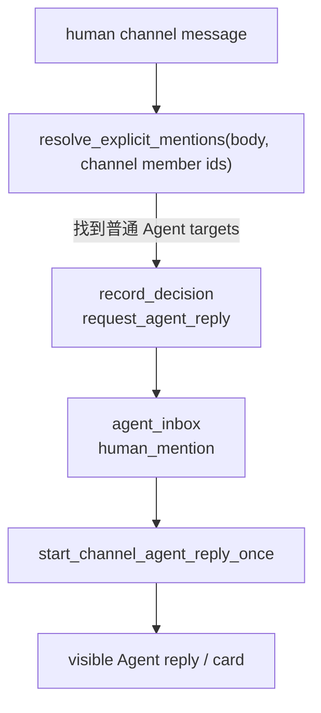
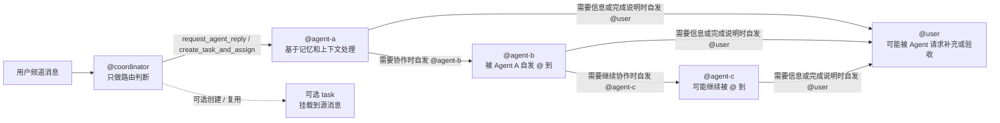

# ADR 0005: 频道信息路由与 Multi-Agent 核心流转

## Status

Accepted for implementation guardrails.

## Context

Slei 的频道不是前端本地聊天室，而是由 daemon 驱动的多 Agent 协作工作区。用户在频道中发送消息后，系统必须把消息、路由判断、任务创建、Agent 调用、工具卡片、诊断和幂等状态都落在 daemon 与 SQLite 里。UI 只展示 daemon 返回的数据，并触发 daemon API。

这份文档固定当前频道发言、coordinator 路由和多 Agent 协作的核心线路，防止后续实现漂移到前端本地路由、mock 数据、硬编码关键词分派或“第一个 ready Agent”兜底。

## 核心原则

- daemon 是业务控制面：路由、任务、Agent 调用、worker event 处理、持久化、幂等和 reset 防护都必须在 daemon 内完成。
- UI shell 只调用 daemon API、显示 loading/error/empty 状态、渲染 daemon DTO。UI 不得自行决定消息应该交给哪个 Agent。
- Coordinator 是不可见控制面 Agent。它可以产生结构化路由决策，但不能以 coordinator 身份发频道消息。
- 普通 Agent 才能产生可见频道回复、任务回复和交互卡片。
- 显式 `@agent` 是用户意图，daemon 应直接路由到被提及 Agent，并持久化 decision/context。Coordinator 不得覆盖用户显式目标。
- 无显式目标的普通频道消息走 coordinator runtime。代码只验证和执行 coordinator JSON，不用关键词替代 coordinator 判断。
- 单纯咨询问题即使不创建 task，也必须先由 coordinator 判断目标 Agent，再以 `request_agent_reply` 路由到一个或多个普通 Agent；不得由 UI 或 daemon 本地规则直接挑选第一个可用 Agent。
- coordinator 路由之后不存在产品层面的 primary Agent。被路由到的 Agent 只是当前被 `@` 到的协作者；TA 是否需要交给下一个 Agent、是否需要用户补充、是否认为工作结束，都由该 Agent 根据自身记忆中的频道成员信息和当前上下文自发决定。
- 任务消息和任务卡片必须遵守 `docs/architecture/0006-task-source-message-card.md`：任务卡片是源消息的展示状态，不是新增消息。
- 所有可变生产状态使用 SQLite repository，不用 JSON 或前端 fixture 作为生产状态来源。
- 失败必须可诊断：worker/coordinator 失败要记录 failed/manual-assignment 状态，不得静默吞掉或伪造成功回复。

## 总体架构



边界要求：

- Desktop JavaScript 不直接访问 worker、不持有 daemon token、不写生产路由规则。
- Tauri Broker 只做安全 transport 和离线/error 展示所需的薄桥接，不成为路由控制面。
- Worker 只执行 runtime 命令并输出事件；产品状态变更仍由 daemon service 根据事件落库。

## 频道消息端到端流转



## Worker Event 分发顺序

`AppState::handle_worker_event` 是 runtime event 的总入口。事件必须按固定顺序分发，避免频道 run 被私聊逻辑抢走，或 coordinator run 被普通 Agent 逻辑误处理。



约束：

- coordinator run id 必须来自 `coordinator_runtime_runs`，状态为 `pending/completed/failed`。
- channel agent run id 必须在 daemon 内存 `channel_agent_runs` 中登记后才接收事件。
- Agent DM 只能处理前两者都未处理的 worker event。
- reset 期间或 reset 前启动的 run 不能继续写入生产状态。

## Coordinator 路由模型

Coordinator 是结构化决策者，不是可见聊天成员。

输入由 daemon 构造：

- source message id、author id、body、channel id/name
- 当前频道普通成员列表、handle、角色、readiness
- workspace mounts 和安全 context refs
- 可用 action enum 与任务策略

输出必须是 JSON：

```json
{
  "intent": "consultation | task_command | status_update | noise | ambiguous",
  "action": "request_agent_reply | create_task_and_assign | needs_manual_assignment | archive_only",
  "routeMode": "explicit | broadcast | semantic | task | none",
  "primaryAssigneeAgentId": "agent_alice",
  "targetAgentIds": ["agent_alice", "agent_coda"],
  "task": {
    "title": "实现导出功能",
    "summary": "用户要求实现导出功能",
    "assigneeAgentId": "agent_alice",
    "collaboratorAgentIds": ["agent_coda"]
  },
  "reason": "用户要求 Alice 和 Coda 一起看方案。",
  "confidence": 0.86
}
```

daemon 负责验证和执行：

- action、intent、routeMode 必须是已知枚举。
- target 必须是当前频道普通成员。
- coordinator/system Agent 永远不能作为 downstream target。
- target 去重时保留 coordinator 输出顺序。
- malformed JSON、非法 target 或 worker failed 只能进入 `needs_manual_assignment` / failed diagnostic，不能 fallback 到第一个 ready Agent。
- `primaryAssigneeAgentId`、`assigneeAgentId` 和 `task.assigneeAgentId` 只是兼容旧 API 和当前 task storage 的技术字段；在产品语义上不得解释为固定 primary Agent 或主流程负责人。对 `request_agent_reply` 来说，真正的路由目标是 `targetAgentIds`。
- 如果兼容字段存在，它必须指向 `targetAgentIds[0]`；如果不需要兼容字段，可以为 `null`，daemon 仍按 `targetAgentIds` 创建 inbox 和 Agent runtime。

## 显式 @agent 快速路径

显式提及是用户直接指定目标。当前实现对非任务消息采用直接路由：



这条路径仍然必须持久化 decision 和 routing context package。它不是前端捷径，也不是跳过 daemon 业务规则。

## Multi-Agent 自发协作流转

coordinator 的职责是在频道消息进入系统后，判断应该先 `@` 哪些普通 Agent。此后不再存在 daemon 固定编排出的主从协作链；被路由到的 Agent 根据自己的 `MEMORY.md`、`notes/channels.md`、`notes/relationships.md` 和当前上下文，自发决定下一步。

- 如果当前 Agent 认为需要其他 Agent 接手或参与，TA 在频道或任务线程里显式 `@agent`；daemon 只把这个可见提及转换成 handoff/inbox/runtime。
- 如果当前 Agent 认为需要用户补充信息，TA 自己 `@用户` 或直接向用户说明需要补充。
- 如果当前 Agent 认为工作可以结束，TA 自己说明完成或请求验收；这不是 daemon 固定插入的“用户验收节点”。
- 如果 coordinator 判断消息应成为 task，daemon 创建或复用绑定到源消息的 task root；任务卡片是源消息的展示状态，不新增 `task_card` 消息。详细约束见 `docs/architecture/0006-task-source-message-card.md`。



关键边界：

- Coordinator 只做路由判断和必要的 task 初始化，不持续当项目经理。
- 下游 handoff 是 Agent 的可见自发行为，由当前 Agent 根据记忆里的频道成员关系通过 `@agent` 触发。
- 任务线程里没有显式 `@agent` 的回复不得自动 handoff 给 task 的兼容 `assignee_id`；`assignee_id` 只能作为任务存储和旧 API 兼容字段，不能隐式驱动协作接管。
- 用户补充、用户验收、工作结束都不是固定状态机节点；它们只能来自 Agent 或用户的可见消息。
- task storage 当前存在 `assignee_id` 等兼容字段，但 UI 和业务文案不得把它塑造成产品层面的 primary Agent 概念。多目标路由和后续协作应以 visible `@agent`、decision/context/inbox 为准。
- Agent 生成工具卡片时，worker 只发 `product_tool_requested`，卡片 proposal、message id 绑定和频道消息落库都由 daemon 完成。

## 持久化对象

必须使用 SQLite repository 持久化：

| 对象 | 用途 |
| --- | --- |
| `channel_messages` | 人类消息、Agent 可见回复、Agent 卡片消息；历史 `task_card` control message 仅作为旧数据过滤/清理对象，不做任务卡片 UI 兼容 |
| `coordinator_runtime_runs` | coordinator 异步 run、prompt、output buffer、状态 |
| `coordinator_decisions` | 已验证的路由决策和 failed/manual decision |
| `routing_context_packages` | 下游 Agent 可审计上下文包 |
| `agent_inbox_events` | human mention、task assignment、task handoff |
| `task_roots` / `task_replies` | 任务和任务线程 |
| `interactive_cards` | product tool 产生的交互卡片 |
| `diagnostic_events` | runtime started/completed/failed 等诊断 |

生产代码不得用前端 state、fixture、JSON 文件或内存假数据替代这些对象。内存缓存只允许做运行中 run correlation、reset guard、幂等短缓存；可恢复状态必须能从 SQLite 重建。

## Drift Guardrails

后续实现改动前必须检查：

- 频道消息是否仍先落 daemon message，再进入 orchestrator。
- UI 是否没有新增 route/assign/mention 业务判断。
- 无显式目标的消息，包括单纯咨询但不建 task 的消息，是否仍走 coordinator runtime，而不是本地关键词分类。
- malformed/failed coordinator 是否不会选第一个 ready Agent 兜底。
- coordinator/system Agent 是否仍被所有用户可见列表、mention suggestion、DM、routing target 过滤。
- worker event 是否仍按 coordinator -> channel agent -> DM 顺序分发。
- channel agent reply 是否真实启动 worker，并在 completed 后由 daemon 写回频道消息。
- 任务消息是否仍遵守 `docs/architecture/0006-task-source-message-card.md`：源消息原地升级，新增路径不写 `task_card` 消息。
- 任务线程回复是否仍只有可见 `@agent` 才创建 handoff；不能因为 task 有 `assignee_id` 就隐式把消息转给该 Agent。
- product tool card 是否由 daemon 落 `interactive_cards` 并挂到频道消息。
- reset 期间是否阻止旧 run 写入状态。
- 新增生产状态是否写 SQLite repository，而不是 JSON/mock/localStorage。

## Verification Checklist

修改这条线路后至少运行：

```sh
cargo fmt --all -- --check
cargo test -p slei-daemon --test channel_orchestration_flow
cargo test -p slei-daemon --test channel_coordinator
cargo test -p slei-daemon
```

涉及桌面 bridge 或 UI 展示时再补充：

```sh
pnpm --filter @slei/desktop typecheck
```

手工验证建议：

1. 在频道发送 `@yeal 请只回复 OK`，应看到普通 Agent 在同一频道可见回复。
2. 发送无显式目标的工作请求，应先出现 `coordinator_pending`，随后由 coordinator 决策创建任务或触发 Agent 回复。
3. 停掉 daemon 后发送频道消息，UI 应显示 daemon unavailable/offline，不得启用本地 mock 回复。
