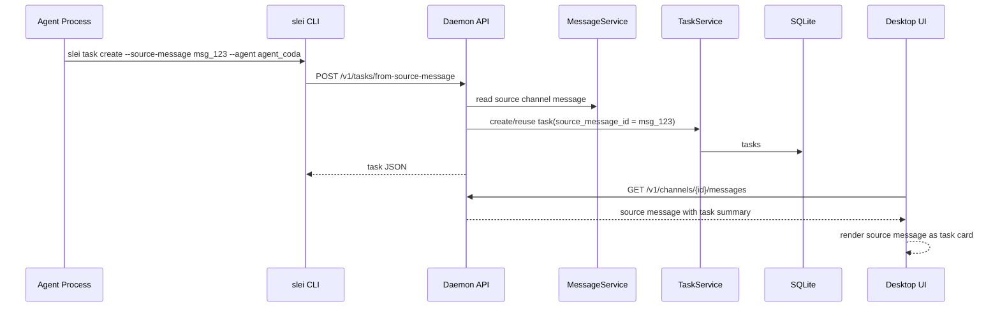
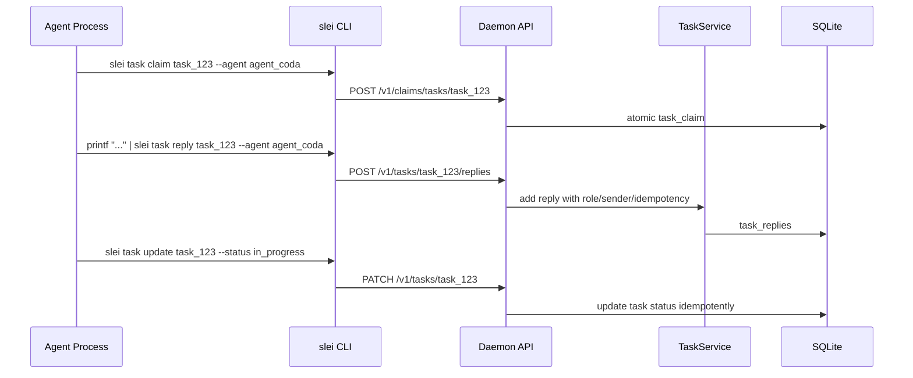

# ADR 0006: 任务源消息与原地任务卡片

## 状态

已接受，作为任务源消息、任务卡片和任务线程入口的实现 guardrail。

## Context

Slei 频道里的“转为任务”不能把同一个请求拆成一条普通消息加一条新的任务卡片消息。这样会让 timeline 重复，也容易把任务识别和展示逻辑漂移到 UI。

任务消息的 source of truth 必须在 daemon 和 SQLite：消息先作为频道消息或私聊消息持久化；只有用户勾选“转为任务”或 Agent/coordinator 显式自动转任务时，daemon 才创建 task，并作为 `source_message_id` 关联到这条消息。UI 只展示 daemon 返回的消息、thread summary 和 task summary，不自行判断消息是否应该成为任务，也不在前端新增任务卡片。

## Decision

任务卡片是源消息的一种展示状态，不是新的消息。

- `slei task create --source-message <msg-id> --agent <agent-id>` 创建或返回 `source_message_id = msg-id` 的同一个 task root。
- 同一源消息只能关联一个任务；重复调用必须返回同一任务，不新增任务或消息。
- 新增生产路径禁止写入新的 `kind = task_card` 频道消息，也禁止写入新的 `task_card:` control message。
- 所有频道/私聊消息都可以手动打开普通子线程；普通子线程只创建 `message_threads`，不创建 task，也不把源消息升级为任务。
- 任务创建必须确保同一源消息对应的 `message_thread` 存在，并把 `tasks.thread_id` 关联到该 thread；已有普通子线程再转任务时复用同一个 thread。
- 消息列表 DTO 应在源消息上挂载 thread summary；有任务时再挂载 task summary。UI 根据 `message.task` 把原消息原地展示为任务卡片。
- 历史 `task_card:` 消息不再做 UI 兼容渲染：旧控制消息应被隐藏或通过 reset/清理移除。

## CLI 与 API 语义

Agent 只能通过 `slei` CLI 触发任务副作用，CLI 再调用 daemon API 并落 SQLite。

```sh
slei task create --source-message <msg-id> --agent <agent-id>
slei task claim <task-id> --agent <agent-id>
printf "任务回复正文" | slei task reply <task-id> --agent <agent-id>
slei task update <task-id> --status in_progress
slei task list --channel "#channel"
slei task thread <task-id>
```

约束：

- `task create --source-message` 必须保留源消息作者、正文和所在频道/私聊目标；任务卡片展示仍来自源消息。
- `task claim` 是任务维度原子锁，独立于 `message claim`。只有第一个成功 claim 的 Agent 拥有该任务处理权；同一 Agent 重试应视为成功。
- `task reply` 必须保留 `role`、`sender_id` 和稳定 reply id。重复 idempotency key 不得新增回复。
- `task update` 只能通过 daemon API 修改 SQLite，不得从 UI、本地文件或 Agent workspace 直接改任务状态。
- 所有写命令必须带 `idempotency-key` header；CLI 未显式传入时为本次调用生成 UUID。

## 数据流



任务回复和状态更新：



## Handoff 与任务线程

- 任务线程回复中的可见 `@agent` 是 handoff 信号。
- daemon 可根据可见 mention 创建任务 handoff inbox/runtime，但不得因为 task 存在兼容 assignee 字段就隐式转交。
- 需要其他 Agent 接力时，当前 Agent 必须在任务回复正文中可见 `@agent`。
- 任务线程历史需要时由 Agent 调用 `slei task thread <task-id>` 主动读取。
- 普通消息子线程回复也保存在 daemon/SQLite，并聚合在子线程抽屉中；这些回复不进入主 timeline，且回复本身不能再嵌套创建子线程。

## UX 合同

任务卡片必须建立在原消息视觉结构上，而不是另起一张独立系统卡片。

- 保留原消息作者、handle、正文、发送时间、复制和收藏能力。
- 右上角展示：`N 条回复` `｜` 状态圆点 + 状态文案 `｜` copy star `｜` time。
- 状态颜色与任务状态保持一致：`pending_assignment` 为 amber，`in_progress` 为 blue，`in_review` 为 violet，`done` 为 green。
- 不再使用右下角回复按钮；点击右上角 `N 条回复` 打开该任务线程。
- 任务卡片不使用额外 border；不使用额外 task icon 角标，避免破坏原消息视觉结构。
- 时间格式沿用消息时间展示约定，当前为 `MM-DD HH:mm`。

## 历史数据清理

- `MessageKind::TaskCard` 和 `task_card:{task_id}:source:{source_message_id}` 仅作为旧数据识别和过滤依据。
- Desktop timeline 不渲染旧 `task_card` control message，也不使用它把普通消息升级成任务卡片。
- 如果旧数据影响验收，可通过开发 reset 或定向清理旧 `task_card` 消息处理；不要为了旧数据重新引入兼容任务卡片 UI。
- 新 API、daemon service、Tauri bridge、desktop mock 和测试 fixture 不得再把新增任务表达为新的 `task_card` 消息。

## Drift Guardrails

涉及任务消息、任务卡片、任务 CLI/API、频道消息渲染、任务线程入口的改动前必须检查：

- 任务是否仍由 daemon/SQLite 创建、关联、幂等和恢复。
- UI 是否只根据 daemon DTO 渲染 `message.task`，没有自行识别任务或新增任务卡片。
- `slei task create --source-message` 是否仍创建或返回同一源消息任务。
- `slei task claim` 是否仍是任务维度原子锁。
- `slei task reply` 是否仍保留 role、sender 和稳定 reply id。
- `slei task update` 是否仍只通过 daemon API 改 SQLite。
- 新增任务路径是否仍原地升级源消息，而不是写入新的 `task_card` 消息。
- 历史 `task_card:` 是否仍被隐藏/清理，而不是恢复成 UI 兼容渲染路径。
- 手动打开普通子线程是否不会创建 task，也不会把源消息升级为任务。
- 勾选“转为任务”和 Agent/coordinator 自动转任务是否才会进入 TASK，并复用同一源消息 thread。
- Agent 回复、任务回复和附件入口是否继承源消息所在频道/私聊目标。
- 任务卡片 UX 是否仍符合本 ADR 的原消息结构、右上角回复/状态/actions/time，且没有恢复 border 或 task icon 角标。

## 验证清单

修改这条线路后至少验证：

```sh
cargo fmt --check
cargo test -p slei-daemon --test broadcast_claim_api
cargo test -p slei-daemon --test task_api
cargo test -p slei-daemon --test task_service
cargo test -p slei-daemon --test channel_orchestration_flow
```

涉及桌面 UI 时再补充：

```sh
pnpm --filter @slei/desktop test
pnpm --filter @slei/desktop lint
```

手工验证建议：

1. Agent 调用 `slei task create --source-message msg_123 --agent agent_coda` 后，timeline 中原消息变成任务卡片，没有新增第二张卡片。
2. 重复创建同一源消息任务，返回同一 task id。
3. `slei task claim` 竞争时只有一个 Agent 成功。
4. `slei task reply` 后右上角回复数增加，任务线程保留 role/sender。
5. 重启 daemon 后，源消息与 task 的关联仍存在。
