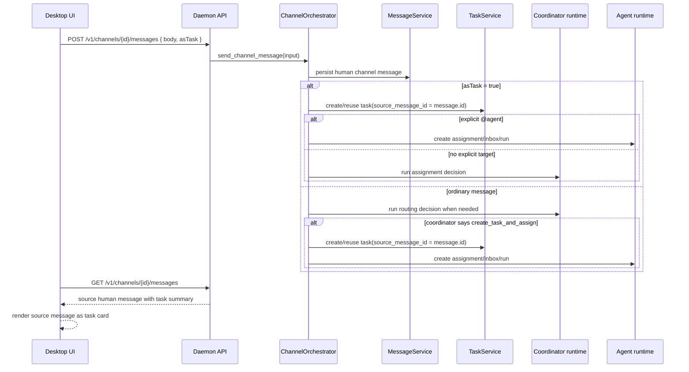

# ADR 0006: 任务消息原地升级与源消息任务卡片

## Status

Accepted for implementation guardrails.

## Context

Slei 频道里的“转为任务”和 coordinator 判定任务，不能把同一个用户请求拆成一条普通消息加一条新的任务卡片消息。这样会让 timeline 重复、session 过滤复杂化，也容易把任务识别逻辑漂移到 UI。

任务消息的 source of truth 必须在 daemon 和 SQLite：消息先作为频道消息持久化，任务作为 `source_message_id` 关联到这条消息。UI 只展示 daemon 返回的消息和 task summary，不自行判断消息是否应该成为任务，也不在前端新增任务卡片。

## Decision

任务卡片是源消息的一种展示状态，不是新的消息。

- 用户勾选“转为任务”发送频道消息时，daemon 必须立即创建或复用 `source_message_id = message.id` 的 task root，并在消息列表 DTO 上给源消息挂载 task summary。
- `asTask=true` 不需要经过 coordinator 判断“是否是任务”。如果有显式 `@agent`，daemon 直接给被提及 Agent 创建任务指派；如果没有显式目标，coordinator 只负责后台判断应该指派给谁。
- 普通频道消息如果经 coordinator 判定为 `create_task_and_assign` 或 `needs_manual_assignment`，daemon 同样只创建或复用源消息 task；消息列表中应表现为原消息原地升级为任务卡片。
- 新增生产路径禁止写入新的 `kind = task_card` 频道消息，也禁止写入新的 `task_card:` control message。
- 历史 `task_card:` 消息不再做 UI 兼容渲染：旧控制消息应被隐藏或通过 reset/清理移除，任务卡片只来自源消息上的 `task` summary。

## Data Flow



## UX Contract

任务卡片必须建立在原消息视觉结构上，而不是另起一张独立系统卡片。

- 保留原消息作者、handle、正文、发送时间、复制和收藏能力。
- 右上角展示：`N 条回复` `｜` 状态圆点 + 状态文案 `｜` copy star `｜` time。
- 状态颜色与任务状态保持一致：`pending_assignment` 为 amber，`in_progress` 为 blue，`in_review` 为 violet，`done` 为 green。
- 不再使用右下角回复按钮；点击右上角 `N 条回复` 打开该任务线程。
- 整个卡片有 border；不使用额外 task icon 角标，避免破坏原消息视觉结构。
- 时间格式沿用消息时间展示约定，当前为 `MM-DD HH:mm`。

## Legacy Cleanup

- `MessageKind::TaskCard` 和 `task_card:{task_id}:source:{source_message_id}` 仅作为旧数据识别和过滤依据。
- Desktop timeline 不渲染旧 `task_card` control message，也不使用它把普通消息升级成任务卡片。
- 如果旧数据影响验收，可通过开发 reset 或定向清理旧 `task_card` 消息处理；不要为了旧数据重新引入兼容任务卡片 UI。
- 新 API、daemon service、Tauri bridge、desktop mock 和测试 fixture 不得再把新增任务表达为新的 `task_card` 消息。

## Drift Guardrails

涉及任务消息、任务卡片、coordinator 建任务、频道消息渲染、任务线程入口的改动前必须检查：

- 任务是否仍由 daemon/SQLite 创建、关联、幂等和恢复。
- UI 是否只根据 daemon DTO 渲染 `message.task`，没有自行识别任务或新增任务卡片。
- `asTask=true` 是否仍立即创建或复用源消息 task，而不是等待 coordinator 判断任务与否。
- coordinator 判定任务时是否仍原地升级源消息，而不是写入新的 `task_card` 消息。
- 显式 `@agent + asTask=true` 是否仍尊重用户目标，直接创建任务指派。
- 历史 `task_card:` 是否仍被隐藏/清理，而不是恢复成 UI 兼容渲染路径。
- 频道 session、Agent 回复、任务回复和附件入口是否继承源消息 session。
- 任务卡片 UX 是否仍符合本 ADR 的原消息结构、右上角回复/状态/actions/time 和 border 约定，且没有恢复 task icon 角标。

## Verification Checklist

修改这条线路后至少验证：

```sh
cargo test -p slei-daemon --test channel_orchestration_flow
cargo test -p slei-daemon
pnpm --filter @slei/desktop test
pnpm --filter @slei/desktop lint
```

手工验证建议：

1. 勾选“转为任务”发送频道消息，timeline 中原消息立即变成任务卡片，没有新增第二张卡片。
2. 普通消息被 coordinator 判定为任务后，原消息原地升级为任务卡片。
3. 任务卡片右上角状态、copy、star、time 单行对齐，右下角 `N 条回复` 能打开任务线程。
4. 重启 daemon 后，源消息与 task 的关联仍存在。
