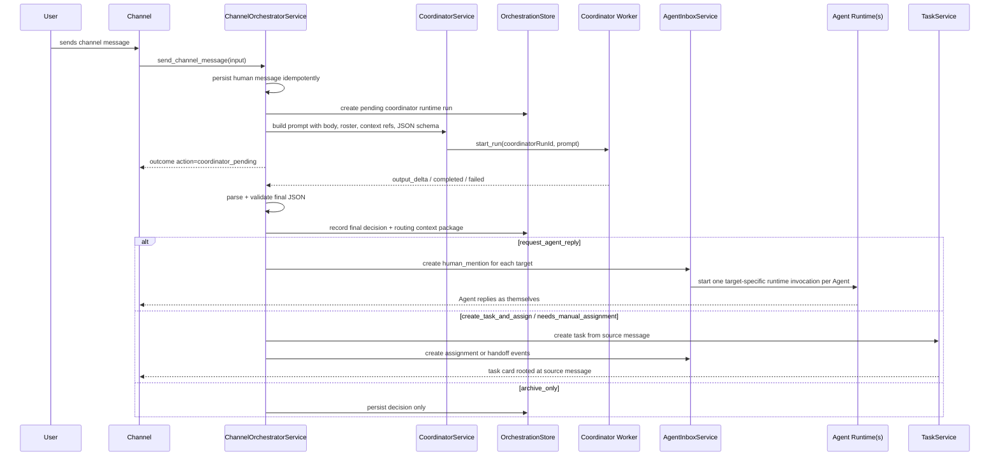

# Channel Coordinator Multi-Target Routing Implementation Plan

> **For agentic workers:** REQUIRED: Use superpowers:subagent-driven-development (if subagents available) or superpowers:executing-plans to implement this plan. Steps use checkbox (`- [x]`) syntax for tracking.

**Goal:** Let the channel Coordinator decide whether a channel message should route to one Agent or multiple Agents, instead of always routing reply requests to the first ready Agent.

**Execution status:** Completed on 2026-06-09 in commits `613fb4a`, `c5c2d8a`, `c1c421e`, `6e42cd9`, and `ef23173`.

**Architecture:** Keep the Coordinator prompt as the source of routing truth and run it asynchronously through the worker event pipeline. `send_channel_message` persists the source message, starts a pending Coordinator runtime run, and returns `coordinator_pending`; when worker events complete, the daemon parses the Coordinator's fixed JSON response, validates member and safety constraints, persists the final decision, and executes side effects. Preserve current single-assignee task behavior for `create_task_and_assign` while allowing the Coordinator JSON to return any number of downstream Agent targets.

**Tech Stack:** Rust daemon with Tokio/Axum/sqlx/SQLite, TypeScript protocol package, Tauri desktop bridge, React desktop app with Vitest tests.

---

## Scope Check

This is one vertical behavior change across protocol, daemon, and desktop. Do not build a general LLM scheduler in this pass. The Coordinator prompt owns semantic routing; code owns JSON validation, persistence, and side-effect execution.

The new behavior should be:

- The Orchestrator sends raw message body and channel member roster to the Coordinator through a pending runtime run.
- The Coordinator decides whether the route is explicit, broadcast, semantic, task, or none.
- Mentions can appear anywhere in the text; code must not assume they are at the start of the message.
- The Coordinator returns fixed JSON with `action`, `intent`, `routeMode`, `primaryAssigneeAgentId`, `targetAgentIds`, `task`, `reason`, and `confidence`.
- Code validates the JSON and target ids after the worker `completed` event, then fans out to downstream Agents or creates a task.
- Invalid Coordinator output becomes a diagnostic/manual-assignment outcome; it must not silently route to the first ready Agent.

## End-To-End Architecture

The channel Coordinator is a control-plane actor, not a visible speaker. It receives persisted channel messages through `ChannelOrchestratorService`, reads the raw message and structured roster/context in a worker run, returns a fixed JSON decision via worker events, and then the Orchestrator creates the side effects that make work happen. Visible replies are produced only by the selected target Agents.



### Coordinator Runtime Protocol

Coordinator routing is asynchronous. The daemon must not block `send_channel_message` waiting for model output, and it must not create a local fallback route while the Coordinator is thinking.

`send_channel_message` returns a pending outcome:

```json
{
  "messageId": "msg_123",
  "action": "coordinator_pending",
  "coordinatorRunId": "coord_run_456",
  "decisionStatus": "pending",
  "assigneeAgentIds": []
}
```

Runtime states:

- `pending`: source channel message is persisted, a Coordinator run exists, and no downstream Agent has been invoked.
- `completed`: worker output was parsed as valid Coordinator JSON, decision was persisted, and side effects were applied.
- `failed`: worker failed, timed out, or returned malformed/invalid JSON. Persist a diagnostic `needs_manual_assignment` decision and do not invoke downstream Agents.

Worker event handling:

- `AppState::handle_worker_event` must route events whose `run_id` belongs to a Coordinator run into `ChannelOrchestratorService::handle_coordinator_worker_event`.
- `output_delta` appends to the pending Coordinator run output buffer.
- `completed` parses the accumulated output as Coordinator JSON and applies the validated final decision.
- `failed` marks the run failed and persists the diagnostic/manual-assignment decision.
- Agent DM worker events continue through the existing `AgentDmService` path.

Idempotency:

- Re-sending the same idempotency key while pending returns the same pending outcome and does not start a second Coordinator run.
- Re-sending after completion returns the completed outcome derived from the persisted decision.
- Replayed `completed` or `failed` worker events must not duplicate inbox events, task cards, or routing context packages.

### Coordinator JSON Contract

The prompt, not code, defines routing semantics. It must tell the Coordinator:

- Mentions may appear at the beginning, middle, or end of the message.
- A user can ask for multiple people without exact `@handle` syntax.
- The Coordinator itself must never be a downstream target.
- Task-like requests should produce task actions, not ordinary visible reply actions.
- The response must be JSON only.

Output shape:

```json
{
  "intent": "consultation",
  "action": "request_agent_reply",
  "routeMode": "explicit",
  "primaryAssigneeAgentId": "agent_alice",
  "targetAgentIds": ["agent_alice", "agent_coda"],
  "task": null,
  "reason": "The user asked Alice and Coda to review the proposal.",
  "confidence": 0.86
}
```

Task output shape:

```json
{
  "intent": "task_command",
  "action": "create_task_and_assign",
  "routeMode": "task",
  "primaryAssigneeAgentId": "agent_alice",
  "targetAgentIds": ["agent_alice", "agent_coda"],
  "task": {
    "title": "实现导出功能",
    "summary": "用户要求实现导出功能",
    "assigneeAgentId": "agent_alice",
    "collaboratorAgentIds": ["agent_coda"]
  },
  "reason": "The user asked for implementation work and mentioned Alice.",
  "confidence": 0.91
}
```

### Validation Boundary

Code may validate the Coordinator's JSON but must not reinterpret the message body to replace the decision.

Validation is allowed to:

- parse JSON and reject malformed responses;
- enforce enum values;
- verify target ids are channel members;
- reject coordinator system Agents as downstream targets;
- dedupe target ids preserving Coordinator order;
- derive compatibility `assigneeAgentId` from `primaryAssigneeAgentId`;
- turn invalid decisions into diagnostics or `needs_manual_assignment`.

Validation is not allowed to:

- infer `@agent`, broadcast, consultation, or task intent by local keyword rules;
- silently replace an invalid/missing target with the first ready Agent;
- override a valid explicit non-ready target simply because it is not ready.

### Context Envelope

Each selected Agent receives a target-specific context envelope. This must be curated context, not a raw channel transcript:

```ts
type ChannelRoutingContext = {
  sourceMessageId: string;
  channelId: string;
  channelName?: string;
  targetAgentId: string;
  primaryAssigneeAgentId?: string;
  targetAgentIds: string[];
  intent: "consultation" | "task_command" | "status_update" | "noise" | "ambiguous";
  action: "request_agent_reply" | "create_task_and_assign" | "needs_manual_assignment" | "archive_only";
  assignmentReason: string;
  sourceBody: string;
  relatedMessageIds: string[];
  taskId?: string;
  safeMemoryRefs: string[];
  workspaceMounts: Array<{ path: string; label: string }>;
};
```

For this implementation, the runtime prompt can still be assembled in desktop, but it must include the target Agent and all co-targets:

```text
你被频道协调员路由来回复 #channel 里的用户消息。
目标 Agent: @target
同批路由目标: @alice, @coda
请直接回答用户，不要解释路由过程。

用户消息:
...
```

### Task Conversion

Task conversion remains separate from multi-Agent visible replies:

1. Coordinator classifies task-command language.
2. Orchestrator creates one task root from the source message.
3. The validated Coordinator JSON `task.assigneeAgentId`, or `primaryAssigneeAgentId` when the task object omits an assignee, becomes the task `assignee_id`.
4. Agent readiness controls inbox/delivery state only; it must not cause code to retarget a valid Coordinator-selected Agent.
5. If there is no valid primary target in the Coordinator JSON, the task is created with `needs_assignment = true`.
6. Additional relevant target ids are recorded on the Coordinator decision/context package, and can receive handoff/inbox events where the existing task flow supports it.
7. Full multi-assignee task storage is out of scope for this slice.

## Knowledge Notes

- Existing plan `docs/superpowers/plans/2026-06-03-slei-channel-coordinator.md` said the coordinator can route to single or multiple Agents, but current implementation narrowed reply decisions to one `assignee_agent_id`.
- Existing tests assert first-ready routing for broadcast prompts. These tests must be updated to inject fixed Coordinator JSON and assert the resulting multi-target list.
- Existing UI assumes one activity placeholder per channel message. Multi-target replies need stable per-agent activity ids to avoid overwriting each other.

## File Structure

### Daemon / Storage

- Modify `crates/slei-storage/src/repositories/mod.rs`
  - Add `assignee_agent_ids: Vec<String>` to `CoordinatorDecisionRecord`.
  - Persist the full target list in a JSON text column while keeping `assignee_agent_id` for backward compatibility.
  - Add coordinator runtime run persistence helpers for pending output buffers and status replay.
- Modify `crates/slei-storage/src/migrations.rs`
  - Add a migration repair step that adds `assignee_agent_ids TEXT NOT NULL DEFAULT '[]'` when missing.
  - Add a migration repair step for the `coordinator_runtime_runs` table.
- Modify `crates/slei-storage/migrations/0001_initial.sql`
  - Add `assignee_agent_ids TEXT NOT NULL DEFAULT '[]'` to fresh schemas.
  - Add a `coordinator_runtime_runs` table for fresh schemas.
- Modify `crates/slei-daemon/src/services/orchestration_store.rs`
  - Thread `assignee_agent_ids` into decision recording and replay.
  - Add pending run create, append-output, complete, fail, and lookup helpers.
- Modify `crates/slei-daemon/src/services/coordinator_service.rs`
  - Add multi-target fields to `CoordinatorDecision`.
  - Add Coordinator prompt input/member structs.
  - Add fixed JSON decision structs.
  - Add `build_coordinator_prompt`, `parse_and_validate_coordinator_json`, and a Coordinator runtime start boundary that emits worker `start_run` commands without waiting for output.
  - Keep routing semantics in the prompt; code only validates schema, membership, and safety constraints.
- Modify `crates/slei-daemon/src/services/channel_orchestrator_service.rs`
  - Add `assignee_agent_ids` to `SendChannelMessageOutcome`.
  - Add `coordinator_run_id` and `decision_status` to `SendChannelMessageOutcome`.
  - Start pending Coordinator runtime runs from `send_channel_message`.
  - Fan out `human_mention` inbox events for each selected target only after the Coordinator run completes.
  - Preserve task assignment as one primary assignee.
  - Persist a routing context package with primary and all target ids.
- Modify `crates/slei-daemon/src/state.rs`
  - Route worker events for Coordinator runs into `ChannelOrchestratorService` before or alongside the existing Agent DM event path.
- Modify `crates/slei-daemon/src/api/messages.rs`
  - Include multi-target ids in diagnostics without logging message body.

### Protocol / Desktop Bridge

- Modify `packages/protocol-client/src/contracts.ts`
  - Add optional `assigneeAgentIds?: string[]`.
  - Add optional `coordinatorRunId?: string` and `decisionStatus?: "pending" | "completed" | "failed"`.
- Modify `packages/protocol-client/src/contracts.test.ts`
  - Assert the new field.
- Modify `apps/desktop/src-tauri/src/daemon_broker.rs`
  - Add `assignee_agent_ids: Vec<String>` to `SendChannelMessageOutcome`.
  - Keep local archive fallback as an empty list.
- Modify `apps/desktop/src/lib/daemon-bridge.ts`
  - Update fake bridge channel routing to produce `assigneeAgentIds`.
  - Keep `assigneeAgentId` as the first target.

### Desktop App

- Modify `apps/desktop/src/app/SleiApp.tsx`
  - Add helper `channelReplyTargetIds(outcome)`.
  - Add helper `createChannelAgentActivityMessages(...)`.
  - Split `runChannelAgentReply(...)` into a per-agent runner and call it for every target.
  - Use stable activity ids shaped like `agent-activity-${messageId}-${agentId}`.
  - Extend `channelAgentReplyPrompt` to include target Agent and co-target context.
- Modify `apps/desktop/src/app/SleiApp.test.ts`
  - Cover multi-target activity creation and per-agent message ids.
- Modify `apps/desktop/e2e/composer-submit.spec.ts`
  - Update existing single-target tests and add multi-target activity coverage.

### Tests

- Modify `crates/slei-daemon/tests/channel_coordinator.rs`
  - Add service tests for explicit multi-mentions and broadcast routing by injected Coordinator JSON.
  - Update old first-ready broadcast assertions.
- Modify `crates/slei-daemon/tests/channel_orchestration_flow.rs`
  - Add an end-to-end flow that creates two ready Agents, sends a broadcast prompt, and asserts two inbox events plus `assignee_agent_ids`.
  - Update public API JSON assertions to include `assigneeAgentIds`.
- Modify `apps/desktop/src-tauri/src/lib.rs`
  - Update bridge serialization tests if they assert the old outcome shape.

## Task 1: Persist Multi-Target Coordinator Decisions

**Files:**
- Modify: `crates/slei-storage/src/repositories/mod.rs`
- Modify: `crates/slei-storage/src/migrations.rs`
- Modify: `crates/slei-storage/migrations/0001_initial.sql`
- Modify: `crates/slei-daemon/src/services/orchestration_store.rs`
- Test: `crates/slei-storage/src/lib.rs`
- Test: `crates/slei-daemon/tests/coordinator_persistence.rs`

- [x] **Step 1: Write the failing storage test**

Add to `crates/slei-storage/src/lib.rs` near the existing coordinator decision tests.

First, cover the final target list:

```rust
#[tokio::test]
async fn coordinator_decisions_persist_full_assignee_target_list() {
    let (url, _path) = sqlite_file_url("decision-targets");
    let db = SleiDb::connect(&url).await.unwrap();
    db.migrate().await.unwrap();
    let repos = Repositories::new(db.pool().clone());
    let decision_id = Uuid::new_v4();

    repos
        .insert_coordinator_decision(
            decision_id,
            "all",
            "msg_broadcast",
            "consultation",
            "request_agent_reply",
            Some("agent_alice"),
            &["agent_alice".to_string(), "agent_coda".to_string()],
            "broadcast routed to all ready agents",
        )
        .await
        .unwrap();

    let decisions = repos
        .coordinator_decisions_for_message("msg_broadcast")
        .await
        .unwrap();

    assert_eq!(decisions[0].assignee_agent_id.as_deref(), Some("agent_alice"));
    assert_eq!(
        decisions[0].assignee_agent_ids,
        vec!["agent_alice".to_string(), "agent_coda".to_string()]
    );

}
```

Then add a pending Coordinator runtime run test:

```rust
#[tokio::test]
async fn coordinator_runtime_runs_persist_pending_output_and_status() {
    let (url, _path) = sqlite_file_url("coordinator-runs");
    let db = SleiDb::connect(&url).await.unwrap();
    db.migrate().await.unwrap();
    let repos = Repositories::new(db.pool().clone());

    repos
        .insert_coordinator_runtime_run(
            "coord_run_1",
            "dev",
            "msg_1",
            "idem-1",
            "prompt body",
        )
        .await
        .unwrap();
    repos
        .append_coordinator_runtime_output("coord_run_1", "{\"intent\"")
        .await
        .unwrap();
    repos
        .append_coordinator_runtime_output("coord_run_1", ":\"consultation\"}")
        .await
        .unwrap();
    repos
        .finish_coordinator_runtime_run("coord_run_1", "completed", None)
        .await
        .unwrap();

    let run = repos
        .coordinator_runtime_run("coord_run_1")
        .await
        .unwrap()
        .unwrap();

    assert_eq!(run.status, "completed");
    assert_eq!(run.output, "{\"intent\":\"consultation\"}");
    assert_eq!(run.message_id, "msg_1");
    assert_eq!(run.idempotency_key, "idem-1");
}
```

- [x] **Step 2: Run the test to verify it fails**

Run: `cargo test -p slei-storage coordinator_decisions_persist_full_assignee_target_list`

Expected: FAIL because `insert_coordinator_decision` does not accept a target list, `CoordinatorDecisionRecord` has no `assignee_agent_ids`, and runtime-run persistence does not exist.

- [x] **Step 3: Add storage schema support**

In `CoordinatorDecisionRecord`:

```rust
pub struct CoordinatorDecisionRecord {
    pub id: Uuid,
    pub channel_id: String,
    pub message_id: String,
    pub intent: String,
    pub action: String,
    pub assignee_agent_id: Option<String>,
    pub assignee_agent_ids: Vec<String>,
    pub reason: String,
}
```

Change `insert_coordinator_decision` signature:

```rust
pub async fn insert_coordinator_decision(
    &self,
    id: Uuid,
    channel_id: &str,
    message_id: &str,
    intent: &str,
    action: &str,
    assignee_agent_id: Option<&str>,
    assignee_agent_ids: &[String],
    reason: &str,
) -> Result<(), sqlx::Error> {
    let assignee_agent_ids_json = serde_json::to_string(assignee_agent_ids)
        .map_err(|error| sqlx::Error::Protocol(error.to_string()))?;
    sqlx::query(
        "INSERT INTO coordinator_decisions(
            id, channel_id, message_id, intent, action, assignee_agent_id, assignee_agent_ids, reason
         )
         VALUES (?, ?, ?, ?, ?, ?, ?, ?)",
    )
    .bind(id.to_string())
    .bind(channel_id)
    .bind(message_id)
    .bind(intent)
    .bind(action)
    .bind(assignee_agent_id)
    .bind(assignee_agent_ids_json)
    .bind(reason)
    .execute(&self.pool)
    .await?;
    Ok(())
}
```

In `coordinator_decisions_for_message`, select and decode the new column:

```rust
let assignee_agent_ids_raw: String = row.try_get("assignee_agent_ids")?;
let assignee_agent_ids = serde_json::from_str::<Vec<String>>(&assignee_agent_ids_raw)
    .unwrap_or_default();
```

Update `crates/slei-storage/migrations/0001_initial.sql` and `crates/slei-storage/src/migrations.rs` table definitions to include:

```sql
assignee_agent_ids TEXT NOT NULL DEFAULT '[]',
```

Add a migration repair statement in `migrations.rs` for legacy DBs:

```rust
ensure_column(pool, "coordinator_decisions", "assignee_agent_ids", "TEXT NOT NULL DEFAULT '[]'").await?;
```

If there is no existing `ensure_column` helper, follow the local table-repair pattern already used for sequence columns in the same file.

Add runtime run schema support:

```sql
CREATE TABLE IF NOT EXISTS coordinator_runtime_runs (
    run_id TEXT PRIMARY KEY,
    channel_id TEXT NOT NULL,
    message_id TEXT NOT NULL,
    idempotency_key TEXT NOT NULL,
    prompt TEXT NOT NULL,
    output TEXT NOT NULL DEFAULT '',
    status TEXT NOT NULL DEFAULT 'pending',
    error TEXT,
    created_at TEXT NOT NULL DEFAULT CURRENT_TIMESTAMP,
    updated_at TEXT NOT NULL DEFAULT CURRENT_TIMESTAMP
);

CREATE INDEX IF NOT EXISTS idx_coordinator_runtime_runs_message
    ON coordinator_runtime_runs(message_id);
CREATE INDEX IF NOT EXISTS idx_coordinator_runtime_runs_idempotency
    ON coordinator_runtime_runs(idempotency_key);
```

Add a record:

```rust
pub struct CoordinatorRuntimeRunRecord {
    pub run_id: String,
    pub channel_id: String,
    pub message_id: String,
    pub idempotency_key: String,
    pub prompt: String,
    pub output: String,
    pub status: String,
    pub error: Option<String>,
}
```

Add repository helpers:

```rust
pub async fn insert_coordinator_runtime_run(
    &self,
    run_id: &str,
    channel_id: &str,
    message_id: &str,
    idempotency_key: &str,
    prompt: &str,
) -> Result<(), sqlx::Error>;

pub async fn append_coordinator_runtime_output(
    &self,
    run_id: &str,
    delta: &str,
) -> Result<(), sqlx::Error>;

pub async fn finish_coordinator_runtime_run(
    &self,
    run_id: &str,
    status: &str,
    error: Option<&str>,
) -> Result<(), sqlx::Error>;

pub async fn coordinator_runtime_run(
    &self,
    run_id: &str,
) -> Result<Option<CoordinatorRuntimeRunRecord>, sqlx::Error>;

pub async fn coordinator_runtime_run_for_idempotency(
    &self,
    idempotency_key: &str,
) -> Result<Option<CoordinatorRuntimeRunRecord>, sqlx::Error>;
```

- [x] **Step 4: Thread the list through `OrchestrationStore`**

Change `record_decision` in `crates/slei-daemon/src/services/orchestration_store.rs` to accept `assignee_agent_ids: &[String]` and pass it to `insert_coordinator_decision`.

Also add thin `OrchestrationStore` wrappers around the runtime-run helpers. These wrappers should be used by `ChannelOrchestratorService`; do not access repositories directly from orchestration code.

- [x] **Step 5: Update existing direct repository call sites**

In `crates/slei-daemon/tests/coordinator_persistence.rs`, update each direct `insert_coordinator_decision` call by inserting the target list argument immediately after `Some("agent_alice")`:

```rust
&["agent_alice".to_string()],
```

For the restart test, also assert replay of the list:

```rust
assert_eq!(decisions[0].assignee_agent_ids, vec!["agent_alice".to_string()]);
```

- [x] **Step 6: Run storage and persistence tests**

Run:

```bash
cargo test -p slei-storage coordinator_decisions_persist_full_assignee_target_list
cargo test -p slei-storage coordinator_runtime_runs_persist_pending_output_and_status
cargo test -p slei-daemon --test coordinator_persistence
```

Expected: PASS.

- [x] **Step 7: Commit**

```bash
git add crates/slei-storage/src/repositories/mod.rs crates/slei-storage/src/migrations.rs crates/slei-storage/migrations/0001_initial.sql crates/slei-storage/src/lib.rs crates/slei-daemon/src/services/orchestration_store.rs crates/slei-daemon/tests/coordinator_persistence.rs
git commit -m "feat: persist coordinator target lists"
```

## Task 2: Make Coordinator Prompt Decisions Return Validated JSON

**Files:**
- Modify: `crates/slei-daemon/src/services/coordinator_service.rs`
- Modify: `crates/slei-daemon/tests/channel_coordinator.rs`

- [x] **Step 1: Write failing Coordinator prompt and JSON validation tests**

Replace deterministic body-classification tests with tests for the prompt/JSON contract.

Add:

```rust
#[tokio::test]
async fn coordinator_prompt_includes_raw_message_roster_and_json_schema() {
    let prompt = build_coordinator_prompt(CoordinatorPromptInput {
        channel_id: "all".to_string(),
        channel_name: "all".to_string(),
        message_id: "msg_tail_mention".to_string(),
        author_id: "human_lei".to_string(),
        body: "这个方案怎么看 @alice-win".to_string(),
        members: vec![CoordinatorPromptMember {
            agent_id: "agent_alice".to_string(),
            name: "Alice".to_string(),
            handle: "@alice-win".to_string(),
            agent_kind: "agent".to_string(),
            readiness: "ready".to_string(),
        }],
        context_refs: vec!["channels/all/summary".to_string()],
        workspace_mounts: vec![WorkspaceMount {
            path: "/workspace/Slei".to_string(),
            label: "Slei".to_string(),
        }],
    });

    assert!(prompt.contains("这个方案怎么看 @alice-win"));
    assert!(prompt.contains("@alice-win"));
    assert!(prompt.contains("\"targetAgentIds\""));
    assert!(prompt.contains("Return JSON only"));
    assert!(prompt.contains("Coordinator must not visibly answer"));
}
```

Add:

```rust
#[test]
fn coordinator_json_validation_preserves_tail_mention_targets_returned_by_prompt() {
    let members = vec![
        CoordinatorPromptMember {
            agent_id: "agent_alice".to_string(),
            name: "Alice".to_string(),
            handle: "@alice-win".to_string(),
            agent_kind: "agent".to_string(),
            readiness: "ready".to_string(),
        },
        CoordinatorPromptMember {
            agent_id: "agent_coda".to_string(),
            name: "Coda".to_string(),
            handle: "@coda-win".to_string(),
            agent_kind: "agent".to_string(),
            readiness: "memory_syncing".to_string(),
        },
    ];
    let raw = r#"{
      "intent": "consultation",
      "action": "request_agent_reply",
      "routeMode": "explicit",
      "primaryAssigneeAgentId": "agent_alice",
      "targetAgentIds": ["agent_alice", "agent_coda"],
      "task": null,
      "reason": "The user mentioned Alice at the end and asked Coda to review too.",
      "confidence": 0.88
    }"#;

    let decision = parse_and_validate_coordinator_json(raw, &members).unwrap();

    assert_eq!(decision.intent, IntentKind::Consultation);
    assert_eq!(decision.action, CoordinatorAction::RequestAgentReply);
    assert_eq!(decision.assignee_agent_id.as_deref(), Some("agent_alice"));
    assert_eq!(
        decision.assignee_agent_ids,
        vec!["agent_alice".to_string(), "agent_coda".to_string()]
    );
}
```

Add:

```rust
#[test]
fn coordinator_json_validation_rejects_coordinator_targets_without_first_ready_fallback() {
    let members = vec![
        CoordinatorPromptMember {
            agent_id: "agent_coordinator_all".to_string(),
            name: "#all Coordinator".to_string(),
            handle: "@all-coordinator".to_string(),
            agent_kind: "coordinator".to_string(),
            readiness: "ready".to_string(),
        },
        CoordinatorPromptMember {
            agent_id: "agent_alice".to_string(),
            name: "Alice".to_string(),
            handle: "@alice-win".to_string(),
            agent_kind: "agent".to_string(),
            readiness: "ready".to_string(),
        },
    ];
    let raw = r#"{
      "intent": "consultation",
      "action": "request_agent_reply",
      "routeMode": "explicit",
      "primaryAssigneeAgentId": "agent_coordinator_all",
      "targetAgentIds": ["agent_coordinator_all"],
      "task": null,
      "reason": "invalid target",
      "confidence": 0.8
    }"#;

    let error = parse_and_validate_coordinator_json(raw, &members).unwrap_err();

    assert_eq!(error, CoordinatorDecisionError::InvalidTarget("agent_coordinator_all".to_string()));
}
```

Add:

```rust
#[test]
fn coordinator_task_json_stays_task_action_with_primary_and_collaborators() {
    let members = vec![
        CoordinatorPromptMember {
            agent_id: "agent_alice".to_string(),
            name: "Alice".to_string(),
            handle: "@alice-win".to_string(),
            agent_kind: "agent".to_string(),
            readiness: "ready".to_string(),
        },
        CoordinatorPromptMember {
            agent_id: "agent_coda".to_string(),
            name: "Coda".to_string(),
            handle: "@coda-win".to_string(),
            agent_kind: "agent".to_string(),
            readiness: "ready".to_string(),
        },
    ];
    let raw = r#"{
      "intent": "task_command",
      "action": "create_task_and_assign",
      "routeMode": "task",
      "primaryAssigneeAgentId": "agent_alice",
      "targetAgentIds": ["agent_alice", "agent_coda"],
      "task": {
        "title": "实现导出功能",
        "summary": "用户要求实现导出功能",
        "assigneeAgentId": "agent_alice",
        "collaboratorAgentIds": ["agent_coda"]
      },
      "reason": "The user asked for implementation work.",
      "confidence": 0.92
    }"#;

    let decision = parse_and_validate_coordinator_json(raw, &members).unwrap();

    assert_eq!(decision.intent, IntentKind::TaskCommand);
    assert_eq!(decision.action, CoordinatorAction::CreateTaskAndAssign);
    assert_eq!(decision.assignee_agent_id.as_deref(), Some("agent_alice"));
    assert_eq!(
        decision.assignee_agent_ids,
        vec!["agent_alice".to_string(), "agent_coda".to_string()]
    );
    assert_eq!(decision.task.as_ref().unwrap().title, "实现导出功能");
}
```

Add a runtime start test that verifies Coordinator prompt ownership without expecting a synchronous decision:

```rust
#[tokio::test]
async fn coordinator_service_starts_worker_run_with_prompt_instead_of_local_keyword_routing() {
    let transport = WorkerTransport::fake();
    let coordinator = CoordinatorService::new_with_worker(
        OrchestrationStore::for_tests().await,
        ClaudeWorkerAdapter::new(transport.clone()),
    );

    let run = coordinator
        .start_runtime_run(CoordinatorRuntimeInput {
            run_id: "coord_run_tail".to_string(),
            channel_id: "all".to_string(),
            channel_name: "all".to_string(),
            message_id: "msg_tail".to_string(),
            author_id: "human_lei".to_string(),
            body: "你怎么看 @alice-win".to_string(),
            members: vec![CoordinatorPromptMember {
                agent_id: "agent_alice".to_string(),
                name: "Alice".to_string(),
                handle: "@alice-win".to_string(),
                agent_kind: "agent".to_string(),
                readiness: "ready".to_string(),
            }],
            context_refs: vec![],
            workspace_mounts: vec![],
        })
        .await
        .unwrap();

    assert_eq!(run.run_id, "coord_run_tail");
    let commands = transport.commands();
    assert_eq!(commands[0]["type"], "start_run");
    assert_eq!(commands[0]["run_id"], "coord_run_tail");
    assert_eq!(commands[0]["input"]["prompt"].as_str().unwrap().contains("你怎么看 @alice-win"), true);
    assert_eq!(commands[0]["input"]["prompt"].as_str().unwrap().contains("\"targetAgentIds\""), true);
}
```

- [x] **Step 2: Run the tests to verify they fail**

Run: `cargo test -p slei-daemon --test channel_coordinator`

Expected: FAIL because the prompt input structs, JSON parser, validator, runtime start API, and `assignee_agent_ids` field do not exist yet.

- [x] **Step 3: Add Coordinator JSON types**

```rust
#[derive(Clone, Debug, Deserialize, Serialize, PartialEq)]
#[serde(rename_all = "camelCase")]
pub struct CoordinatorPromptInput {
    pub channel_id: String,
    pub channel_name: String,
    pub message_id: String,
    pub author_id: String,
    pub body: String,
    pub members: Vec<CoordinatorPromptMember>,
    pub context_refs: Vec<String>,
    pub workspace_mounts: Vec<WorkspaceMount>,
}

#[derive(Clone, Debug, Deserialize, Serialize, PartialEq)]
#[serde(rename_all = "camelCase")]
pub struct CoordinatorPromptMember {
    pub agent_id: String,
    pub name: String,
    pub handle: String,
    pub agent_kind: String,
    pub readiness: String,
}

#[derive(Clone, Debug, Deserialize, Serialize, PartialEq)]
#[serde(rename_all = "camelCase")]
pub struct WorkspaceMount {
    pub path: String,
    pub label: String,
}

#[derive(Clone, Debug, Deserialize, PartialEq)]
#[serde(rename_all = "camelCase")]
pub struct CoordinatorDecisionJson {
    pub intent: IntentKind,
    pub action: CoordinatorAction,
    pub route_mode: RouteMode,
    pub primary_assignee_agent_id: Option<String>,
    pub target_agent_ids: Vec<String>,
    pub task: Option<CoordinatorTaskJson>,
    pub reason: String,
    pub confidence: f32,
}

#[derive(Clone, Debug, Deserialize, PartialEq)]
#[serde(rename_all = "snake_case")]
pub enum RouteMode {
    Explicit,
    Broadcast,
    Semantic,
    Task,
    None,
}

#[derive(Clone, Debug, Deserialize, PartialEq)]
#[serde(rename_all = "camelCase")]
pub struct CoordinatorTaskJson {
    pub title: String,
    pub summary: String,
    pub assignee_agent_id: Option<String>,
    pub collaborator_agent_ids: Vec<String>,
}
```

- [x] **Step 4: Add prompt builder**

`build_coordinator_prompt(input)` should include:

- Coordinator role: control-plane router, never visible speaker.
- Raw message body unchanged.
- Channel roster with ids, handles, names, readiness, and agent kinds.
- Workspace mounts and safe context refs available to target Agents.
- Instruction that mentions may appear anywhere and can be semantic, not only prefix `@`.
- Instruction that task requests return task JSON.
- Instruction to return JSON only.
- The exact schema and enum values.

- [x] **Step 5: Add JSON parse and validation**

Add:

```rust
pub fn parse_and_validate_coordinator_json(
    raw: &str,
    members: &[CoordinatorPromptMember],
) -> Result<CoordinatorDecision, CoordinatorDecisionError> {
    let parsed: CoordinatorDecisionJson = serde_json::from_str(raw)
        .map_err(CoordinatorDecisionError::InvalidJson)?;
    validate_coordinator_decision(parsed, members)
}
```

Validation rules:

- No target may have `agent_kind == "coordinator"`.
- All target ids must exist in the provided member roster.
- Dedupe `target_agent_ids` while preserving Coordinator order.
- `primary_assignee_agent_id`, when present, must be in the deduped target list.
- For task JSON, assignee and collaborator ids must also pass the same member/coordinator checks.
- Do not inspect `body` to infer route mode or action.
- Do not fallback to the first ready Agent on invalid or empty target output.

- [x] **Step 6: Add runtime start boundary**

Do not add a synchronous `decide_json` provider. The existing worker adapter is event-based, so production must start a Coordinator run and later complete it from worker events.

Add:

```rust
#[derive(Clone, Debug, Deserialize, Serialize, PartialEq)]
#[serde(rename_all = "camelCase")]
pub struct CoordinatorRuntimeInput {
    pub run_id: String,
    pub channel_id: String,
    pub channel_name: String,
    pub message_id: String,
    pub author_id: String,
    pub body: String,
    pub members: Vec<CoordinatorPromptMember>,
    pub context_refs: Vec<String>,
    pub workspace_mounts: Vec<WorkspaceMount>,
}

#[derive(Clone, Debug, PartialEq, Eq)]
pub struct CoordinatorRuntimeRun {
    pub run_id: String,
    pub message_id: String,
}
```

Add `CoordinatorService::new_with_worker(store, worker)` and `CoordinatorService::start_runtime_run(input)`.

`start_runtime_run` should:

- Resolve the system Coordinator Agent for the channel, such as `agent_coordinator_<channel_id>`.
- Start one Coordinator runtime invocation through the existing daemon worker boundary used by Agent DMs, with a system prompt that contains the router contract and the structured prompt from `build_coordinator_prompt`.
- Return `CoordinatorRuntimeRun { run_id, message_id }` immediately after `ClaudeWorkerAdapter::start_run` succeeds.
- Never inspect `input.body` to decide a route locally.

The final assistant text is captured later by `ChannelOrchestratorService::handle_coordinator_worker_event` from `output_delta` and `completed` worker events.

- [x] **Step 7: Update final decision persistence API**

Add a helper that persists a validated final `CoordinatorDecision`. It will be called from worker event completion, not from `send_channel_message`.

Persist `intent`, `action`, `primaryAssigneeAgentId`, `targetAgentIds`, and `reason` from the validated JSON. Diagnostic output should print `route_mode`, `assignee_agent_id`, `assignee_agent_ids`, and `coordinator_run_id`.

- [x] **Step 8: Run Coordinator tests**

Run: `cargo test -p slei-daemon --test channel_coordinator`

Expected: PASS.

- [x] **Step 9: Commit**

```bash
git add crates/slei-daemon/src/services/coordinator_service.rs crates/slei-daemon/tests/channel_coordinator.rs
git commit -m "feat: validate coordinator JSON routing decisions"
```

## Task 3: Start Pending Coordinator Runs And Complete Them From Worker Events

**Files:**
- Modify: `crates/slei-daemon/src/services/channel_orchestrator_service.rs`
- Modify: `crates/slei-daemon/src/state.rs`
- Modify: `crates/slei-daemon/src/api/messages.rs`
- Modify: `crates/slei-daemon/tests/channel_orchestration_flow.rs`

- [x] **Step 1: Write failing orchestration test**

Add to `crates/slei-daemon/tests/channel_orchestration_flow.rs`:

```rust
#[tokio::test]
async fn broadcast_channel_message_creates_inbox_events_for_all_selected_reply_targets() {
    let state = app_state_with_agent_handles(&[
        ("agent_alice", "@alice-win"),
        ("agent_coda", "@coda-win"),
    ])
    .await;
    state
        .channels()
        .create_channel(
            ChannelDraft {
                name: "dev".to_string(),
                description: None,
                permission: PermissionPreset::default(),
            },
            "create-dev-broadcast",
        )
        .await
        .unwrap();
    for agent_id in ["agent_alice", "agent_coda"] {
        state.channels().add_agent_to_channel("dev", agent_id).await.unwrap();
        state
            .channels()
            .set_member_readiness("dev", agent_id, ChannelMemberReadiness::Ready)
            .await
            .unwrap();
    }

    let input = SendChannelMessageInput {
        channel_id: "dev".to_string(),
        author_id: "human_lei".to_string(),
        body: "大家好，报数".to_string(),
        idempotency_key: "send-broadcast-multi".to_string(),
    };

    let pending = state
        .channel_orchestrator()
        .send_channel_message(input.clone())
        .await
        .unwrap();

    assert_eq!(pending.action, "coordinator_pending");
    assert_eq!(pending.decision_status.as_deref(), Some("pending"));
    let coordinator_run_id = pending.coordinator_run_id.clone().unwrap();
    assert!(pending.assignee_agent_ids.is_empty());
    let commands = state.worker_commands();
    assert_eq!(commands[0]["type"], "start_run");
    assert_eq!(commands[0]["run_id"], coordinator_run_id);
    assert!(commands[0]["input"]["prompt"]
        .as_str()
        .unwrap()
        .contains("大家好，报数"));

    for agent_id in ["agent_alice", "agent_coda"] {
        let inbox = state.agent_inbox().events_for_agent(agent_id).await;
        assert!(inbox.iter().all(|event| event.message_id != pending.message_id));
    }

    state
        .handle_worker_event(serde_json::json!({
            "type": "output_delta",
            "run_id": coordinator_run_id,
            "delta": r#"{
              "intent": "consultation",
              "action": "request_agent_reply",
              "routeMode": "broadcast",
              "primaryAssigneeAgentId": "agent_alice",
              "targetAgentIds": ["agent_alice", "agent_coda"],
              "task": null,
              "reason": "The Coordinator selected both available engineering agents.",
              "confidence": 0.87
            }"#
        }))
        .await
        .unwrap();
    state
        .handle_worker_event(serde_json::json!({
            "type": "completed",
            "run_id": coordinator_run_id
        }))
        .await
        .unwrap();

    let outcome = state
        .channel_orchestrator()
        .send_channel_message(input)
        .await
        .unwrap();

    assert_eq!(outcome.action, "request_agent_reply");
    assert_eq!(outcome.decision_status.as_deref(), Some("completed"));
    assert_eq!(outcome.assignee_agent_id.as_deref(), Some("agent_alice"));
    assert_eq!(
        outcome.assignee_agent_ids,
        vec!["agent_alice".to_string(), "agent_coda".to_string()]
    );

    for agent_id in ["agent_alice", "agent_coda"] {
        let inbox = state.agent_inbox().events_for_agent(agent_id).await;
        assert!(inbox.iter().any(|event| {
            event.event_type == "human_mention" && event.message_id == outcome.message_id
        }));
    }

    let decisions = state
        .orchestration()
        .decisions_for_message_for_tests(&outcome.message_id)
        .await;
    assert_eq!(
        decisions[0].assignee_agent_ids,
        vec!["agent_alice".to_string(), "agent_coda".to_string()]
    );

    let packages = state
        .orchestration()
        .routing_context_packages_for_message_for_tests(&outcome.message_id)
        .await;
    assert_eq!(packages.len(), 2);
    let payloads = packages
        .iter()
        .map(|package| serde_json::from_str::<serde_json::Value>(&package.payload).unwrap())
        .collect::<Vec<_>>();
    assert_eq!(payloads[0]["sourceMessageId"], outcome.message_id);
    assert_eq!(payloads[0]["coordinatorRunId"], coordinator_run_id);
    assert_eq!(payloads[0]["channelId"], "dev");
    assert_eq!(payloads[0]["targetAgentId"], "agent_alice");
    assert_eq!(payloads[0]["primaryAssigneeAgentId"], "agent_alice");
    assert_eq!(payloads[0]["targetAgentIds"], serde_json::json!(["agent_alice", "agent_coda"]));
    assert_eq!(payloads[0]["action"], "request_agent_reply");
    assert_eq!(payloads[0]["sourceBody"], "大家好，报数");
    assert!(payloads[0]["workspaceMounts"].is_array());
    assert_eq!(payloads[1]["targetAgentId"], "agent_coda");
}
```

Add a worker-completion failure regression test:

```rust
#[tokio::test]
async fn malformed_coordinator_json_does_not_fallback_to_first_ready_agent() {
    let state = app_state_with_agent_handles(&[
        ("agent_alice", "@alice-win"),
        ("agent_coda", "@coda-win"),
    ])
    .await;
    state
        .channels()
        .create_channel(
            ChannelDraft {
                name: "dev".to_string(),
                description: None,
                permission: PermissionPreset::default(),
            },
            "create-dev-invalid-json",
        )
        .await
        .unwrap();

    for agent_id in ["agent_alice", "agent_coda"] {
        state.channels().add_agent_to_channel("dev", agent_id).await.unwrap();
        state
            .channels()
            .set_member_readiness("dev", agent_id, ChannelMemberReadiness::Ready)
            .await
            .unwrap();
    }

    let input = SendChannelMessageInput {
        channel_id: "dev".to_string(),
        author_id: "human_lei".to_string(),
        body: "请看看这个问题 @alice-win".to_string(),
        idempotency_key: "send-invalid-coordinator-json".to_string(),
    };
    let pending = state
        .channel_orchestrator()
        .send_channel_message(input.clone())
        .await
        .unwrap();
    let coordinator_run_id = pending.coordinator_run_id.clone().unwrap();

    state
        .handle_worker_event(serde_json::json!({
            "type": "output_delta",
            "run_id": coordinator_run_id,
            "delta": "{not json"
        }))
        .await
        .unwrap();
    state
        .handle_worker_event(serde_json::json!({
            "type": "completed",
            "run_id": coordinator_run_id
        }))
        .await
        .unwrap();

    let outcome = state
        .channel_orchestrator()
        .send_channel_message(input)
        .await
        .unwrap();

    assert_eq!(outcome.action, "needs_manual_assignment");
    assert_eq!(outcome.decision_status.as_deref(), Some("failed"));
    assert_eq!(outcome.assignee_agent_id, None);
    assert!(outcome.assignee_agent_ids.is_empty());

    for agent_id in ["agent_alice", "agent_coda"] {
        let inbox = state.agent_inbox().events_for_agent(agent_id).await;
        assert!(!inbox.iter().any(|event| {
            event.event_type == "human_mention" && event.message_id == outcome.message_id
        }));
    }

    let decisions = state
        .orchestration()
        .decisions_for_message_for_tests(&outcome.message_id)
        .await;
    assert_eq!(decisions[0].action, "needs_manual_assignment");
    assert!(decisions[0].reason.contains("Coordinator decision failed"));
}
```

- [x] **Step 2: Run the test to verify it fails**

Run: `cargo test -p slei-daemon --test channel_orchestration_flow broadcast_channel_message_creates_inbox_events_for_all_selected_reply_targets`

Expected: FAIL because `send_channel_message` does not return `coordinator_pending`, worker events are not correlated to Coordinator runs, invalid completion is not converted to `needs_manual_assignment`, and `SendChannelMessageOutcome` plus replayed decisions do not include `assignee_agent_ids`.

- [x] **Step 3: Add outcome and replay fields**

In `SendChannelMessageOutcome`:

```rust
pub assignee_agent_ids: Vec<String>,
pub coordinator_run_id: Option<String>,
pub decision_status: Option<String>,
```

In `ResolvedCoordinatorDecision`:

```rust
assignee_agent_ids: Vec<String>,
coordinator_run_id: Option<String>,
decision_status: Option<String>,
```

When replaying existing decisions:

```rust
assignee_agent_ids: decision.assignee_agent_ids,
decision_status: Some("completed".to_string()),
```

When converting a fresh `CoordinatorDecision`:

```rust
assignee_agent_ids: decision.assignee_agent_ids,
decision_status: Some("completed".to_string()),
```

When replaying a pending run for the same idempotency key:

```rust
SendChannelMessageOutcome {
    message_id: pending_run.message_id,
    action: "coordinator_pending".to_string(),
    task_id: None,
    assignee_agent_id: None,
    assignee_agent_ids: Vec::new(),
    coordinator_run_id: Some(pending_run.run_id),
    decision_status: Some("pending".to_string()),
}
```

Convert worker failures and validation failures into a safe decision:

```rust
ResolvedCoordinatorDecision {
    id: decision_id,
    intent: "ambiguous".to_string(),
    action: "needs_manual_assignment".to_string(),
    assignee_agent_id: None,
    assignee_agent_ids: Vec::new(),
    coordinator_run_id: Some(run_id),
    decision_status: Some("failed".to_string()),
    reason: format!("Coordinator decision failed: {error}"),
    task: None,
}
```

Persist this diagnostic decision and a no-target routing context package. Do not create inbox events and do not inspect the source body to recover a route.

- [x] **Step 3a: Start pending Coordinator runs from channel sends**

In `send_channel_message`, after persisting the human message and collecting channel member roster:

1. If a completed decision already exists for the message, return the completed outcome.
2. If a pending run exists for the idempotency key, return the pending outcome.
3. Otherwise create a new `coord_run_<uuid>` run id.
4. Persist the pending runtime run with prompt and idempotency key.
5. Call `CoordinatorService::start_runtime_run`.
6. Return `coordinator_pending`.

Do not create task cards, inbox events, or routing context packages during pending state.

- [x] **Step 3b: Handle Coordinator worker events**

Add `ChannelOrchestratorService::handle_coordinator_worker_event(event: serde_json::Value) -> Result<bool, ChannelOrchestratorError>`.

Behavior:

- Return `Ok(false)` if the event has no `run_id` or the `run_id` is not a Coordinator runtime run.
- On `output_delta`, append the delta to the run output and return `Ok(true)`.
- On `completed`, if the run is still pending, parse and validate accumulated output, mark the run completed, persist the final decision, and apply side effects.
- On `failed`, mark the run failed and persist/apply the diagnostic `needs_manual_assignment` decision.
- If the run is already completed or failed, return `Ok(true)` without duplicating side effects.

Update `AppState::handle_worker_event`:

```rust
let handled_by_coordinator = self
    .channel_orchestrator()
    .handle_coordinator_worker_event(event.clone())
    .await?;
if !handled_by_coordinator {
    self.agent_dm().handle_worker_event(event).await?;
}
```

If error types make `?` awkward, map coordinator errors into a shared `WorkerEventDispatchError`; do not silently drop Coordinator failures.

- [x] **Step 4: Persist target-specific routing context packages**

Replace `persist_routing_context` with a plural helper such as `persist_routing_context_packages`. It should receive:

```rust
decision_id: &str,
coordinator_run_id: Option<&str>,
channel_id: &str,
channel_name: Option<&str>,
message_id: &str,
message_body: &str,
task_id: Option<&str>,
intent: &str,
action: &str,
assignment_reason: &str,
assignee_agent_id: Option<&str>,
assignee_agent_ids: &[String],
safe_memory_refs: &[String],
workspace_mounts: &[WorkspaceMount],
```

Remove the current "if any package exists for this message, return" guard or change it so idempotent retry only skips when the expected package count already exists.

Create one routing context package per target Agent. For archive/no-target decisions, create one aggregate package with `targetAgentId: null` and an empty `targetAgentIds` list.

Use this target expansion:

```rust
let context_target_ids = if assignee_agent_ids.is_empty() {
    vec![None]
} else {
    assignee_agent_ids
        .iter()
        .map(|agent_id| Some(agent_id.as_str()))
        .collect::<Vec<_>>()
};
```

Each target payload should include the full context envelope:

```rust
for target_agent_id in context_target_ids {
    let payload = json!({
        "sourceMessageId": message_id,
        "currentMessageId": message_id,
        "coordinatorRunId": coordinator_run_id,
        "channelId": channel_id,
        "channelName": channel_name,
        "targetAgentId": target_agent_id,
        "taskId": task_id,
        "intent": intent,
        "action": action,
        "primaryAssigneeAgentId": assignee_agent_id,
        "targetAgentIds": assignee_agent_ids,
        "assignmentReason": assignment_reason,
        "sourceBody": message_body,
        "relatedMessageIds": [message_id],
        "channelSummaryRef": format!("channels/{channel_id}/summary"),
        "taskThreadRef": task_id.map(|id| format!("tasks/{id}/thread")),
        "safeMemoryRefs": safe_memory_refs,
        "workspaceMounts": workspace_mounts,
    });
    self.orchestration
        .record_routing_context_package(
            Uuid::new_v4(),
            decision_id,
            message_id,
            &serde_json::to_string(&payload)?,
            false,
        )
        .await?;
}
```

When calling it from `send_channel_message`, pass:

```rust
decision.coordinator_run_id.as_deref(),
decision.assignee_agent_id.as_deref(),
&decision.assignee_agent_ids,
```

Because the context package now carries `sourceBody`, update any tests that assert routing context packages do not contain the command body. Deleted-message cleanup tests should remain responsible for verifying that deleted source bodies are scrubbed from packages.

- [x] **Step 5: Fan out mention creation**

Move the existing action side-effect logic into an `apply_completed_coordinator_decision(...)` helper that is called from worker completion, not from the initial pending send. In that helper, replace the `request_agent_reply` branch with:

```rust
"request_agent_reply" => {
    let targets = if decision.assignee_agent_ids.is_empty() {
        decision.assignee_agent_id.iter().cloned().collect::<Vec<_>>()
    } else {
        decision.assignee_agent_ids.clone()
    };
    for agent_id in targets {
        if let Some(readiness) = readiness_by_agent.get(&agent_id) {
            self.create_human_mention_once(
                &agent_id,
                &channel_id,
                &message.id,
                readiness.clone(),
            )
            .await;
        }
    }
}
```

When building `SendChannelMessageOutcome`:

```rust
let outcome = SendChannelMessageOutcome {
    message_id: message.id,
    action: decision.action,
    task_id,
    assignee_agent_id: decision.assignee_agent_id,
    assignee_agent_ids: decision.assignee_agent_ids,
    coordinator_run_id: decision.coordinator_run_id,
    decision_status: decision.decision_status.or_else(|| Some("completed".to_string())),
};
```

- [x] **Step 6: Update diagnostics**

In `crates/slei-daemon/src/api/messages.rs`, log both fields:

```rust
"message_id={} action={} decision_status={} coordinator_run_id={} task_id={} assignee_agent_id={} assignee_agent_ids={}",
outcome.message_id,
outcome.action,
outcome.decision_status.as_deref().unwrap_or("none"),
outcome.coordinator_run_id.as_deref().unwrap_or("none"),
outcome.task_id.as_deref().unwrap_or("none"),
outcome.assignee_agent_id.as_deref().unwrap_or("none"),
outcome.assignee_agent_ids.join(",")
```

- [x] **Step 7: Run orchestration tests**

Run: `cargo test -p slei-daemon --test channel_orchestration_flow`

Expected: PASS.

- [x] **Step 8: Commit**

```bash
git add crates/slei-daemon/src/services/channel_orchestrator_service.rs crates/slei-daemon/src/state.rs crates/slei-daemon/src/api/messages.rs crates/slei-daemon/tests/channel_orchestration_flow.rs
git commit -m "feat: complete coordinator routing from worker events"
```

## Task 4: Extend Protocol And Bridge Contracts Compatibly

**Files:**
- Modify: `packages/protocol-client/src/contracts.ts`
- Modify: `packages/protocol-client/src/contracts.test.ts`
- Modify: `apps/desktop/src-tauri/src/daemon_broker.rs`
- Modify: `apps/desktop/src-tauri/src/lib.rs`
- Modify: `apps/desktop/src/lib/daemon-bridge.ts`

- [x] **Step 1: Write failing protocol contract test**

In `packages/protocol-client/src/contracts.test.ts`, update the outcome:

```ts
const outcome = {
  messageId: "msg_1",
  action: "coordinator_pending",
  coordinatorRunId: "coord_run_1",
  decisionStatus: "pending",
  assigneeAgentIds: [],
} satisfies SendChannelMessageOutcome;

expect(receipt.outcome.coordinatorRunId).toBe("coord_run_1");
expect(receipt.outcome.decisionStatus).toBe("pending");
```

- [x] **Step 2: Run the protocol test to verify it fails**

Run: `pnpm --filter @slei/protocol-client test`

Expected: FAIL because `assigneeAgentIds`, `coordinatorRunId`, and `decisionStatus` are not in the interface.

- [x] **Step 3: Update TypeScript protocol**

In `packages/protocol-client/src/contracts.ts`:

```ts
export interface SendChannelMessageOutcome {
  messageId: string;
  action: string;
  taskId?: string;
  assigneeAgentId?: string;
  assigneeAgentIds?: string[];
  coordinatorRunId?: string;
  decisionStatus?: "pending" | "completed" | "failed";
}
```

- [x] **Step 4: Update Tauri bridge structs**

In `apps/desktop/src-tauri/src/daemon_broker.rs`:

```rust
pub struct SendChannelMessageOutcome {
    pub message_id: String,
    pub action: String,
    #[serde(default, skip_serializing_if = "Option::is_none")]
    pub task_id: Option<String>,
    #[serde(default, skip_serializing_if = "Option::is_none")]
    pub assignee_agent_id: Option<String>,
    #[serde(default, skip_serializing_if = "Vec::is_empty")]
    pub assignee_agent_ids: Vec<String>,
    #[serde(default, skip_serializing_if = "Option::is_none")]
    pub coordinator_run_id: Option<String>,
    #[serde(default, skip_serializing_if = "Option::is_none")]
    pub decision_status: Option<String>,
}
```

For local archive fallback:

```rust
assignee_agent_ids: Vec::new(),
coordinator_run_id: None,
decision_status: None,
```

- [x] **Step 5: Update fake bridge channel outcomes without local routing heuristics**

In `apps/desktop/src/lib/daemon-bridge.ts`, do not compute explicit mentions, broadcasts, or task intent from the message body. Add a test helper field to the fake bridge state, for example:

```ts
let nextChannelMessageOutcome: SendChannelMessageOutcome | undefined;
```

Expose it only in tests or fixture setup:

```ts
setNextChannelMessageOutcome(outcome: SendChannelMessageOutcome) {
  nextChannelMessageOutcome = outcome;
}
```

Then `sendChannelMessage` returns the injected outcome when present, otherwise archives locally:

```ts
const outcome = nextChannelMessageOutcome
  ? { ...nextChannelMessageOutcome, messageId: nextChannelMessageOutcome.messageId ?? messageId }
  : { messageId, action: "archive_only", assigneeAgentIds: [], decisionStatus: "completed" };
nextChannelMessageOutcome = undefined;
return { outcome };
```

This keeps fake bridge tests honest: tests that need a multi-target route must provide the Coordinator JSON-derived outcome explicitly instead of relying on local body parsing.

- [x] **Step 6: Run contract and desktop type checks**

Run:

```bash
pnpm --filter @slei/protocol-client test
pnpm --filter @slei/desktop typecheck
```

Expected: PASS.

- [x] **Step 7: Commit**

```bash
git add packages/protocol-client/src/contracts.ts packages/protocol-client/src/contracts.test.ts apps/desktop/src-tauri/src/daemon_broker.rs apps/desktop/src-tauri/src/lib.rs apps/desktop/src/lib/daemon-bridge.ts
git commit -m "feat: expose channel reply target lists"
```

## Task 5: Start One Desktop Runtime Reply Per Target Agent

**Files:**
- Modify: `apps/desktop/src/app/SleiApp.tsx`
- Modify: `apps/desktop/src/app/SleiApp.test.ts`
- Modify: `apps/desktop/e2e/composer-submit.spec.ts`

- [x] **Step 1: Write failing UI helper tests**

In `apps/desktop/e2e/composer-submit.spec.ts`, add:

```ts
it("builds pending agent activities for every requested channel reply target", () => {
  const activities = createChannelAgentActivityMessages(
    {
      messageId: "msg_channel_all_multi",
      action: "request_agent_reply",
      assigneeAgentId: "agent_alice",
      assigneeAgentIds: ["agent_alice", "agent_coda"],
    },
    "all",
    [
      {
        id: "agent_alice",
        name: "Alice",
        handle: "@alice",
        avatar: "AL",
        type: "agent",
        runtimeStatus: "idle",
        role: "Engineer",
        description: "",
        computer: "本机设备",
        created: "2026-06-09",
        creator: "system",
        runtime: "ClaudeCode",
        model: "Sonnet",
        instructions: "",
        permissions: [],
        environmentVariables: [],
        createdAgents: [],
        activity: "",
        capabilities: [],
      },
      {
        id: "agent_coda",
        name: "Coda",
        handle: "@coda",
        avatar: "CO",
        type: "agent",
        runtimeStatus: "idle",
        role: "Engineer",
        description: "",
        computer: "本机设备",
        created: "2026-06-09",
        creator: "system",
        runtime: "ClaudeCode",
        model: "Sonnet",
        instructions: "",
        permissions: [],
        environmentVariables: [],
        createdAgents: [],
        activity: "",
        capabilities: [],
      },
    ],
  );

  expect(activities.map((activity) => activity.id)).toEqual([
    "agent-activity-msg_channel_all_multi-agent_alice",
    "agent-activity-msg_channel_all_multi-agent_coda",
  ]);
  expect(activities.map((activity) => activity.author)).toEqual(["Alice", "Coda"]);
});
```

Update imports to include `createChannelAgentActivityMessages`.

Add a prompt-context test:

```ts
it("builds target-specific channel reply prompts with co-target context", () => {
  const prompt = channelAgentReplyPrompt({
    channelId: "all",
    channelName: "all",
    targetHandle: "@alice",
    targetHandles: ["@alice", "@coda"],
    body: "大家怎么看这个方案？",
  });

  expect(prompt).toContain("你被频道协调员路由来回复 #all 里的用户消息。");
  expect(prompt).toContain("目标 Agent: @alice");
  expect(prompt).toContain("同批路由目标: @alice, @coda");
  expect(prompt).toContain("请直接回答用户，不要解释路由过程。");
  expect(prompt).toContain("大家怎么看这个方案？");
});
```

Update imports to include `channelAgentReplyPrompt`.

Add a pending-outcome guard test:

```ts
it("does not build agent activities while coordinator decision is pending", () => {
  const activities = createChannelAgentActivityMessages(
    {
      messageId: "msg_pending",
      action: "coordinator_pending",
      coordinatorRunId: "coord_run_1",
      decisionStatus: "pending",
      assigneeAgentIds: [],
    },
    "all",
    [],
  );

  expect(activities).toEqual([]);
});
```

- [x] **Step 2: Run the test to verify it fails**

Run: `pnpm --filter @slei/desktop test -- composer-submit.spec.ts`

Expected: FAIL because `createChannelAgentActivityMessages` does not exist, `channelAgentReplyPrompt` still accepts only `(channelId, body)`, and pending Coordinator outcomes are not modeled.

- [x] **Step 3: Add target helpers**

In `apps/desktop/src/app/SleiApp.tsx`:

```ts
export function channelReplyTargetIds(outcome: SendChannelMessageOutcome): string[] {
  const ids = outcome.assigneeAgentIds && outcome.assigneeAgentIds.length > 0
    ? outcome.assigneeAgentIds
    : outcome.assigneeAgentId
      ? [outcome.assigneeAgentId]
      : [];
  return ids.filter((agentId, index) => ids.indexOf(agentId) === index);
}

export function channelAgentActivityId(messageId: string, agentId: string): string {
  return `agent-activity-${messageId}-${agentId}`;
}

export function createChannelAgentActivityMessages(outcome: SendChannelMessageOutcome, channelId: string, members: SleiMember[]): SleiMessage[] {
  if (outcome.action !== "request_agent_reply") return [];
  return channelReplyTargetIds(outcome)
    .filter((agentId) => !agentId.startsWith("agent_coordinator_"))
    .map((agentId) => {
      const member = members.find((candidate) => candidate.id === agentId);
      if (member?.directMessageEnabled === false) return null;
      return {
        id: channelAgentActivityId(outcome.messageId, agentId),
        author: member?.name ?? agentId,
        handle: member?.handle,
        avatar: member?.avatar,
        role: "agent" as const,
        time: new Date().toLocaleTimeString([], { hour: "2-digit", minute: "2-digit" }),
        body: "",
        channelId,
        status: "pending" as const,
      };
    })
    .filter((message): message is SleiMessage => Boolean(message));
}
```

Keep `createChannelAgentActivityMessage` as a compatibility wrapper:

```ts
export function createChannelAgentActivityMessage(outcome: SendChannelMessageOutcome, channelId: string, members: SleiMember[]): SleiMessage | null {
  return createChannelAgentActivityMessages(outcome, channelId, members)[0] ?? null;
}
```

- [x] **Step 4: Make the runtime prompt target-specific**

Export and replace the old two-argument `channelAgentReplyPrompt` with:

```ts
export function channelAgentReplyPrompt(input: {
  channelId: string;
  channelName?: string;
  targetHandle?: string;
  targetHandles: string[];
  body: string;
}): string {
  const channelLabel = input.channelName || input.channelId;
  const channelName = channelLabel.startsWith("#") ? channelLabel : `#${channelLabel}`;
  return [
    `你被频道协调员路由来回复 ${channelName} 里的用户消息。`,
    input.targetHandle ? `目标 Agent: ${input.targetHandle}` : undefined,
    input.targetHandles.length > 0 ? `同批路由目标: ${input.targetHandles.join(", ")}` : undefined,
    "请直接回答用户，不要解释路由过程。",
    "",
    "用户消息:",
    input.body.trim(),
  ].filter((line): line is string => line !== undefined).join("\n");
}
```

- [x] **Step 5: Split channel reply runner by target**

Change:

```ts
async function runChannelAgentReply(outcome: SendChannelMessageOutcome, channelMessage: SleiMessage, channelId: string) {
  const agentId = outcome.assigneeAgentId;
  ...
}
```

to:

```ts
async function runChannelAgentReplyForAgent(outcome: SendChannelMessageOutcome, channelMessage: SleiMessage, channelId: string, agentId: string) {
  ...
  const activityId = channelAgentActivityId(outcome.messageId, agentId);
  ...
}

async function runChannelAgentReplies(outcome: SendChannelMessageOutcome, channelMessage: SleiMessage, channelId: string) {
  await Promise.all(
    channelReplyTargetIds(outcome).map((agentId) =>
      runChannelAgentReplyForAgent(outcome, channelMessage, channelId, agentId),
    ),
  );
}
```

Inside `runChannelAgentReplyForAgent`, compute handles from members before sending the runtime message:

```ts
const targetIds = channelReplyTargetIds(outcome);
const targetHandles = targetIds
  .map((targetId) => data.members.find((candidate) => candidate.id === targetId)?.handle ?? targetId);
const targetHandle = member?.handle ?? agentId;
```

Then send:

```ts
body: channelAgentReplyPrompt({
  channelId,
  channelName: sourceChannel?.name,
  targetHandle,
  targetHandles,
  body: channelMessage.body,
}),
```

Update the send path:

```ts
const agentActivities = createChannelAgentActivityMessages(result.receipt.outcome, targetId, current.members);
const nextMessages = [channelMessage, archiveNotice, ...agentActivities].filter((message): message is SleiMessage => Boolean(message));
```

And:

```ts
if (result.receipt.outcome.action === "request_agent_reply") {
  void runChannelAgentReplies(result.receipt.outcome, channelMessage, targetId);
}
```

For `coordinator_pending`, append only the human channel message. Do not create an Agent activity placeholder and do not call `runChannelAgentReplies`. A later event/polling layer can append completed Agent activity when the daemon reports the final decision; this plan keeps desktop from inventing local routing while pending.

In the `catch` block use the same `activityId` rather than `agent-reply-${outcome.messageId}` so the failed message replaces the correct placeholder.

- [x] **Step 6: Run desktop tests**

Run:

```bash
pnpm --filter @slei/desktop test -- composer-submit.spec.ts SleiApp.test.ts
pnpm --filter @slei/desktop typecheck
```

Expected: PASS.

- [x] **Step 7: Commit**

```bash
git add apps/desktop/src/app/SleiApp.tsx apps/desktop/src/app/SleiApp.test.ts apps/desktop/e2e/composer-submit.spec.ts
git commit -m "feat: run channel replies for all selected agents"
```

## Task 6: Public API Compatibility And Regression Verification

**Files:**
- Modify: `crates/slei-daemon/tests/channel_orchestration_flow.rs`
- Modify: `apps/desktop/src-tauri/src/lib.rs`
- Modify: any compile-failing call sites from Tasks 1-5.

- [x] **Step 1: Update public API test assertions**

In `public_default_all_channel_message_api_accepts_messages`, assert:

```rust
assert_eq!(body["outcome"]["action"], "coordinator_pending");
assert_eq!(body["outcome"]["decisionStatus"], "pending");
assert!(body["outcome"]["coordinatorRunId"].as_str().is_some());
```

Add a public API test with two ready Agents and simulated Coordinator worker completion. The request body can still be `"大家报数"` as raw input, but the expected multi-target result must come from the worker-returned Coordinator JSON, not local body parsing:

```rust
let pending_body = send_channel_message_through_api(&app, "大家报数", "api-broadcast").await;
let run_id = pending_body["outcome"]["coordinatorRunId"].as_str().unwrap();
state
    .handle_worker_event(serde_json::json!({
        "type": "output_delta",
        "run_id": run_id,
        "delta": r#"{
          "intent": "consultation",
          "action": "request_agent_reply",
          "routeMode": "broadcast",
          "primaryAssigneeAgentId": "agent_alice",
          "targetAgentIds": ["agent_alice", "agent_coda"],
          "task": null,
          "reason": "The Coordinator selected both agents.",
          "confidence": 0.9
        }"#
    }))
    .await
    .unwrap();
state
    .handle_worker_event(serde_json::json!({
        "type": "completed",
        "run_id": run_id
    }))
    .await
    .unwrap();
let body = send_channel_message_through_api(&app, "大家报数", "api-broadcast").await;
```

Then assert:

```rust
assert_eq!(body["outcome"]["action"], "request_agent_reply");
assert_eq!(body["outcome"]["decisionStatus"], "completed");
assert_eq!(
    body["outcome"]["assigneeAgentIds"],
    serde_json::json!(["agent_alice", "agent_coda"])
);
```

- [x] **Step 2: Update Tauri serialization assertions**

Where `apps/desktop/src-tauri/src/lib.rs` checks channel send JSON, add:

```rust
"decisionStatus": "pending",
"coordinatorRunId": "coord_run_1",
"assigneeAgentIds": []
```

For local archive fallback, assert `receipt.outcome.assignee_agent_ids.is_empty()` and `receipt.outcome.coordinator_run_id.is_none()`.

- [x] **Step 3: Run focused regression tests**

Run:

```bash
cargo test -p slei-storage
cargo test -p slei-daemon --test channel_coordinator
cargo test -p slei-daemon --test channel_orchestration_flow
pnpm --filter @slei/protocol-client test
pnpm --filter @slei/desktop test -- composer-submit.spec.ts SleiApp.test.ts
pnpm --filter @slei/desktop typecheck
```

Expected: all PASS.

- [x] **Step 4: Run final verification**

Use @superpowers:verification-before-completion before claiming completion.

Run:

```bash
cargo test -p slei-storage
cargo test -p slei-daemon
pnpm --filter @slei/protocol-client test
pnpm --filter @slei/desktop test
pnpm --filter @slei/desktop typecheck
```

Expected: all PASS. If the full desktop test suite is too slow or flaky, record the failing command and exact failure before narrowing.

- [x] **Step 5: Commit**

```bash
git add crates/slei-daemon/tests/channel_orchestration_flow.rs apps/desktop/src-tauri/src/lib.rs
git commit -m "test: cover multi-target channel routing regressions"
```

## Implementation Notes

- Keep `assigneeAgentId` / `assignee_agent_id` for compatibility. It is the primary target, always equal to the first element of `assigneeAgentIds` when the list is non-empty.
- Never include coordinator Agents in reply targets.
- Keep task assignment single-target in this plan. A future plan can introduce multi-assignee tasks if product design wants that.
- Preserve target order from the validated Coordinator JSON; code may dedupe but must not reorder by readiness or local heuristics.
- Use idempotency replay carefully: repeated sends with the same idempotency key must return the same `assigneeAgentIds` and must not duplicate inbox events.
- Do not log channel message body in diagnostics.

## Completion Prompt

After implementation and verification, summarize:

- Which prompts now route to multiple Agents.
- Which compatibility fields remain.
- Which tests passed.
- Ask the user whether to merge this Slei task to `master` or another branch, per repository instruction.
