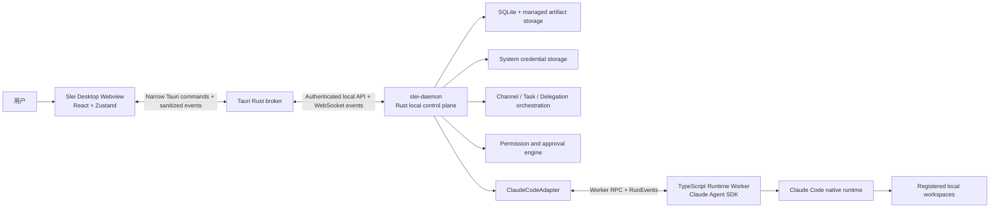
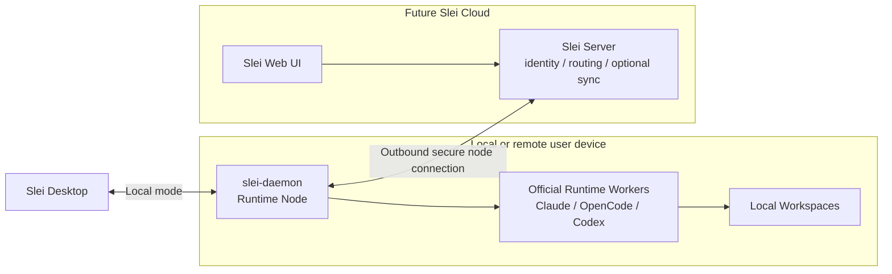
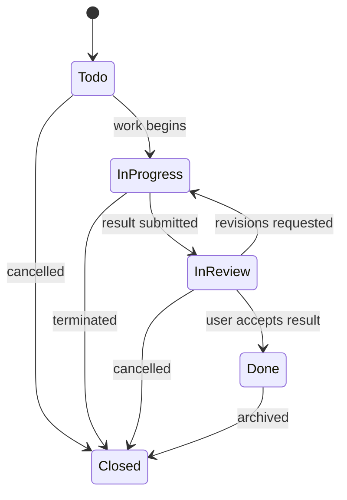
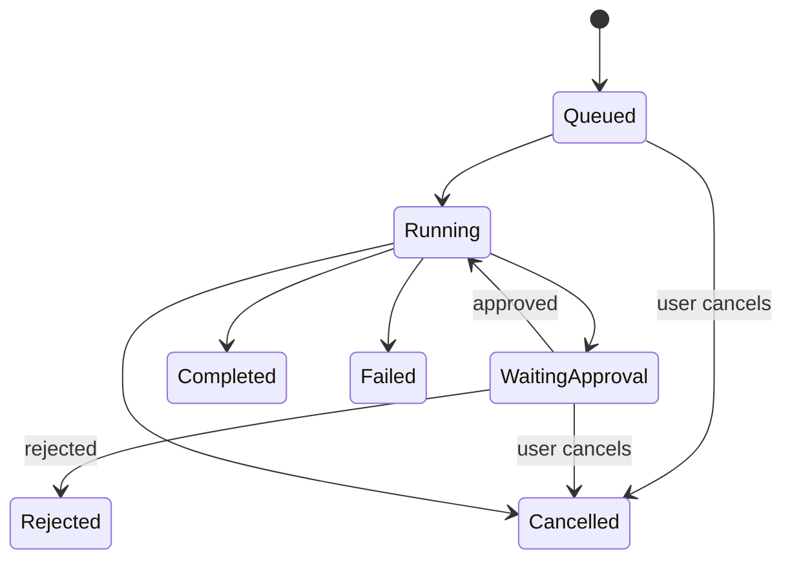
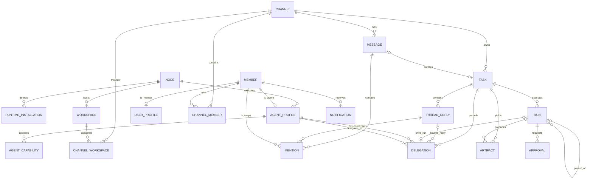
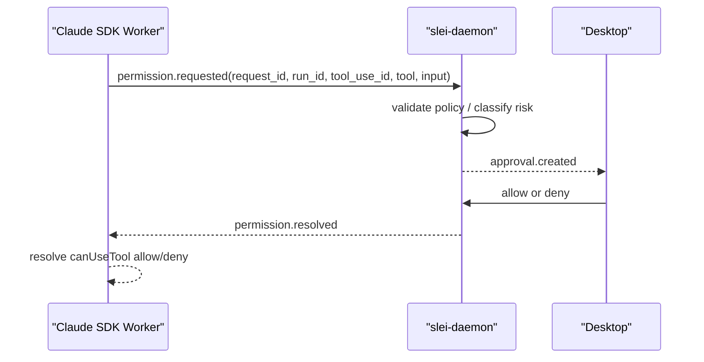

# Slei Product Architecture and MVP Module Plan

- Status: Design approved for documentation
- Date: 2026-05-27
- Product: Slei
- MVP priority: Local-first desktop agent team workspace
- Future direction: Cloud/Web UI connected to independently deployed runtime nodes

## 1. Product Summary

Slei is a local-first desktop product for collaborating with a team of local AI
agents through an IM-like interface. Users work in channels, create trackable
tasks, continue focused discussions in task threads, approve risky agent
actions, and inspect resulting artifacts. Agents run through an independent
local daemon, initially using a Claude Agent SDK-backed worker as the first
runtime adapter.

Slei is not a chat wrapper around a command-line agent. It is a visible,
controllable, recoverable local control plane for agent collaboration:

- Every task transfer between agents is public through `@mention`.
- Every risky execution action can be approved or denied by the user.
- Every non-deleted message, task thread, execution record, approval and
  artifact is persisted locally in the MVP; a deleted human message retains
  only its tombstone metadata.
- The daemon is architected as an independent execution node so that it can
  later connect to a cloud server and support a remote Web UI.

## 2. Confirmed Product Decisions

| Topic | Decision |
| --- | --- |
| Product name | `Slei` |
| Desktop technology | Tauri v2 desktop application with React and TypeScript UI |
| Runtime process | Independent Rust `slei-daemon` executable |
| Claude adapter deployment | Daemon-managed TypeScript SDK Worker sidecar; MVP packaging must bundle a verified JavaScript runtime/worker artifact strategy |
| Frontend stack | Vite + React + TypeScript; Zustand (UI state) + TanStack Query (server state); shadcn/ui components; Tailwind CSS |
| Daemon stack | Rust with Tokio async runtime; Axum HTTP framework; sqlx + SQLite; WebSocket via axum/tokio-tungstenite |
| Local IPC | Tauri Rust connection broker communicates with daemon over authenticated loopback HTTP/WebSocket; React Webview receives narrow IPC commands/events only and never receives daemon credentials |
| MVP target platform | macOS (primary); Windows and Linux deferred post-MVP |
| MVP runtime | Claude Code through `@anthropic-ai/claude-agent-sdk` only |
| Runtime integration strategy | Rust daemon owns Slei domain policy; runtime-specific TypeScript workers use official SDK/server protocols where available |
| Post-MVP runtime order | OpenCode through `@opencode-ai/sdk` first; native Codex after an approval-control spike using `codex app-server` / `@openai/codex-sdk` |
| MVP execution mode | Fully local, single-user, local daemon |
| Future connection mode | Optional cloud/Web UI controlling connected daemon nodes |
| Primary collaboration unit | Channel, not project |
| Channel workspace model | A channel may mount zero, one or multiple local workspaces |
| Agent workspace permissions | Channel permissions are shared by default; individual agents may be restricted |
| Normal response rule | Each channel has a primary agent for messages without explicit mention |
| Agent delegation | Only visible `@agent` delegation; no hidden agent-to-agent dispatch |
| Human interaction | User is a mentionable human member with stable `@handle` |
| Permission experience | Default permission presets with explicit high-risk approval |
| Persistence | Messages, threads, execution history, approvals and artifact indexes saved locally; deleted human message bodies are permanently removed from Slei storage and any runtime-context material, leaving only tombstones |
| Task model | A task owns a dedicated reply thread and lifecycle separate from ordinary chat |
| Task management | Global Tasks menu includes Board and List views |
| Languages | MVP fully supports Simplified Chinese and English; Chinese is default |
| npm distribution | Not delivered in MVP; future npm launcher invokes/downloads Rust daemon |
| Message display style | Flat inline layout — no chat bubbles; all messages (human, agent, system) share the same document-like flow with sender identity shown inline |
| Agent streaming display | Text streams in place in the flat layout; tool calls appear as collapsible inline blocks, collapsed by default |
| Create as Task | Checkbox toggle inside the composer; when checked, sending creates a Task and opens its thread instead of posting a plain message |
| Visual design style | Neo-Brutalism: thick solid borders, hard offset shadows, flat high-contrast fills, strong typography, minimal gradients; primary palette of black/white with 1–2 accent colors; border weight varies by hierarchy (heavy for panel/card containers, lighter for intra-content dividers) |

## 3. Product Vocabulary

The Chinese UI should use clear product terms instead of exposing lower-level
runtime language unnecessarily.

| Domain entity | Simplified Chinese UI | English UI | Meaning |
| --- | --- | --- | --- |
| `Channel` | 频道 | Channel | A public collaboration space for chat and tasks |
| `Workspace` | 工作区 | Workspace | A locally registered directory mounted to channels |
| `Member` | 成员 | Member | A human or agent participating in Slei |
| `Agent` | Agent / 智能成员 | Agent | A runtime-backed collaborative member |
| `Task` | 任务 | Task | A tracked objective with a focused discussion thread |
| `ThreadReply` | 任务回复 | Task Reply | A reply within a task discussion |
| `Run` | 执行记录 | Run | One runtime execution by one agent |
| `Delegation` | 任务流转 | Delegation | A visible `@agent` task transfer |
| `Approval` | 审批 | Approval | A user's risk-sensitive execution decision |
| `Artifact` | 产物 | Artifact | An attachment, patch, output file or result reference |
| `Node` | 运行节点 | Runtime Node | A computer running `slei-daemon` |
| `Runtime` | 运行时 | Runtime | The agent execution engine, initially Claude Code via Agent SDK |

## 4. System Architecture

### 4.1 MVP Local Architecture



Desktop is the interaction client. Its Rust broker owns local daemon
discovery/authentication and gives the Webview only typed commands and
sanitized events; JavaScript never receives the local bearer token or a direct
daemon socket. The daemon owns channels, tasks, executions, approvals, events,
persistence and runtime communication. Desktop may close and reconnect without
losing the daemon's saved state.

### 4.2 Future Connected Node Architecture



The MVP does not implement cloud registration, npm distribution or remote
control. It does establish boundaries that avoid making the daemon a desktop
implementation detail.

The Claude adapter choice introduces an internal Worker sidecar: the daemon
remains the single Slei control-plane authority, but a distribution that wants
Claude execution must also carry a tested way to launch the TypeScript SDK
Worker. P0 must choose and validate either a bundled JavaScript runtime plus
worker bundle, or a compiled worker artifact supported by the SDK; this cannot
be deferred to release packaging.

### 4.3 Future Daemon Distribution

The daemon core remains a Rust executable. A later npm launcher may provide a
simple node deployment experience without rewriting runtime control in Node.js:

```bash
npx @slei-ai/daemon@latest connect \
  --server-url https://api.example.com \
  --pair-code ABCD-EFGH \
  --name "office-mac"
```

The npm package would resolve the platform binary, verify/download it, and
launch the Rust daemon. Long-lived device credentials should use system secure
storage; permanent secrets should not be encouraged in shell history.
The server URL above is illustrative only; a production endpoint is not
selected as part of the MVP design.

## 5. Information Architecture and UI Scope

### 5.0 Layout Model

All pages share a three-column shell:

```
┌──────────┬──────────────────────┬──────────────────────┐
│ Nav      │  Main Content        │  Right Detail Panel  │
│ Sidebar  │                      │  (on demand)         │
│          │  Channel Timeline,   │                      │
│ • Chat   │  Task Board,         │  Task Thread,        │
│ • Tasks  │  Members list,       │  Member Detail,      │
│ • Mbrs   │  Computers,          │  Run Detail, etc.    │
│ • Comp   │  Settings…           │                      │
│ • Set    │                      │                      │
│          │                      │                      │
│ #chan-1  │  [flat message flow] │  [opens on click]    │
│ #chan-2  │  ________________    │  ________________    │
│          │  [Composer]          │  [Reply Composer]    │
└───────────────────────┴──────────────────────┘
```

- **Nav Sidebar**: fixed width; top section for primary nav (Chat / Tasks /
  Members / Computers / Settings), bottom section for channel list when in Chat.
- **Main Content**: adapts to the selected primary nav item; always visible.
- **Right Detail Panel**: slides open on demand (clicking a task card, a member,
  a run, etc.); can be closed without leaving the current main view. When no
  detail is open the main content area fills the full width.
- **Visual style**: Neo-Brutalism — thick solid borders, hard offset box-shadows,
  flat high-contrast fills, strong typography. Primary palette is black/white
  with 1–2 product accent colors. Border weight follows hierarchy: heavy borders
  for panel and card containers; lighter rules for intra-content dividers.
  shadcn/ui Neo-Brutalism theme variant used as the component baseline.


| Menu | Purpose | MVP scope |
| --- | --- | --- |
| 会话 / Chat | Channels, ordinary chat, task cards and task thread collaboration | Full |
| 任务 / Tasks | Cross-channel board/list for task status and user attention | Full |
| 成员 / Members | Human/agent identities, agent runtime, permissions and activity | Full |
| 运行节点 / Computers | Local daemon health, runtime detection and workspace registry | Local node full |
| 设置 / Settings | User profile, language, notifications, security and diagnostics | Essential full |

### 5.2 Chat Area

The Chat area is the public channel timeline. It shows short conversation,
system events, visible delegations, and task cards without forcing every deep
task discussion into the shared timeline.

| Feature | MVP behavior |
| --- | --- |
| Channel sidebar | Search/activity entry points, channel list, create/edit/switch |
| Channel header | Name, description, mounted workspace summary, members and settings |
| Channel tabs | `CHAT`, channel-scoped `TASKS`, channel-scoped `FILES` |
| Timeline | Flat inline layout — no bubbles; human messages, agent messages and system events share a continuous document-like flow; sender identity (avatar + name) shown at the start of each entry |
| Agent streaming | Text streams in place inline; tool calls appear as collapsible blocks within the message, collapsed by default; a subtle "working" indicator appears while streaming has not yet produced output |
| Interactive card | Agent-proposed action (e.g., create channel, add member) shown as a card; user clicks to open a detail Modal with editable pre-populated fields, then confirms or dismisses; card reflects outcome state |
| Composer | Text input, attachments, mention autocomplete (`@` triggers a picker showing agents and the human user), and an **「As Task / 创建为任务」checkbox toggle**: when checked, sending creates a Task and opens its thread instead of posting a plain channel message |
| Ordinary message | Primary agent responds unless an agent is explicitly mentioned |
| Task card | Title, status, assignee, reply count, artifact indicators and attention badge |
| Stream feedback | Processing, waiting approval, failure, cancellation and completion |

### 5.3 Task Thread

A Task is a first-class discussion and delivery container, not an execution
list item. The thread appears in a right-side panel from Chat or Tasks.

| Feature | MVP behavior |
| --- | --- |
| Creation | User checks the **「As Task」toggle** in the composer before sending; the message becomes the task root and its thread opens immediately |
| Side panel | Opens the complete focused discussion while retaining channel context |
| Replies | User and agents reply in the same task context |
| Mentions | `@agent` dispatches visible collaboration; `@human` requests user action |
| Execution updates | Agent processing, approvals and results appear in context |
| Interactive cards | Agent-proposed structured actions within the task context; same click-to-Modal confirmation flow as channel timeline |
| Artifacts | Attachments, patches and generated outputs remain associated with the task |
| Channel link | `在渠道中查看 / View in channel` locates the task root card |
| Summary | Completed result and important state updates are reflected on the channel card |
| Stop control | While a Run is active in this task, a「停止 / Stop」button appears in the reply composer area |

### 5.3a Channel FILES Tab

The FILES tab in a channel aggregates all artifacts produced by tasks in that channel.

| Feature | MVP behavior |
| --- | --- |
| Grouping | Artifacts grouped by originating task; tasks in reverse creation order |
| Item | File-type icon + filename (truncated) + file size + timestamp + producer agent avatar + task link |
| Sort | Most recent artifact first within each task group |
| Open | Click filename → artifact viewing behavior (see §7.0 Artifact Viewing) |
| Empty state | Empty State component: paperclip icon, "没有产物", subtitle explaining when artifacts appear |
| No search | Full-text artifact search is deferred to P2 |

### 5.4 Tasks Status Board

Tasks is a first-level menu, aggregating tasks across channels. It is the
control surface for delivery progress; the thread remains the content surface.

| Feature | MVP behavior |
| --- | --- |
| Views | Board and List |
| Filters | Channel, creator and assignee |
| Columns | 待处理, 进行中, 待审查, 已完成, 已关闭 |
| Cards | Channel, task number, title/summary, status, assignee and attention markers |
| Opening | A card opens its task thread/detail panel |
| Status change | Menu action required; drag-and-drop recommended if delivery permits |
| Attention | Waiting for your reply, confirmation, approval, or mentioned you |

### 5.5 Members Area

Members represents both agents and humans. In the MVP there is one human user,
while the data model allows future shared channels.

| Feature | MVP behavior |
| --- | --- |
| Member groups | Agents and Humans |
| Human identity | Current user's avatar, nickname, stable handle and status |
| Agent profile | Display name, avatar, description, node, runtime and model config |
| Agent permissions | Defaults, channel/workspace overrides and approval policy |
| Agent activity | Task delegations, executions and approval records |
| Skills/Commands | Read-only discovery and display for Claude Code capabilities |
| Later-only tabs | Graph, reminders, apps and rich Agent DMs are not MVP-critical |

### 5.6 Computers / Runtime Nodes Area

This page is called `运行节点 / Computers`, rather than only runtime
management, because its long-term responsibility includes independent remote
daemon nodes.

| Feature | MVP behavior |
| --- | --- |
| Node list | Show the local machine; model supports multiple future nodes |
| Node details | Name, host, OS/architecture, daemon version and connection state |
| Runtime detection | Detect Claude runtime worker/native runtime readiness, authentication and availability |
| Runtime placeholders | Other runtimes may be visible as unsupported/not installed only if useful |
| Hosted agents | List agents executed on this node |
| Workspaces | User explicitly selects and registers accessible local directories |
| Diagnostics | Health checks, adapter errors, connection/version guidance and log summary |

### 5.7 Settings and Human Identity

The user is a formal member whom agents may visibly mention in a task or chat.

| Section | MVP behavior |
| --- | --- |
| Profile | Avatar, nickname, stable unique `@handle`, bio and optional role title |
| Locale | Default `zh-CN`, switchable `en-US`, persisted across restarts |
| Notifications | Mention, waiting approval and task attention preferences |
| Security | Local credentials/data location and approval preference entry points |
| Diagnostics | Daemon/node and basic troubleshooting links |

Nickname and handle are separate. A user can change their display name without
breaking historical mentions because references use stable member IDs and
handles. **The `@handle` is immutable once set during onboarding**; only the
nickname (display name) can be changed afterward.

## 6. Core Product Behavior

### 6.1 Channel and Workspace Rules

- A channel may have no workspaces, supporting ordinary conversation.
- A channel may mount multiple registered local workspaces.
- Agents in a channel inherit the channel's mounted workspace access by
  default.
- Per-agent overrides may restrict accessible workspaces and capabilities.
- A workspace must be explicitly registered before it can be mounted or used.

### 6.2 Mention and Delegation Rules

| Mention target | Behavior |
| --- | --- |
| No explicit mention in channel chat | Run the channel primary agent |
| User explicitly mentions an agent | Run the selected agent visibly |
| Agent requests another agent in a task thread | Agent uses the typed `slei_request_visible_delegation` MCP tool; daemon first publishes a visible `@agent` delegation record, then creates the child execution |
| Agent asks the human user | Agent uses the typed `slei_request_human_reply` MCP tool; daemon displays the question, notifies the user and flags the task if action is needed |
| Runtime requests permission through its adapter | Adapter forwards the permission request to the daemon; the daemon generates a formal Approval object and the run is paused until the user decides |

Agents must not silently delegate tasks. Complex agent-to-agent work should
occur inside a Task Thread, where users can follow handoffs and results.

An agent expressing intent to do something risky in plain text does **not**
grant permission. For the MVP, the Claude SDK Worker's `canUseTool` callback
forwards permission-sensitive actions to the Daemon and waits for its formal
Approval decision. The Approval object is system-generated, not
agent-generated.

### 6.3 Task State and Attention

Task status represents delivery progress:



Translated values:

| Internal value | `zh-CN` | `en-US` |
| --- | --- | --- |
| `todo` | 待处理 | Todo |
| `in_progress` | 进行中 | In Progress |
| `in_review` | 待审查 | In Review |
| `done` | 已完成 | Done |
| `closed` | 已关闭 | Closed |

Attention is not an extra status column. It identifies required user actions:

| Attention type | Meaning |
| --- | --- |
| `awaiting_human_reply` | Agent asked the user for additional information |
| `awaiting_confirmation` | A submitted result needs user acceptance |
| `awaiting_approval` | A high-risk action needs formal approval |
| `mentioned_user` | User was mentioned without blocking progress |

### 6.5 Agent-Driven Interactive Cards

An agent may propose a structured action — such as creating a Channel or adding
a Member — as an interactive card in the conversation timeline or task thread.

| Step | Behavior |
| --- | --- |
| Agent proposes | Calls the registered Slei SDK MCP tool `slei_propose_interactive_card` with a typed action payload; the daemon validates it and persists a message/reply of kind `interactive_card` |
| Card displayed | Desktop renders a compact card showing the action summary and a confirmation button; card state is `pending` |
| User clicks | A Modal opens showing the full editable field set pre-populated with agent defaults |
| User confirms | Daemon executes the action (e.g., creates Channel or Member) and updates card state to `confirmed` |
| User dismisses | No action is taken; card state updates to `dismissed` |
| Card outcome | The card in the timeline/thread reflects the final state and any created entity link |

Interactive cards are agent-initiated **proposals**, not automatic executions.
The user edits fields and controls the final outcome. Cards are distinct from
the security `Approval` flow: approvals gate risky runtime actions; interactive
cards guide deliberate creation workflows.
Free-form generated text is never parsed into an executable card action.

The Guide Agent (`引导员`) uses interactive cards during the initial onboarding
conversation to help users create their first channels and agents, using the
Claude Agent SDK runtime's configured default model for any created agent.

### 6.4 Execution Records (`Run`)

A Run is one daemon-managed execution of one agent against its runtime. It is
not a user-created item and should usually appear in Chinese UI as `执行记录`.

Examples:

- A casual message triggers one primary-agent Run without a Task.
- One Task may contain analysis, delegated research, implementation and review
  Runs by different agents.
- Runs own execution statuses, approvals and artifacts; Tasks own the overall
  collaborative objective and discussion.



## 7. Domain Data Plan

### 7.0 Additional Behavior Rules

#### Message Lifecycle

| Rule | Detail |
|------|--------|
| Human message edit | A human user may edit their own plain-text messages. Edited messages show an `已编辑 / edited` label with the last-edit timestamp. Edit history is not exposed in MVP. Agent messages are **immutable** — they cannot be edited or deleted by the user. |
| Human message delete | A human user may delete their own messages. Deleted messages are replaced with a「消息已删除 / Message deleted」tombstone in the timeline; the original message content is permanently removed and is not retained for audit, recovery, runtime session replay or future context reconstruction. Deletion of a root message that created a Task is blocked while the task is active; user must close the task first. Related task, approval, artifact and run records may retain independently authored content, but must not retain a copied original message body solely for replay or audit. |
| Agent message delete | Not permitted in MVP. |

#### Agent Status

An agent's presence status is derived from its active Runs, not manually set.

| Status | Condition |
|--------|-----------|
| 🟢 在线 / Online | Agent has no active Runs and its Claude runtime adapter is detected as available on its node |
| 🟡 运行中 / Busy | Agent has one or more Runs in `Running` or `WaitingApproval` state |
| ⚪ 离线 / Offline | Agent's node is disconnected or its Claude runtime adapter is not available |

#### Artifact Viewing and Access

| Action | Behavior |
|--------|---------|
| View artifact in thread | Artifact links appear as inline chips in task replies: file-type icon + filename + size. Click to open. |
| Open file | Small text/code files (< 500 KB): open in a built-in read-only viewer panel (right panel). Binary or large files: a narrow Tauri Rust command validates a daemon-issued artifact token, then asks the OS to open the managed artifact; Webview never invokes general shell open. |
| Patch / diff artifact | Rendered as a diff view in the right panel (unified diff, additions green bg, deletions red bg). |
| Download | Secondary action on artifact chip; saves to user's Downloads folder. |
| Artifact in Files tab | Channel FILES tab shows all artifacts grouped by originating task, in reverse chronological order. Shows filename, task link, producer agent, timestamp. |

#### Notification Delivery

| Channel | MVP behavior |
|---------|-------------|
| In-app badge | Bell icon in Nav Sidebar shows unread count badge. Notification list (§4.26 in design system) accessible from bell icon. |
| macOS system notification | Sent for: `awaiting_approval` (always), `awaiting_human_reply` and `mentioned_user` (user-configurable in Settings → Notifications). Requires Tauri `notification` permission. |
| Sound | Off by default; user can enable a subtle ping in Settings. |


### 7.1 Core Entities

| Entity | Responsibility | Key data |
| --- | --- | --- |
| `Node` | A daemon-hosting computer | Stable ID, name, OS, architecture, version, status, mode |
| `RuntimeInstallation` | Installed runtime capability | Node, kind, executable, version, auth/availability |
| `Workspace` | User-registered local directory | Node, display name, path, availability, metadata |
| `UserProfile` | Current local human identity | Member ID, nickname, immutable handle (set at onboarding), avatar, locale, timezone |
| `Member` | Common human/agent identity | Type, display name, stable handle, avatar, status |
| `AgentProfile` | Runtime-backed member settings | Node, runtime, model config, role, permission preset |
| `AgentCapability` | Detected skill or command | Agent, type, name, source, description |
| `Channel` | Shared public conversation scope | Name, description, primary agent, visibility |
| `ChannelWorkspace` | Mounted workspace policy | Channel, workspace, default permission |
| `ChannelMember` | Channel membership and override | Channel, member, role, workspace/permission override |
| `Message` | Public timeline record | Channel, author, kind (`text` \| `system_event` \| `interactive_card`), content/payload, timestamps |
| `Mention` | Reference to a member | Source message/reply, target member, target type, read state |
| `Task` | Tracked objective | Channel, root message, title, status, assignee, attention |
| `ThreadReply` | Task discussion record | Task, author, content/payload, reply_kind (`text` \| `execution_update` \| `delegation_record` \| `approval_request` \| `artifact_link` \| `system_event` \| `interactive_card`), timestamps |
| `Run` | One agent execution | Trigger, agent, runtime, task, parent run, status |
| `Delegation` | Visible handoff | Task, source/target agents, source reply, child run |
| `Approval` | Risk decision | Run, action, risk, status, decision user and timestamps |
| `Artifact` | Output index | Task/run/reply, kind, managed location, hash and metadata |
| `Notification` | Human attention item | User, cause, linked context, read state |
| `EventLog` | Replayable change stream | Sequence, event type, entity, payload, persisted timestamp |

### 7.2 Key Relationships



### 7.3 Local Persistence and Sync Eligibility

| Data | MVP storage | Future sync default |
| --- | --- | --- |
| Channels, members and task status | Local SQLite | Eligible when user opts in |
| Chat and task thread content | Local SQLite | Eligible only with explicit user setting |
| Task/execution summaries and delegation links | Local SQLite | Selectively eligible |
| Complete tool output | Local storage | Local-only by default |
| Workspace absolute paths | Local SQLite | Never sync raw path by default |
| File contents and patches | Managed local artifacts | Local-only unless explicitly shared |
| Credentials/environment secrets | System credential store | Never plaintext sync |
| Approvals | Local audit store | Optional audit summary later |

## 8. Daemon and Protocol Plan

### 8.1 Daemon Responsibilities

- Maintain the authoritative domain state and persistence layer.
- Expose a versioned local query/command API and event stream.
- Start, monitor, cancel and recover runtime-backed executions.
- Validate workspace and permission policy before execution.
- Pause risky activity until explicit approval is resolved.
- Store node identity and later support outbound cloud registration without
  changing Desktop-facing domain models.

### 8.2 Local Protocol

MVP protocol recommendation:

- Local HTTP API for commands, mutations, detail reads and pagination, consumed
  by the trusted Tauri Rust broker rather than Webview JavaScript.
- WebSocket event stream between daemon and broker for real-time updates and
  reconnect replay; broker emits typed sanitized events into the Webview.
- Per-install local authentication token accessible only to daemon and broker.
- Protocol handshake that rejects incompatible Desktop/daemon versions.
- Monotonic `EventLog.sequence` allowing Desktop to request missed updates.
- Mutation requests include an idempotency key so reconnect/retry does not
  duplicate messages, tasks, cards, approvals or run initiation.

**Daemon port and auth token:**

| Item | Specification |
|------|--------------|
| Port | Ephemeral loopback port selected by daemon at launch; daemon publishes an owner-readable runtime descriptor for the native broker. A diagnostic `--port` override is allowed only for development/tests. |
| Bind address | `127.0.0.1` only (never `0.0.0.0` in MVP) |
| Runtime descriptor | Owner-only `0600` file containing port, instance identity and protocol version, but never credentials; replaced atomically on every daemon start |
| Auth token | 32-byte random secret stored behind the native credential/token-store abstraction; only daemon and Tauri Rust broker may load it, never React/Webview code |
| Token rotation | Rotated when credential state is reset; no token is placed in URL, WebSocket subprotocol, browser storage or logs |

**Daemon auto-start:**
The Tauri Rust broker reads the runtime descriptor, proves daemon identity
through the authenticated handshake, and attempts to launch the daemon binary
if no valid instance is available. If the binary is not found, Desktop shows a
"Daemon not found" state with a help link instead of failing silently. The MVP
does not claim protection from other malicious processes already running as the
same OS user; it does prevent Webview content from receiving control-plane
credentials.

| API domain | Responsibilities |
| --- | --- |
| `/system` | Health, protocol version, diagnostics and log summary |
| `/nodes` | Local node details, runtime detection and workspace registry |
| `/workspaces` | Explicit workspace registration, removal, availability and channel mount policy |
| `/agents` | Profile, capability scan, permissions and activity |
| `/channels` | CRUD, members, workspace mounts and timeline messages |
| `/tasks` | CRUD, filters, status transitions, attention and replies |
| `/runs` | Execution initiation, cancellation, details and relationships |
| `/delegations` | Delegation records, handoff chain and source/child run links |
| `/approvals` | Pending requests and user decisions |
| `/artifacts` | Upload, metadata, guarded access and task links |
| `/notifications` | User notification list, unread counts and mark-read operations |
| `/settings` | User profile, locale, notification and local preferences |

### 8.3 Realtime Events

Events are machine-coded and localized by Desktop. The daemon must not send
hard-coded final UI prose for user-visible system behavior.

| Event | UI impact |
| --- | --- |
| `node.status_changed` | Connection/health indicators |
| `runtime.detected` | Computers runtime tags and validation results |
| `agent.created`, `agent.updated` | Members updates |
| `channel.updated`, `message.created` | Chat timeline updates |
| `message.card_submitted`, `message.card_dismissed` | Interactive card state and outcome update in timeline/thread |
| `task.created`, `task.status_changed`, `task.attention_changed` | Cards and Tasks board |
| `thread.reply_created` | Task panel update and unread counts |
| `run.started`, `run.output_delta`, `run.completed`, `run.failed` | Processing feedback |
| `run.waiting_approval`, `approval.resolved` | Approval card lifecycle |
| `delegation.created` | Visible task transfer card/timeline update |
| `artifact.created` | Files and thread result links |
| `notification.created` | User badges and activity notifications |

### 8.4 Error Taxonomy and Recovery

All errors propagate as machine codes. Desktop localizes them; the daemon never
sends user-facing prose.

#### 8.4.1 Error Code Taxonomy

| Code range | Domain | Examples |
|-----------|--------|---------|
| `E1xx` | Daemon system | `E101` port conflict, `E102` single-instance lock failed, `E103` database open failed, `E104` storage quota exceeded, `E105` data directory inaccessible |
| `E2xx` | Protocol / connectivity | `E201` protocol version mismatch, `E202` auth token invalid, `E203` WebSocket disconnected, `E204` Desktop reconnect failed |
| `E3xx` | Runtime / adapter | `E301` runtime not found, `E302` runtime version below minimum, `E303` runtime not authenticated, `E304` runtime process crashed mid-run, `E305` runtime output parse failure, `E306` run timeout exceeded |
| `E4xx` | Permission / workspace | `E401` workspace not registered, `E402` workspace not mounted on channel, `E403` permission preset violation, `E404` approval timeout (user did not respond within limit) |
| `E5xx` | Orchestration | `E501` delegation depth exceeded, `E502` cyclic delegation detected, `E503` agent offline or unavailable, `E504` primary agent not set on channel |
| `E6xx` | User / validation | `E601` validation failed (invalid field), `E602` handle already taken, `E603` invalid mention target, `E604` task root message deletion blocked |

#### 8.4.2 Retry and Recovery Policies

| Failure scenario | Automatic action | User-visible result |
|-----------------|-----------------|-------------------|
| Daemon not found on startup | Desktop auto-launches daemon binary (1 attempt); if fails, show E101/E102 error state | "Daemon 未启动" with relaunch button |
| Explicit diagnostic `--port` already in use | Daemon refuses to start → E101 | Computers page shows port conflict diagnostic |
| WebSocket disconnected | Desktop retries with exponential backoff: 1s → 2s → 4s → 8s → 16s (max 5 attempts); then shows degraded mode banner | "连接已断开，正在重连…" banner; reconnect restores from `EventLog.sequence` |
| WebSocket reconnected | Desktop sends last known `sequence` to daemon; daemon replays missed events | Seamless catch-up; no manual refresh needed |
| Runtime process crash mid-run | Adapter detects process exit; daemon sets Run → `Failed` with `E304`; sends `run.failed` event | Thread shows "执行中断" with error detail and retry button |
| Run exceeds timeout | Daemon force-cancels after **10 minutes** of no output delta; sets Run → `Cancelled` with `E306` | Thread shows "执行超时" |
| Approval timeout | After **30 minutes** of no user decision, daemon auto-rejects with `E404`; sets Run → `Rejected` | Approval card shows "已超时自动拒绝" |
| SQLite write failure | Daemon retries once; if fails, emits `daemon.storage_error` event; does not crash | Computers diagnostics shows storage error badge |
| Duplicate daemon instance | Second instance detects existing lock/port, exits immediately; first instance continues | No user impact |

#### 8.4.3 Non-Retryable Errors

The following errors require user action and are not auto-retried:
`E302` (runtime version too old), `E303` (not authenticated), `E401` (workspace not registered), `E403` (permission violation).
These always surface with a specific localized message and a direct action link (e.g., "前往运行节点页面").


## 9. Runtime and Security Plan

### 9.1 Claude Agent SDK Adapter

The MVP implements one fully functional adapter rather than shallow support for
multiple runtimes. `slei-daemon` remains the authoritative Rust control plane;
a private TypeScript Runtime Worker hosts the official
`@anthropic-ai/claude-agent-sdk` integration and maps SDK interactions into
Slei's runtime-neutral protocol.

| Capability | MVP requirement |
| --- | --- |
| Detection | Verify the Worker package/native Claude runtime can start and report readiness |
| Availability | Validate authenticated runtime state before creating a Run |
| Invocation | Build SDK query input from agent, channel/task, session and mounted workspaces |
| Streaming | Map typed SDK messages and partial output into Slei `RunEvent`s |
| Cancellation | Abort an active SDK query and record the terminal run state |
| Errors | Map worker/SDK/native runtime failures to localizable error codes |
| Permission bridge | Use the SDK `canUseTool` callback to suspend risky actions until daemon Approval resolves |
| Session continuity | Rebuild each Claude request from Slei-owned undeleted visible context; do not persist Claude SDK transcripts in MVP |
| Capability display | Discover allowed workspace-local Claude configuration/capability metadata read-only |

#### 9.1.1 Worker and Invocation Contract

The Rust adapter communicates with the local TypeScript Worker through a
versioned private protocol. The Worker uses the SDK conceptually as follows:

```ts
query({
  prompt: run.prompt,
  options: {
    cwd: run.primaryWorkspaceOrConversationDir,
    additionalDirectories: run.additionalWorkspaces,
    persistSession: false,
    settingSources: [],
    permissionMode: "default",
    mcpServers: { slei: sleiMcpServer },
    disallowedTools: ["Agent", "Task", "WebFetch", "WebSearch"],
    canUseTool: (toolName, input, context) =>
      bridgePermissionToDaemon(run.id, toolName, input, context),
  },
});
```

| Agent/run input | SDK Worker responsibility |
| --- | --- |
| Primary mounted workspace | Set as SDK `cwd` only after daemon authorization |
| Additional mounted workspaces | Pass only daemon-authorized paths through `additionalDirectories` |
| Zero-workspace casual channel | Use a daemon-managed empty conversation directory and disable filesystem mutation and shell execution |
| Role/model/config | Translate only supported `AgentProfile` settings into SDK options |
| Existing conversation/task | Assemble prompt context from current Slei timeline/thread records after tombstone filtering; no deleted message enters a later request |

The Worker must not independently make Slei domain decisions: it cannot add a
workspace mount, alter an agent permission preset, create a Task or finalize an
Approval. Those remain daemon commands.

For MVP the Worker uses an explicit isolated SDK profile:

- `persistSession: false`; Claude transcript/session files are not a recovery
  store and native SDK resume is disabled.
- `settingSources: []`; user/project/local Claude settings are not loaded.
- Native subagents and arbitrary plugins/external MCP servers are disabled.
  Only versioned, in-process Slei MCP tools are registered:
  `slei_propose_interactive_card`, `slei_request_visible_delegation` and
  `slei_request_human_reply`.
- `allowedTools`, `disallowedTools`, `permissionMode` and SDK sandbox settings
  are fixed per Slei permission preset; any tool capable of mutation or shell
  execution must deny or arrive at `canUseTool` before execution.

#### 9.1.2 Permission and Approval Bridge

For Claude in MVP, the permission bridge is an SDK callback, not a CLI
executable hook:



The Worker configures SDK tool permissions so operations requiring Slei review
reach `canUseTool`; the daemon then applies workspace and risk policy before
presenting or automatically denying the request. The Wave 1 gate must prove
there is no configuration path in which a prohibited write, shell or external
path operation proceeds without this bridge.

#### 9.1.3 Streaming and Runtime Sessions

| Concern | MVP contract |
| --- | --- |
| Streaming output | Worker maps SDK typed messages/partial text to `OutputDelta`, tool lifecycle and terminal `RunEvent`s |
| Context key for channel chat | One Slei-owned context scope per `(channel_id, agent_id)` assembled from undeleted persisted records |
| Context key for task work | One Slei-owned context scope per `(task_id, agent_id)` assembled from undeleted persisted records |
| Visible delegation | A delegated agent receives a newly assembled task context only after a visible Slei delegation record; it never inherits hidden SDK state |
| Persistence | Daemon persists run/message/task records, not Claude SDK transcript files or resume tokens; Claude MVP advertises `resumable_session: false` |
| Delete propagation | After a human deletion, a later reconstructed context and every persisted worker/daemon artifact must not contain the deleted original body |
| Restart behavior | New runs reconstruct context from Slei records; an interrupted in-flight run becomes failed/cancelled rather than natively resumed |

#### 9.1.4 MVP Gates and Risks

| Risk | Impact | Mitigation / gate |
| --- | --- | --- |
| SDK permission configuration fails to route a prohibited operation through `canUseTool` | Critical | Wave 1 spike verifies read/edit/controlled presets and external-path denial before approval UI is considered complete |
| Native runtime, SDK package or user configuration changes behavior | High | Pin/test supported SDK and native runtime combinations; surface adapter diagnostics and E302/E305 failures |
| Auth expiry or worker crash mid-run | Medium | Worker emits mapped failure; daemon persists Run failure and restart/retry guidance |
| Reconstructed context differs from native Claude session continuation | Medium | Accept this MVP trade-off to honor irreversible deletion; clearly show that interrupted in-flight work cannot resume |

Adapter code does not decide channel business rules or task delegation. Those
belong to the daemon orchestration and permission domains.

### 9.2 Permissions and Approvals

| Layer | MVP rule |
| --- | --- |
| Workspace registration | Only explicitly selected directories can be mounted |
| Channel mount | Channels may expose registered workspaces to their agents |
| Default access | Channel agents inherit shared mounts by default |
| Agent override | A member can be restricted to a subset or lower capability |
| Permission preset | At minimum support read-only, edit and controlled execution semantics |
| Path traversal | Daemon validates all Slei-issued paths and every tool input exposed through the adapter permission bridge against authorized workspaces; an adapter may claim workspace enforcement only after tests prove prohibited tool actions cannot bypass that bridge (see §9.4.2) |
| High-risk action | Claude SDK Worker forwards a `canUseTool` request to the daemon, which generates a formal Approval object and leaves the callback pending until the user explicitly allows or denies |
| Audit | Approval requester, decision maker, time, action and outcome persist locally |

**Permission preset capability matrix:**

| Capability | Read-only | Edit | Controlled |
|-----------|-----------|------|-----------|
| Read files and directories | ✓ | ✓ | ✓ |
| Write / create files | ✗ | ✓ | ✓ (auto) |
| Delete files | ✗ | ✗ | ✓ (requires Approval) |
| Run shell commands | ✗ | ✗ | ✓ (requires Approval) |
| Network access | ✗ | ✗ | ✓ (requires Approval) |
| Access env / secrets | ✗ | ✗ | ✓ (requires Approval) |

Formal Approval objects are system-generated by the Daemon — they cannot be
bypassed by an agent expressing approval intent in text.

### 9.3 RuntimeAdapter Interface Contract

This interface is the **only contract** between the daemon orchestration layer
and any official SDK, server-protocol or fallback CLI runtime integration.
Adding a runtime requires implementing this interface and capability reporting;
the daemon must not contain provider-specific logic.

Defined in `crates/adapter-api` (shared crate, part of M00):

```rust
/// Unique runtime type discriminant persisted in AgentProfile.
#[derive(Clone, Serialize, Deserialize)]
pub enum RuntimeKind {
    ClaudeCode,
    OpenCode,       // post-MVP, official SDK/server
    Codex,          // post-MVP, app-server/SDK validation required
    Custom(String), // future extensibility
}

/// A discovered installation on a node.
pub struct RuntimeInstallation {
    pub kind:        RuntimeKind,
    pub executable:  Option<PathBuf>, // native runtime or worker, if local
    pub endpoint:    Option<String>,  // local server endpoint, if applicable
    pub version:     semver::Version,
    pub authenticated: bool,
    pub extra:       serde_json::Value, // adapter-specific metadata
}

pub struct RuntimeCapabilities {
    pub streaming:              bool,
    pub resumable_session:      bool,
    pub approvals:              bool,
    pub human_questions:        bool,
    pub workspace_restrictions: bool,
    pub structured_output:      bool,
    pub artifacts:              bool,
}

pub struct RuntimeSession {
    pub id:              Uuid,            // Slei-owned session identity
    pub runtime_kind:    RuntimeKind,
    pub runtime_token:   Option<ProtectedOpaqueToken>, // absent for Claude MVP; future adapters only
    pub channel_id:      Option<Uuid>,
    pub task_id:         Option<Uuid>,
    pub agent_id:        Uuid,
}

/// Input to a single run.
pub struct RunInput {
    pub agent_id:      Uuid,
    pub prompt:        String,           // assembled from channel/task context
    pub system_prompt: Option<String>,   // agent role description
    pub model:         String,           // e.g. "claude-opus-4-5"
    pub workspaces:    Vec<PathBuf>,     // authorized and mounted paths
    pub preset:        PermissionPreset, // ReadOnly | Edit | Controlled
    pub run_id:        Uuid,             // for correlation in approval callbacks
    pub session:       RuntimeSession,  // runtime context continuity binding
}

pub enum SleiProductTool {
    ProposeInteractiveCard,
    RequestVisibleDelegation,
}

/// Events emitted by the adapter into the daemon's run stream.
#[derive(Debug)]
pub enum RunEvent {
    Started,
    OutputDelta    { text: String },
    ToolCallStarted { name: String, input: serde_json::Value },
    ToolCallCompleted { result: serde_json::Value },
    /// Adapter detected a permission-sensitive action.
    /// Daemon intercepts this, creates an Approval object,
    /// then calls RuntimeAdapter::respond_permission().
    PermissionRequest {
        request_id:   Uuid,
        run_id:       Uuid,
        tool_use_id:  String,
        agent_id:     Uuid,
        action:      String,
        description: String,
        risk_level:  RiskLevel,
    },
    HumanQuestionRequested {
        request_id:  Uuid,
        run_id:      Uuid,
        agent_id:    Uuid,
        question:    String,
    },
    ProductToolRequested {
        request_id:  Uuid,
        run_id:      Uuid,
        agent_id:    Uuid,
        tool:        SleiProductTool,
        payload:     serde_json::Value,
    },
    Completed { exit_summary: Option<String> },
    Failed    { code: ErrorCode, detail: String },
    Cancelled,
}

pub trait RuntimeAdapter: Send + Sync {
    fn kind(&self) -> RuntimeKind;

    fn capabilities(&self) -> RuntimeCapabilities;

    /// Detect installation on the local node.
    fn detect(&self) -> Result<RuntimeInstallation, AdapterError>;

    /// Validate that the installation is ready to run (auth, min version, etc.).
    fn validate(&self, inst: &RuntimeInstallation) -> Result<(), AdapterError>;

    fn create_session(&self, input: CreateSessionInput) -> Result<RuntimeSession, AdapterError>;

    /// Optional for runtimes that can resume without violating data policy;
    /// Claude MVP reports unsupported because native transcript persistence is disabled.
    fn resume_session(&self, session: &RuntimeSession) -> Result<(), AdapterError>;

    /// Start a run; returns a stream of RunEvents.
    fn start_run(
        &self,
        inst: &RuntimeInstallation,
        input: RunInput,
    ) -> Result<Pin<Box<dyn Stream<Item = RunEvent> + Send>>, AdapterError>;

    /// Send a permission decision back to a paused run.
    /// Called by the daemon after the user resolves an Approval.
    fn respond_permission(
        &self,
        request_id: Uuid,
        run_id: Uuid,
        decision: PermissionDecision, // Allow | Block
    ) -> Result<(), AdapterError>;

    /// Resolve an active question explicitly presented to the human user.
    fn resolve_human_question(
        &self,
        request_id: Uuid,
        run_id: Uuid,
        answer: String,
    ) -> Result<(), AdapterError>;

    /// Respond after a typed Slei product-tool proposal has been validated and
    /// persisted (for example, a pending card or visible delegation record).
    fn respond_product_tool(
        &self,
        request_id: Uuid,
        run_id: Uuid,
        result: ProductToolResult,
    ) -> Result<(), AdapterError>;

    /// Terminate a running execution.
    fn cancel_run(&self, run_id: Uuid) -> Result<(), AdapterError>;

    /// Scan for agent capabilities (skills, commands).
    /// May return empty Vec if not supported by the runtime.
    fn scan_capabilities(
        &self,
        inst: &RuntimeInstallation,
    ) -> Vec<AgentCapability>;
}
```

**Planned official integrations beyond MVP:**

| Runtime | Planned adapter | Reason / validation gate |
| --- | --- | --- |
| Claude Code | MVP: TypeScript Worker using `@anthropic-ai/claude-agent-sdk` | Direct `canUseTool` approval bridge and typed streaming; SDK transcript persistence/resume disabled for deletion guarantees |
| OpenCode | First post-MVP expansion: `@opencode-ai/sdk` connecting to an OpenCode server | Server/client model, session/events and permission response API closely match Slei; use it to validate multi-runtime abstraction |
| Codex | Subsequent validation: spike `codex app-server` plus `@openai/codex-sdk` | Preserve native Codex identity; prefer app-server if Slei must own command/file approval UI |
| Other runtime | Future: official SDK/server protocol first, CLI parsing only as fallback | No runtime may advertise approvals/workspace restrictions without proving its enforcement path |

The daemon's `RunOrchestrator` only calls methods on `dyn RuntimeAdapter`.
Provider SDK types, event schemas and permission mechanisms remain inside their
adapter/worker implementations.

### 9.4 Security Hardening

This section covers the security requirements that cut across the permission
model, runtime, storage and frontend layers.

#### 9.4.1 Local Data Protection

| Asset | Required file permission | Notes |
|-------|--------------------------|-------|
| Daemon data directory | `0700` (owner rwx only) | Created by daemon on first start |
| Runtime descriptor file | `0600` (owner read/write only) | Contains endpoint/instance metadata only, never bearer credentials |
| Local control token backing store | Native credential/token-store abstraction | Available only to daemon and Tauri Rust broker; never exposed to Webview |
| SQLite database file | `0600` | |
| Artifact storage directory | `0700` | Sub-files `0600` |
| Runtime Worker entrypoint and private IPC credentials | `0700` for worker-owned directory; `0600` for credentials | Local Worker is not a public API endpoint |
| Daemon log directory | `0700` | Log files `0600` |

The daemon verifies these permissions on startup and logs a warning if they
have been relaxed. It does **not** auto-correct permissions (to avoid
surprising the user), but it does surface a `daemon.security_warning` event
that the Computers page displays.

#### 9.4.2 Workspace Boundary Enforcement (Path Traversal)

The daemon validates every file path in `RunInput`, artifact operations and
tool requests delivered through `RuntimeAdapter::PermissionRequest` against
the run's authorized workspace list before Slei authorizes or stores the
operation. A path merely appearing in runtime output is untrusted display data,
not evidence that the daemon mediated the underlying action.

**Enforcement rule:** a resolved absolute path `P` is within workspace `W` if
and only if `P.starts_with(realpath(W))`. Symlinks in `P` are resolved before
comparison (`canonicalize()` in Rust). If `P` is outside all authorized
workspaces, the daemon:

1. Rejects Slei commands immediately, or returns `PermissionDecision::Block`
   for a runtime tool request received before execution.
2. Sets Run → `Failed` with `E403`.
3. Records the attempted path in the audit log with a `boundary_violation` tag.

**No exceptions:** even if the agent uses a `Controlled` preset, an external
path request delivered to the permission bridge is auto-rejected without user
approval. Wave 1 must verify SDK tool configuration/sandbox controls ensure
prohibited mutations and shell actions cannot execute without reaching this
bridge; until verified, the adapter does not advertise strict workspace
restriction support.

#### 9.4.3 Agent Output Scrubbing

When an agent outputs content that looks like a secret (API key, token,
password), that content flows through `RunEvent::OutputDelta` and is
eventually persisted in `ThreadReply.content`. The daemon applies a
best-effort scrubbing pass before persisting:

**Detection patterns (applied by a streaming scrubber with a rolling overlap
window before WebSocket fan-out or storage, so a credential split across
adjacent SDK chunks is not revealed):**

| Pattern | Action |
|---------|--------|
| `sk-...` (OpenAI-style key) | Replace with `[REDACTED:api-key]` |
| `ghp_...`, `github_pat_...` | Replace with `[REDACTED:github-token]` |
| `AKIA...` (AWS access key) | Replace with `[REDACTED:aws-key]` |
| High-entropy strings ≥ 32 chars after `=`, `:`, `"` | Replace with `[REDACTED:high-entropy]` |
| Content of known secret file paths (`.env`, `*.pem`, `id_rsa`) | Replace file body with `[REDACTED:secret-file]` in output |

> **Limitation:** pattern-based scrubbing is imperfect. The primary protection
> is the `Controlled` permission preset requiring explicit Approval before
> accessing secret files at all. Scrubbing is a defense-in-depth second layer,
> not a primary control.

The redaction is applied before any event fan-out (WebSocket, storage). The
original unredacted content is never written to disk.

#### 9.4.4 Permission Escalation via Interactive Cards

An agent can propose creating a new Agent or Channel via interactive card.
Without validation, a compromised agent could propose:

- A new agent with `Controlled` preset and all workspaces mounted.
- A new agent with a forged display name matching a trusted agent.

**Daemon validation rules for card-proposed entity creation:**

| Proposed action | Validation |
|----------------|-----------|
| Create agent | Preset must be ≤ the proposing agent's own preset (e.g., a `Read-only` agent cannot propose a `Controlled` agent). Workspace list must be a subset of the channel's currently mounted workspaces. |
| Create channel | Allowed; channel has no workspaces and no agents by default — user must configure. |
| Add workspace mount | Not allowed via interactive card; user must perform this from Computers page directly. |
| Modify existing agent permissions | Not allowed via interactive card in MVP. |

If a proposed card action fails validation, the card is shown with an error
state ("此操作不被允许 / Action not permitted") and the creation is blocked
without requiring user interaction.

#### 9.4.5 Frontend Security (Tauri / Webview)

**HTML escaping:** all user-generated and agent-generated text must be HTML-
escaped before rendering. The Markdown renderer must **not** allow raw HTML
pass-through — set `html: false` in the Markdown parser config.

**Tauri v2 Content Security Policy** in `tauri.conf.json`:

```json
"security": {
  "csp": "default-src 'self'; script-src 'self'; style-src 'self' 'unsafe-inline'; img-src 'self' data: asset:; connect-src ipc:; font-src 'self' asset:;"
}
```

Key constraints:
- `script-src 'self'` — no inline scripts, no external scripts.
- `connect-src` — Tauri IPC only. Webview JavaScript cannot connect directly
  to daemon or external network.
- No `unsafe-eval` — prevents dynamic code execution.

**Tauri capability model:** Webview receives only narrow application commands:
query/mutate through the broker, subscribe to sanitized events, request an
already validated artifact open and send a notification request. Generic
`shell`, sidecar execution, `process`, filesystem and HTTP capabilities are not
granted to JavaScript. Daemon launch, credential loading, socket connection and
OS file-open operations live in Rust command handlers that validate typed
inputs.

**XSS via agent output:** even with CSP, injected content that manipulates
the DOM via React state (e.g., a crafted `href="javascript:"`) must be
sanitized. Standard Markdown links allow only `https:` and `http:`. Local
artifacts must render through a daemon-issued artifact identifier and a
validated Desktop open action; arbitrary `file:` URLs from message Markdown
are stripped together with `javascript:` and `data:` URLs.

#### 9.4.6 Runtime Worker and Approval Bridge Security

The TypeScript Runtime Worker and its `canUseTool` bridge are the
security-critical path between Claude's runtime and Slei's approval workflow.

| Requirement | Specification |
|-------------|--------------|
| Process scope | Worker is launched/managed by the daemon for local operation and is not exposed as a network service to Desktop |
| Communication | Versioned private daemon/worker RPC channel authenticated with a per-launch secret; Desktop cannot resolve worker callbacks directly |
| Run correlation | Every callback contains `request_id`, active daemon-issued `run_id`, `tool_use_id` (when applicable) and `agent_id`; unknown, completed or mismatched requests receive a denial |
| Decision authority | Worker may pause and forward an action; only daemon policy plus an authenticated human Approval can return allow |
| Configuration gate | Tests prove the explicit isolated SDK profile loads no filesystem settings/plugins/external MCP/subagents and routes prohibited mutation/shell/external-path attempts to deny or Approval before use |
| Product tools | Only Slei-owned typed MCP tools may propose a card, visible delegation or human question; generated text does not execute product commands |
| Session privacy | Claude MVP sets `persistSession: false`; no native transcript/resume token is persisted, and delete regression scans daemon/worker storage after restart |

#### 9.4.7 IPC Input Validation

All HTTP requests to the daemon API (even from the authenticated Desktop) are
validated:

| Validation | Rule |
|-----------|------|
| Path parameters | Must match UUID or slug patterns; reject requests with path traversal characters |
| File path inputs | All paths in request bodies are resolved and validated against the registered workspace list (same rule as §9.4.2) |
| String length limits | All user-input strings have maximum lengths (nickname: 64, handle: 32, channel name: 128, message content: 100,000 chars) |
| Request rate limiting | Per authenticated native broker: 100 requests/second; WebSocket events replay: max 10,000 events per reconnect |
| JSON schema | All request bodies are validated against typed schemas (Rust `serde` deserialization with `deny_unknown_fields`) |
| Mutation idempotency | Every create/send/resolve/start mutation accepts a client-generated idempotency key; retries return the original outcome without adding entities/events |

**WebSocket replay scope:** when a Desktop reconnects with a `sequence` number,
the daemon replays only events from the last **24 hours** by default,
regardless of the requested sequence. If the client needs older events, it must
use the HTTP paginated timeline APIs. This limits the blast radius of a
compromised client requesting a full event dump.

#### 9.4.8 Sensitive Content in Notifications and Logs

**OS notifications:** system notifications for `awaiting_approval` show only
"有一项操作需要审批" and the agent name — not the specific command or file
path. The full detail is only visible inside the Desktop app after the user
opens the approval card. This prevents sensitive details appearing in macOS
Notification Center, screen recordings, or shared screens.

**Daemon logs:**

| Log content | Policy |
|-------------|--------|
| Workspace absolute paths | Log only the workspace ID (UUID), not the path |
| Agent output content | Never log `RunEvent::OutputDelta` content at any level |
| API request bodies | Log only method + path + status code, never body |
| Error details | Log full error for daemon-internal errors; sanitize user-supplied values before logging |
| Auth token | Never logged under any circumstances |

Log level `INFO` is safe for production. `DEBUG` mode may log additional
detail but still never logs the above redacted categories.

#### 9.4.9 Out-of-Scope for MVP (Post-MVP Hardening)

| Item | Reason deferred | Target phase |
|------|----------------|-------------|
| macOS notarization and code signing | Requires Apple Developer account setup; blocking for public distribution but not internal testing | Before P1 public release |
| Automatic auth token rotation | Token rotation adds complexity; 127.0.0.1 binding limits exposure in MVP | P2 |
| Dependency supply chain audit | `cargo audit` / `npm audit` should be part of CI but not a blocking MVP gate | P1 CI setup |
| Additional OS-level sandbox profiles beyond verified runtime permission controls | Packaging and policy complexity; required before stronger isolation claims | P2/P3 |
| Hardware-backed token storage (Secure Enclave) | macOS Secure Enclave available but over-engineering for single-user MVP | P3 |


**Future runtime permission flows:** OpenCode is planned through its SDK/server
permission response API. Native Codex requires a post-MVP spike: its official
SDK is suitable for basic thread execution, while `codex app-server` is the
candidate protocol for Slei-owned command/file approval interactions. In both
cases, adapters map provider-specific requests to the same
`PermissionRequest` / `respond_permission()` contract.


## 10. Internationalization Plan

### 10.1 MVP Language Scope

| Locale | MVP level |
| --- | --- |
| `zh-CN` | Complete and default |
| `en-US` | Complete selectable locale |

### 10.2 Coverage

Localization covers navigation, chat/thread actions, Tasks board states,
Members, Computers, Settings, onboarding, empty states, accessibility labels,
errors, diagnostics, notifications, dates/times and quantities.

### 10.3 Engineering Rules

- User-visible strings are resource keys in a shared i18n package, not literals
  embedded across UI components.
- Error and event payloads use stable codes and interpolation parameters.
- Locale settings persist locally and apply immediately across all primary
  pages.
- Layouts must tolerate Chinese and English text length changes.
- Resource-key consistency and untranslated-string checks are part of MVP
  quality verification.

## 11. Module Delivery Plan

Each module below states the planned output, dependencies, MVP exit criteria
and future boundary. This is the implementation planning basis; it is not an
instruction to begin coding.

### M00. Engineering Foundation and Product Standards

**Objective:** Establish shared structure and contracts for parallel Desktop
and Daemon development.

**MVP work packages:**

- Define monorepo folders for desktop, Rust crates, shared protocol client,
  shared UI/tokens and i18n resources.
- Define product vocabulary, domain identifiers, machine error codes (§8.4
  taxonomy) and event naming.
- Define local data paths, asset conventions, logging and schema migration
  practices.
- Define protocol version handshake and compatibility policy.
- **Define `RuntimeAdapter` trait and shared types** (`crates/adapter-api`):
  `RuntimeKind`, `RunInput`, `RunEvent`, `PermissionDecision`, `AdapterError`
  — the single contract boundary between daemon orchestration and all runtime
  adapters (see §9.3).
- Establish formatter, linting, type checks, unit/integration test commands and
  packaging checks.

**Dependencies:** None.

**Exit criteria:**

- Desktop and daemon can build independently.
- `crates/adapter-api` compiles; `RuntimeAdapter` trait and all shared types
  are defined; a stub implementation passes the trait's type-check.
- Protocol types have one controlled definition/mapping boundary.
- Both language bundles contain required baseline terms and validation passes.

### M01. Slei Desktop Shell

**Objective:** Provide the desktop frame and connectivity surface for all
product workflows.

**MVP work packages:**

- Tauri v2 window lifecycle, routing, primary navigation and three-column
  responsive layout (Nav Sidebar | Main Content | Right Detail Panel).
- Pages for Chat, Tasks, Members, Computers and Settings.
- Native-broker daemon discovery/connection, authenticated handshake, reconnect
  and offline/error states; no daemon token/socket exposed to Webview code.
- Global selected channel/task/member/node state and notification indicators.
- Neo-Brutalism design tokens: thick solid borders, hard offset box-shadows,
  flat fills, strong typography and a black/white primary palette with 1–2
  accent colors; shadcn/ui Neo-Brutalism theme variant as the component
  baseline; border weight hierarchy (heavy for containers, lighter for dividers).

**Dependencies:** M00, M05 protocol skeleton.

**Exit criteria:**

- App starts with or without daemon and explains status correctly.
- All five main views are reachable in both locales.
- Reopening restores navigation context and persisted language preference.

### M02. Channels, Chat and Task Thread

**Objective:** Deliver Slei's central two-level conversation model.

**MVP work packages:**

- Flat inline message layout (no bubbles): human messages, agent messages, system events and task cards in a continuous document-like flow with per-entry sender identity.
- Agent streaming in place with collapsible tool-call blocks (collapsed by default) and a working indicator before output starts.
- Composer with attachments, `@` mention autocomplete and **「As Task」checkbox toggle** — when checked, send creates a Task and opens its thread.
- Task root card presentation and right-side Task Thread panel.
- Reply creation, streaming updates, unread/reply count and channel location
  linking.
- Rendering for executions, approvals, visible delegations, artifacts and
  interactive cards (click-to-Modal confirmation flow) in the correct
  chat/thread context.

**Dependencies:** M01, M03, M05, M08, M09.

**Exit criteria:**

- A user can chat in a no-workspace channel.
- A user can create a task and continue all detailed discussion in its thread.
- Restart/reconnect restores timeline, thread, statuses and result references;
  deleting a human message removes it from reconstructed future Agent context.

### M03. Members and Agent Configuration

**Objective:** Configure the agent team and represent the human user as a
member.

**MVP work packages:**

- Members sidebar with Agents and Humans sections and presence/status.
- Agent create/edit/disable flow with avatar, display name, role description,
  node, runtime and model configuration.
- Agent permission defaults and workspace overrides.
- Assignment of agents to channels and designation of primary agent.
- Activity display and read-only Skills/Commands detail.
- User member display linked to Settings-managed profile.

**Dependencies:** M01, M04, M08, M09, M14.

**Exit criteria:**

- Agent bound to the local Claude Agent SDK adapter can be added to a channel.
- Permission edits affect subsequent executions.
- User and agents can be correctly mentioned by stable identity.

### M04. Computers and Runtime Nodes

**Objective:** Make execution location, runtime availability and local
workspaces inspectable and controllable.

**MVP work packages:**

- Local node identity, daemon version, host/OS/architecture and health display.
- Claude Agent SDK Worker/native runtime readiness, authentication validation
  and failure guidance.
- List of agents hosted on the local node.
- Explicit local workspace registration/removal and availability checks.
- Diagnostics entry points for node/runtime problems.
- Node model fields that support later connected remote nodes without enabling
  remote behavior in MVP.
- **First-connection Guide Agent bootstrap**: when the local node first becomes
  available with the Claude runtime adapter ready and authenticated, the daemon
  automatically creates a Guide Agent (`引导员`) using its configured default model
  with a welcoming persona and read-only default permissions, and a default
  Channel with the Guide Agent as primary agent. Its visible welcome
  conversation and interactive-card guidance are delivered once M02/M16
  surfaces are available. If no computer is connected, no Guide Agent is
  created.

**Dependencies:** M05, M06, M09.

**Exit criteria:**

- User can verify daemon and Claude runtime adapter availability.
- User can register workspaces for later channel mounting.
- No unregistered path is silently exposed to agents.
- When the local node first connects with the Claude runtime adapter available, a Guide
  Agent and default Channel are created automatically without user intervention.
- If no computer is connected, no Guide Agent or default Channel is created.

### M05. Daemon Control Plane

**Objective:** Operate the authoritative independent local execution node.

**MVP work packages:**

- Standalone Rust executable lifecycle, single-instance protection, config,
  health and graceful shutdown behavior.
- Domain services for nodes, settings, members, channels, tasks, executions,
  approvals, artifacts and notifications.
- HTTP command/query API and WebSocket event stream authenticated to the Tauri
  Rust broker only, with protected descriptor discovery and version handshake.
- Mutation idempotency keys and event replay so retries cannot duplicate
  messages, tasks, approvals, cards or runs.
- Task/execution scheduling, persisted event sequence and Desktop reconnect
  replay.
- CLI surface stable enough for future launch wrappers and node modes, while
  implementing only local operation now.

**Dependencies:** M00, M09.

**Exit criteria:**

- Daemon runs separately from Desktop and serves recoverable state.
- Desktop shutdown does not erase saved work or corrupt ongoing state.
- Connection failures and incompatible protocol versions are diagnosable.

### M06. Claude Agent SDK Adapter and Worker

**Objective:** Implement the first real runtime integration end to end by
fulfilling the `RuntimeAdapter` trait (§9.3) through an official Claude Agent
SDK-backed TypeScript Worker managed by the Rust daemon.

**MVP work packages:**

- Define and version the private daemon/TypeScript Worker RPC and package the
  Worker as a local-only runtime component.
- Spike the distributable Worker launch strategy (bundled JavaScript runtime
  plus worker bundle, or validated compiled artifact) before committing to
  application packaging.
- Implement `detect()` / `validate()`: verify Worker/native Claude runtime
  readiness and authenticated execution; surface E302/E303.
- Implement Slei context scopes for `(channel, agent)` and `(task, agent)`;
  every run rebuilds context from undeleted Slei records with SDK
  `persistSession: false`.
- Implement `start_run()`: invoke `@anthropic-ai/claude-agent-sdk`; map typed
  SDK message/tool/terminal events into the `RunEvent` stream.
- **Prove the `canUseTool` approval bridge** for read-only, edit and controlled
  presets, including denial of external-path attempts before Slei advertises
  enforced workspace restriction capability.
- Configure and test the isolated SDK profile: explicit `settingSources: []`,
  no native subagents/plugins/external MCP, Slei MCP tools only, fixed tool
  allow/deny/sandbox policy for each preset.
- Implement Slei MCP tool events for typed interactive-card proposal, visible
  delegation request and active human question; each event is daemon validated
  and correlated before any product mutation.
- Implement `respond_permission()`: resolve the pending Worker callback after
  daemon Approval is decided.
- Implement `cancel_run()`: abort the Worker/SDK execution and record a
  deterministic cancelled or failed terminal event.
- Implement `scan_capabilities()`: expose only approved workspace-local Claude
  configuration/skill metadata where available.
- Map Worker/SDK/native runtime failures to the §8.4 error taxonomy.

**Dependencies:** M05, M08, M09.

**Exit criteria:**

- All `RuntimeAdapter` trait methods implemented and unit-tested.
- Claude SDK `canUseTool` approval and rejection both flow correctly through
  Worker → daemon → correlated simulated authenticated decision → Worker
  callback; the visible Approval card is completed in M08 UI before controlled
  operations are enabled.
- A clean macOS installation can launch the packaged Worker without depending
  on a preinstalled developer Node.js environment.
- Slei-reconstructed context works for later task replies, excludes deleted
  human content and does not share context across different agents; no Claude
  native session transcript is persisted.
- Cancellation ends the active SDK run reliably and produces one terminal event.
- Unsupported/unready runtime state is detected before starting a run.
- Risky behavior cannot bypass Slei approval policy.
- Native Claude subagents, arbitrary MCP/plugins/settings sources and
  free-form card/delegation execution are unavailable in the MVP Worker.

### M07. Messaging Orchestration and Visible Delegation

**Objective:** Enable controllable agent teamwork without silent delegation.

**MVP work packages:**

- Mention parser/resolver for agents and humans.
- Primary-agent default trigger for ordinary messages.
- Explicit `@agent` trigger and parent/child execution links.
- Visible delegation records and thread rendering.
- Human mention notifications and task attention management.
- Delegation-depth/repetition safeguards and user stop controls.
- Typed `slei_request_visible_delegation` / `slei_request_human_reply`
  handling; native Claude subagent paths remain disabled by M06.

The maximum delegation depth is **5 levels** (original task → agent A → agent B → ... → agent E). At depth 5 any further `@agent` delegation is blocked and the current agent receives an error message explaining the limit. Cyclic delegation (agent A delegates to agent B which delegates back to agent A in the same delegation chain) is detected by checking whether the proposed target `agent_id` already appears among ancestor runs in that chain and is immediately rejected.

**User stop control:** a「停止 / Stop」button appears in the Thread Composer area whenever a Run is in `Running` or `WaitingApproval` state within the current task. Clicking it cancels the active Run and all its child Runs, setting them to `Cancelled`.

**Dependencies:** M03, M05, M06, M08, M09, M14.

**Exit criteria:**

- Every delegated execution is visible and traceable from the originating task.
- A typed request to the human never launches another runtime but correctly
  signals attention and shows the question.
- Repeated or cyclic delegation is stopped with a user-visible explanation.

### M08. Workspaces, Permissions and Approvals

**Objective:** Protect local resources while enabling useful agent execution.

**MVP work packages:**

- Channel mounts over registered workspaces and per-agent override rules.
- Permission presets and effective-access calculation.
- Risk classification and Approval lifecycle.
- Desktop approval cards with allow/deny operations and context.
- Persistent audit history and redaction of sensitive values, without retaining
  deleted human-message bodies in approvals, events or runtime context.

**Dependencies:** M05, M09.

**Exit criteria:**

- Unauthorized workspace usage is rejected.
- High-risk work does not proceed without approval.
- Decisions can be audited from the relevant task or member activity.

### M09. Local Storage, Assets and Recovery

**Objective:** Preserve the complete local collaboration history safely.

**MVP work packages:**

- SQLite schema and migrations for all core entities and indexes needed for
  timeline/task queries.
- Managed artifact storage with metadata, hashes and guarded retrieval.
- Event log sequence for event replay and reconnect consistency.
- Secure separation of credentials/environment secrets from ordinary data.
- Entity metadata distinguishing future sync-eligible from local-only content.
- Optional protected adapter token storage for future adapters only; the Claude
  MVP reconstructs channel/task context from undeleted Slei records and does
  not persist native SDK transcripts or resume tokens.

**Dependencies:** M00.

**Exit criteria:**

- Restarting Desktop and daemon preserves all required MVP state.
- Credentials do not appear in ordinary database history, logs or messages.
- Tasks board and thread recovery remain consistent with channel cards.

### M10. Tasks Board and Files/Artifacts Views

**Objective:** Provide actionable oversight of work and connected outputs.

**MVP work packages:**

- Global Tasks primary menu with Board/List views and filters.
- Status columns, counts, card details, attention flags and state operations.
- Task detail/thread linking from cards and back to original channels.
- Channel-level Files view grouped around task and artifact origin.
- Artifact-to-task, task-to-execution and channel-to-task navigation.

**Dependencies:** M02, M07, M09.

**Exit criteria:**

- Cross-channel tasks are searchable/filterable by key board dimensions.
- Status changes remain synchronized across board, chat cards and thread.
- Artifacts can be understood through their originating task context.

### M11. Skills and Commands Read-only Discovery

**Objective:** Show what capabilities an agent exposes without attempting a
full extension management product in the MVP.

**MVP work packages:**

- Scan approved workspace-local Claude configuration/skills or equivalent
  capability metadata exposed through the SDK integration.
- Show capability name, source scope and description in Agent Profile.
- Handle discovery errors without blocking normal execution.

**Dependencies:** M06.

**Exit criteria:**

- Users can inspect recognized agent capabilities.
- No install/edit/distribution feature is implied or required for MVP.

### M12. Diagnostics, Basic Search and Update Readiness

**Objective:** Ensure the local MVP can be tested and troubleshot over time.

**MVP work packages:**

- Localizable error code handling and actionable error panels.
- Node/runtime diagnostics and minimal log summary/export direction.
- Protocol incompatibility and migration guidance.
- Basic timeline loading/browsing; full-text search may remain a P2 feature.

**Dependencies:** M01, M04, M05, M09.

**Exit criteria:**

- Common daemon/runtime failures explain themselves to users in either locale.
- Critical test failures can be diagnosed without reading raw internals first.

### M13. Cloud, Web UI and Remote Node Boundary

**Objective:** Preserve a clean path to future connected nodes without adding
cloud work to the local MVP.

**MVP work packages (design only):**

- Stable node IDs, node mode vocabulary and future registration concepts.
- Data sync eligibility/security policy.
- Distinction between local control API and future server-facing node protocol.
- Requirement that daemon remains final authority for local execution policy.

**Future implementation:**

- Slei Server, account/auth, node pairing/revocation, outbound secure node
  connections, Web UI, selective synchronization and remote execution routing.

**Exit criteria for MVP:** Local design does not require breaking changes to
introduce remote nodes later; no cloud implementation is delivered.

### M14. Settings and User Identity

**Objective:** Make the human user configurable, mentionable and localized.

**MVP work packages:**

- Profile editor for avatar, nickname, stable handle, bio and optional role.
- Language selection for complete Chinese/English UI.
- Notification preferences for mention, approval and task attention.
- Local security/data and diagnostics entry points.
- Notification and mention identity integrated across Chat, Tasks and Members.

**Dependencies:** M01, M09.

> Wave 0 delivers only the `UserProfile` data schema as part of M09 baseline
> schema work. The full M14 feature module (profile editor UI, locale switching,
> notification preferences) begins implementation in Wave 2 once M01 is
> available.

**Exit criteria:**

- Agent can publicly mention the user and the user can locate/respond in the
  correct context.
- Locale and profile persist across restarts.
- Approval actions record the acting human identity.

### M15. Daemon Distribution and Independent Node Launch

**Objective:** Make the daemon an independently operable executable now and a
simple deployable runtime node later.

**MVP work packages:**

- Produce a standalone daemon binary usable by the Desktop local flow.
- Package any adapter sidecars required for MVP runtime execution, including a
  verified Claude SDK Worker launch strategy that does not depend on a
  developer machine setup.
- Define local configuration, data/log directories and stable command-line
  configuration surface.
- Allow daemon startup/lifecycle to be independent of the UI architecture.
- Document future npm launcher and cloud connection entry points without
  publishing or connecting them.

**Future implementation:**

- `@slei-ai/daemon` npm launcher, signed binary resolution/download, pairing,
  remote connection, service installation, automatic startup/update and
  revocation.

**Exit criteria for MVP:**

- Local daemon does not require being embedded in Desktop code and can
  supervise its packaged Claude Worker dependency.
- Its architecture can be launched by a later wrapper without moving core
  orchestration or storage logic into npm/Node.

### M16. Onboarding and First-Run Setup

**Objective:** Guide a new user from blank state to a configured identity and a
connected computer — without requiring manual module assembly.

**MVP work packages:**

- First-run detection: if no `UserProfile` exists, enter onboarding flow before
  showing the main shell.
- Welcome screen with language selection (`zh-CN` default, `en-US` selectable);
  choice persists immediately.
- User profile creation: avatar, nickname and **immutable `@handle`** (set once
  and cannot be changed afterward).
- Daemon connectivity check: if the daemon is not running, explain and guide
  launch; block progress until connected.
- Computer connection step: guide the user to verify or add a local node;
  Claude runtime adapter readiness and authentication guidance are surfaced here.
- Explain that a Guide Agent (`引导员`) and a default Channel will be
  automatically created once the computer connects with the Claude runtime
  adapter available.
- Onboarding completes after the user's identity is saved and the daemon is
  reachable; Guide Agent creation is triggered by the computer connection (see
  M04), not by the onboarding flow itself.

**Dependencies:** M01, M04, M05, M09, M14.

**Exit criteria:**

- A user who has never launched Slei can complete the identity and connection
  setup in under 5 minutes.
- After onboarding: `UserProfile` exists with immutable handle and daemon is
  connected; if a computer with the Claude runtime adapter available exists, Guide Agent and
  default Channel exist.
- Onboarding is skipped entirely on subsequent launches once a profile exists.
- All onboarding screens operate correctly in both `zh-CN` and `en-US`.

## 12. MVP Delivery Waves

| Wave | Modules | Demonstrable outcome | Gate |
| --- | --- | --- | --- |
| `Wave 0: Foundation` | M00, M09 foundation, M14 foundation, M15 boundary | Repository/contracts/data/i18n/user-profile schema/daemon shape are settled | Schema, protocol, vocabulary and locale validation pass |
| `Wave 1: Runtime Safety Engine` | M01, M04, M05, M06, M08 engine | Native broker connects local daemon; headless Claude runs prove confined tools, reconstructed context and approval correlation | Packaged Worker, isolated SDK profile, deletion propagation, streaming, cancellation and simulated approval allow/deny all pass; a failed gate blocks later runtime-backed surfaces |
| `Wave 2: Restricted Collaboration Surface` | M02, M03, M14 complete, M16 | Onboarding completes automatically; channels, agents, no-workspace/read-only chat, task creation, thread replies and typed Guide cards work | Onboarding, typed card tool and conversation/task restoration pass; controlled engineering actions remain disabled until Approval UI ships |
| `Wave 3: Controlled Teamwork` | M07, M08 UI | Visible handoffs, human questions/mentions, workspace policy and user-facing approvals work | Audit, approval UI, permission and delegation safeguards pass before controlled operations are enabled |
| `Wave 4: Operational MVP` | M10, M11, M12, M13 design closure | Task board, artifacts, capability inspection and diagnostics complete product loop | Full local bilingual acceptance suite passes |

## 13. MVP Acceptance Scenarios

Slei P1 MVP is ready only when all of these can be demonstrated locally:

1. A first-time user launches Slei and is automatically guided through
   onboarding: language selection (Simplified Chinese by default), profile
   creation with nickname and immutable `@handle`, and daemon connectivity
   verification. Subsequent launches skip onboarding entirely.
2. The Desktop connects to the independent local daemon. Upon first connection
   with the Claude runtime adapter available, a Guide Agent (`引导员`) and a default
   Channel are automatically created; the Guide Agent sends an opening
   orientation message. If no computer is connected, no Guide Agent is created.
3. The user explicitly registers one or more workspaces.
4. The user creates an agent backed by Claude Code, assigns role and effective
   workspace permissions, and adds it to a channel.
5. A channel with no workspace supports casual ordinary conversation with its
   primary agent.
6. A channel with multiple mounted workspaces supports authorized engineering
   collaboration.
7. The user creates a Task from Chat, sees its channel card, opens the Task
   Thread and continues focused replies without scattering all detail in chat.
8. A task can use visible `@agent` delegation; no hidden task transfer occurs,
   and users can inspect the handoff chain.
9. An agent can mention the user, resulting in a visible notification/attention
   indicator and navigable context.
10. A high-risk operation pauses for formal user approval and records the
    outcome.
11. Tasks Board displays cross-channel tasks in Board and List forms, tracks
    five statuses and surfaces user attention conditions.
12. Artifacts and basic Files links remain connected to the task and execution
    that produced them.
13. Restarting Desktop and daemon restores messages, threads, task statuses,
    execution records, delegations, approvals, artifacts and user preferences.
14. All user-facing MVP workflows, system statuses, errors and diagnostic
    prompts operate in both `zh-CN` and `en-US`.
15. The daemon remains local-only in operation, while its executable,
    identity/protocol and data boundaries are compatible with a later npm
    launcher and remote node connection phase.
16. Deleting a human message removes its original text from database/event/runtime
    context material; after restart, a new Claude run cannot recover or receive it.
17. The MVP Worker cannot load hidden subagents, unregistered MCP/plugins or
    filesystem settings, and an Agent-created Interactive Card arrives only
    through a typed Slei MCP proposal.
18. Retried local mutations after a reconnect do not duplicate a message,
    Task, card, Approval or Run.

## 14. Verification and Quality Strategy

| Test layer | Required coverage |
| --- | --- |
| Unit | Task/execution transitions, mention resolution, workspace permission inheritance, error-code localization and sync eligibility rules |
| Protocol contract | Native broker HTTP/WS schemas, authenticated compatibility handshake, idempotency, event sequence replay and reconnect semantics |
| Storage/recovery | Database migrations, task/thread/card consistency, artifact metadata, restart restoration and deleted-text absence across event/runtime-context stores |
| Adapter integration | Claude SDK Worker readiness, Slei context reconstruction with `persistSession: false`, typed MCP product tools, event mapping, cancellation, human question resolution and correlated `canUseTool` approval bridge |
| Security | Workspace enforcement gate (§9.4.2), isolated SDK profile/no hidden subagents or external MCP/plugins/settings, chunk-safe output scrubbing (§9.4.3), card permission escalation blocked (§9.4.4), native-broker token/Worker IPC protection verified, approval run/request correlation validated, Tauri CSP headers present, arbitrary `file:` and `javascript:` Markdown hrefs stripped |
| UI E2E | **Onboarding flow** (first-run detection, Guide Agent creation, handle immutability), profile setup, locale switch, channel setup, agent creation, task/thread, board status transition and approval |
| Packaging | Desktop installation, local daemon distribution/start, data directory handling and diagnostics |

## 15. Key Risks and Mitigation

| Risk | Why it matters | Mitigation in plan |
| --- | --- | --- |
| Claude SDK configuration may permit a tool path outside Slei's approval bridge | Workspace and approval promises would be false | Treat `canUseTool`/preset enforcement as a Wave 1 gate; do not advertise strict capability until denial tests pass |
| SDK transcripts or context copies retain a deleted human message | The explicit no-recovery deletion promise would be false | Claude MVP sets `persistSession: false`, reconstructs from undeleted Slei records and blocks release on deletion scans after restart |
| A Webview/XSS path obtains daemon credentials or launches a sidecar | Local control authority could be stolen by rendered content | Put daemon auth/WS/launch/open behind narrow Tauri Rust commands; no generic Webview shell/fs/http permissions |
| TypeScript SDK Worker adds a packaged JavaScript runtime/sidecar dependency | A Rust-only build would connect successfully but fail when starting Claude work | Run a P0 macOS packaging spike and require clean-install Worker launch before MVP runtime work is accepted |
| Future runtimes expose different session and approval contracts | A Claude-shaped abstraction would block extension | Keep `RuntimeAdapter` capability-based; validate OpenCode second and spike Codex app-server approval before committing its adapter |
| Task, chat and execution concepts may blur in UI | Confusion reduces product value | Keep Task Thread and Board first-class; expose executions as secondary records |
| Rust daemon and React UI may drift on contracts | Hard-to-debug state divergence | Versioned protocol, shared schema/client validation and contract tests |
| All-local persistent logs may hold sensitive content | Agent tools touch source code and secrets | Managed assets, secret separation, redaction, explicit data locations and future sync opt-in |
| Future remote mode could force major architecture changes | MVP could become a dead-end sidecar | Independent daemon, stable node identity, protocol boundaries and sync eligibility from the start |
| Full bilingual MVP increases UI effort | Missing strings/layout failures are visible defects | Shared i18n baseline and automated resource/critical-view verification |

## 16. Product Roadmap Beyond MVP

| Phase | Goal | Scope |
| --- | --- | --- |
| `P0` | Prove local runtime link | Desktop/daemon/Claude SDK Worker minimal interaction plus packaged Worker launch spike |
| `P1 MVP` | Deliver local Agent Team workspace | Full local scope in this document |
| `P2` | Improve daily local operation and validate runtime expansion | Search, richer artifacts/diffs, templates, improved diagnostics, OpenCode adapter, and Codex app-server/SDK spike |
| `P3` | Connect execution nodes to cloud/Web UI | Server, pairing, npm launcher, node transport, optional synchronization |
| `P4` | Expand team workflow | Shared human teams, remote nodes at scale, advanced workflows and administration |

## 17. References

- Reference product and implementation inspiration: [coppynight/slark](https://github.com/coppynight/slark)
- Claude Agent SDK reference: [TypeScript SDK](https://platform.claude.com/docs/en/agent-sdk/typescript), [Permissions](https://code.claude.com/docs/en/agent-sdk/permissions) and [Approvals/User Input](https://code.claude.com/docs/en/agent-sdk/user-input)
- Desktop transport/capability references: [Tauri sidecars](https://v2.tauri.app/develop/sidecar/) and [WHATWG WebSockets Standard](https://websockets.spec.whatwg.org/)
- Codex future-adapter research references: [Codex SDK](https://developers.openai.com/codex/sdk) and [Codex App Server](https://developers.openai.com/codex/app-server)
- OpenCode future-adapter research references: [OpenCode SDK](https://opencode.ai/docs/sdk/) and [OpenCode Permissions](https://opencode.ai/docs/permissions/)
- Product screenshots supplied during Slei planning: Chat/channel interface,
  Members profile interface, Computers/runtime-node interface, Task Thread
  side panel, and Tasks board.
- Design system specification (tokens + component specs): `2026-05-27-slei-design-system.md`
