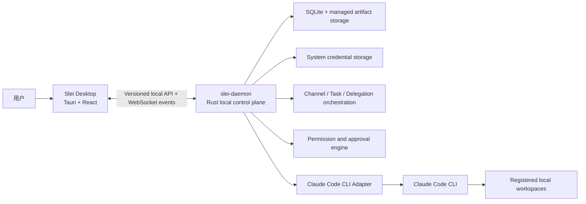
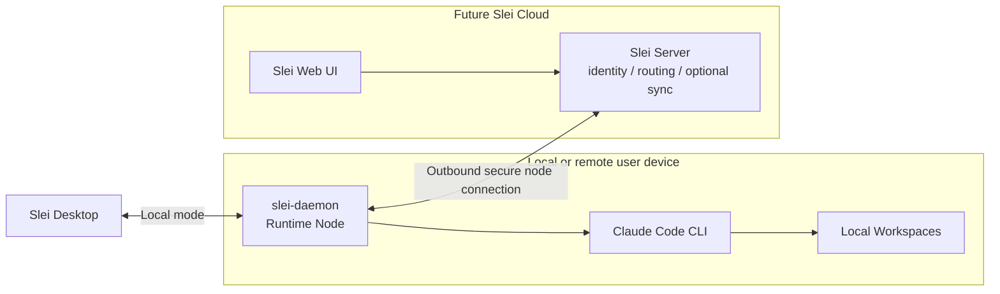
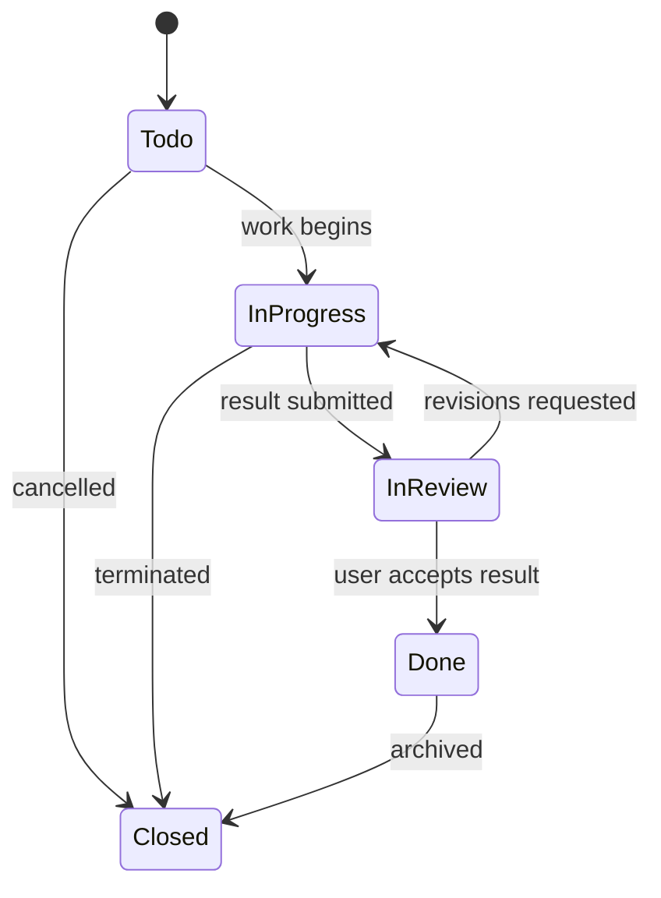
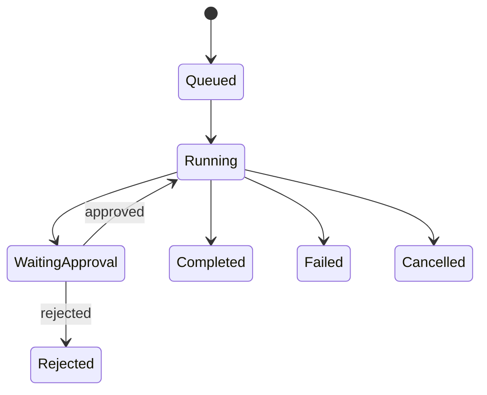
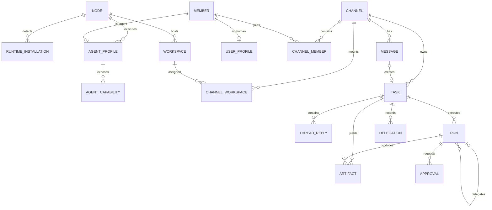

# Slei Product Architecture and MVP Module Plan

- Status: Design approved for documentation
- Date: 2026-05-27
- Product: Slei
- MVP priority: Local-first desktop agent team workspace
- Future direction: Cloud/Web UI connected to independently deployed runtime nodes

## 1. Product Summary

Slei is a local-first desktop product for collaborating with a team of local AI
agents through an IM-like interface. Users work in channels, create trackable
tasks, continue focused discussions in task threads, approve risky agent
actions, and inspect resulting artifacts. Agents run through an independent
local daemon, initially using Claude Code CLI as the first runtime adapter.

Slei is not a chat wrapper around a command-line agent. It is a visible,
controllable, recoverable local control plane for agent collaboration:

- Every task transfer between agents is public through `@mention`.
- Every risky execution action can be approved or denied by the user.
- Every message, task thread, execution record, approval and artifact is
  persisted locally in the MVP.
- The daemon is architected as an independent execution node so that it can
  later connect to a cloud server and support a remote Web UI.

## 2. Confirmed Product Decisions

| Topic | Decision |
| --- | --- |
| Product name | `Slei` |
| Desktop technology | Tauri desktop application with React and TypeScript UI |
| Runtime process | Independent Rust `slei-daemon` executable |
| MVP runtime | Claude Code CLI only |
| MVP execution mode | Fully local, single-user, local daemon |
| Future connection mode | Optional cloud/Web UI controlling connected daemon nodes |
| Primary collaboration unit | Channel, not project |
| Channel workspace model | A channel may mount zero, one or multiple local workspaces |
| Agent workspace permissions | Channel permissions are shared by default; individual agents may be restricted |
| Normal response rule | Each channel has a primary agent for messages without explicit mention |
| Agent delegation | Only visible `@agent` delegation; no hidden agent-to-agent dispatch |
| Human interaction | User is a mentionable human member with stable `@handle` |
| Permission experience | Default permission presets with explicit high-risk approval |
| Persistence | Messages, threads, execution history, approvals and artifact indexes saved locally |
| Task model | A task owns a dedicated reply thread and lifecycle separate from ordinary chat |
| Task management | Global Tasks menu includes Board and List views |
| Languages | MVP fully supports Simplified Chinese and English; Chinese is default |
| npm distribution | Not delivered in MVP; future npm launcher invokes/downloads Rust daemon |

## 3. Product Vocabulary

The Chinese UI should use clear product terms instead of exposing lower-level
runtime language unnecessarily.

| Domain entity | Simplified Chinese UI | English UI | Meaning |
| --- | --- | --- | --- |
| `Channel` | 渠道 | Channel | A public collaboration space for chat and tasks |
| `Workspace` | 工作区 | Workspace | A locally registered directory mounted to channels |
| `Member` | 成员 | Member | A human or agent participating in Slei |
| `Agent` | Agent / 智能成员 | Agent | A runtime-backed collaborative member |
| `Task` | 任务 | Task | A tracked objective with a focused discussion thread |
| `ThreadReply` | 任务回复 | Task Reply | A reply within a task discussion |
| `Run` | 执行记录 | Run | One runtime execution by one agent |
| `Delegation` | 任务流转 | Delegation | A visible `@agent` task transfer |
| `Approval` | 审批 | Approval | A user's risk-sensitive execution decision |
| `Artifact` | 产物 | Artifact | An attachment, patch, output file or result reference |
| `Node` | 运行节点 | Runtime Node | A computer running `slei-daemon` |
| `Runtime` | 运行时 | Runtime | The agent execution engine, initially Claude Code CLI |

## 4. System Architecture

### 4.1 MVP Local Architecture



Desktop is the interaction client. It does not own authoritative execution
state. The daemon owns channels, tasks, executions, approvals, events,
persistence and runtime communication. Desktop may close and reconnect without
losing the daemon's saved state.

### 4.2 Future Connected Node Architecture



The MVP does not implement cloud registration, npm distribution or remote
control. It does establish boundaries that avoid making the daemon a desktop
implementation detail.

### 4.3 Future Daemon Distribution

The daemon core remains a Rust executable. A later npm launcher may provide a
simple node deployment experience without rewriting runtime control in Node.js:

```bash
npx @slei-ai/daemon@latest connect \
  --server-url https://api.example.com \
  --pair-code ABCD-EFGH \
  --name "office-mac"
```

The npm package would resolve the platform binary, verify/download it, and
launch the Rust daemon. Long-lived device credentials should use system secure
storage; permanent secrets should not be encouraged in shell history.
The server URL above is illustrative only; a production endpoint is not
selected as part of the MVP design.

## 5. Information Architecture and UI Scope

### 5.1 MVP Primary Navigation

| Menu | Purpose | MVP scope |
| --- | --- | --- |
| 会话 / Chat | Channels, ordinary chat, task cards and task thread collaboration | Full |
| 任务 / Tasks | Cross-channel board/list for task status and user attention | Full |
| 成员 / Members | Human/agent identities, agent runtime, permissions and activity | Full |
| 运行节点 / Computers | Local daemon health, runtime detection and workspace registry | Local node full |
| 设置 / Settings | User profile, language, notifications, security and diagnostics | Essential full |

### 5.2 Chat Area

The Chat area is the public channel timeline. It shows short conversation,
system events, visible delegations, and task cards without forcing every deep
task discussion into the shared timeline.

| Feature | MVP behavior |
| --- | --- |
| Channel sidebar | Search/activity entry points, channel list, create/edit/switch |
| Channel header | Name, description, mounted workspace summary, members and settings |
| Channel tabs | `CHAT`, channel-scoped `TASKS`, channel-scoped `FILES` |
| Timeline | Human messages, agent messages, collapsible system events and task cards |
| Composer | Text, attachments, mention autocomplete and `创建为任务 / As Task` |
| Ordinary message | Primary agent responds unless an agent is explicitly mentioned |
| Task card | Title, status, assignee, reply count, artifact indicators and attention badge |
| Stream feedback | Processing, waiting approval, failure, cancellation and completion |

### 5.3 Task Thread

A Task is a first-class discussion and delivery container, not an execution
list item. The thread appears in a right-side panel from Chat or Tasks.

| Feature | MVP behavior |
| --- | --- |
| Creation | User marks a channel message as `创建为任务 / As Task` |
| Side panel | Opens the complete focused discussion while retaining channel context |
| Replies | User and agents reply in the same task context |
| Mentions | `@agent` dispatches visible collaboration; `@human` requests user action |
| Execution updates | Agent processing, approvals and results appear in context |
| Artifacts | Attachments, patches and generated outputs remain associated with the task |
| Channel link | `在渠道中查看 / View in channel` locates the task root card |
| Summary | Completed result and important state updates are reflected on the channel card |

### 5.4 Tasks Status Board

Tasks is a first-level menu, aggregating tasks across channels. It is the
control surface for delivery progress; the thread remains the content surface.

| Feature | MVP behavior |
| --- | --- |
| Views | Board and List |
| Filters | Channel, creator and assignee |
| Columns | 待处理, 进行中, 待审查, 已完成, 已关闭 |
| Cards | Channel, task number, title/summary, status, assignee and attention markers |
| Opening | A card opens its task thread/detail panel |
| Status change | Menu action required; drag-and-drop recommended if delivery permits |
| Attention | Waiting for your reply, confirmation, approval, or mentioned you |

### 5.5 Members Area

Members represents both agents and humans. In the MVP there is one human user,
while the data model allows future shared channels.

| Feature | MVP behavior |
| --- | --- |
| Member groups | Agents and Humans |
| Human identity | Current user's avatar, nickname, stable handle and status |
| Agent profile | Display name, avatar, description, node, runtime and model config |
| Agent permissions | Defaults, channel/workspace overrides and approval policy |
| Agent activity | Task delegations, executions and approval records |
| Skills/Commands | Read-only discovery and display for Claude Code capabilities |
| Later-only tabs | Graph, reminders, apps and rich Agent DMs are not MVP-critical |

### 5.6 Computers / Runtime Nodes Area

This page is called `运行节点 / Computers`, rather than only runtime
management, because its long-term responsibility includes independent remote
daemon nodes.

| Feature | MVP behavior |
| --- | --- |
| Node list | Show the local machine; model supports multiple future nodes |
| Node details | Name, host, OS/architecture, daemon version and connection state |
| Runtime detection | Detect Claude Code CLI path, version, authentication and availability |
| Runtime placeholders | Other runtimes may be visible as unsupported/not installed only if useful |
| Hosted agents | List agents executed on this node |
| Workspaces | User explicitly selects and registers accessible local directories |
| Diagnostics | Health checks, adapter errors, connection/version guidance and log summary |

### 5.7 Settings and Human Identity

The user is a formal member whom agents may visibly mention in a task or chat.

| Section | MVP behavior |
| --- | --- |
| Profile | Avatar, nickname, stable unique `@handle`, bio and optional role title |
| Locale | Default `zh-CN`, switchable `en-US`, persisted across restarts |
| Notifications | Mention, waiting approval and task attention preferences |
| Security | Local credentials/data location and approval preference entry points |
| Diagnostics | Daemon/node and basic troubleshooting links |

Nickname and handle are separate. A user can change their display name without
breaking historical mentions because references use stable member IDs and
handles.

## 6. Core Product Behavior

### 6.1 Channel and Workspace Rules

- A channel may have no workspaces, supporting ordinary conversation.
- A channel may mount multiple registered local workspaces.
- Agents in a channel inherit the channel's mounted workspace access by
  default.
- Per-agent overrides may restrict accessible workspaces and capabilities.
- A workspace must be explicitly registered before it can be mounted or used.

### 6.2 Mention and Delegation Rules

| Mention target | Behavior |
| --- | --- |
| No explicit mention in channel chat | Run the channel primary agent |
| User explicitly mentions an agent | Run the selected agent visibly |
| Agent mentions another agent in a task thread | Create a visible delegation and child execution record |
| Agent mentions the human user | Notify the user and flag the task if action is needed |
| Agent requests risky approval through words | Must additionally produce a formal Approval object |

Agents must not silently delegate tasks. Complex agent-to-agent work should
occur inside a Task Thread, where users can follow handoffs and results.

### 6.3 Task State and Attention

Task status represents delivery progress:



Translated values:

| Internal value | `zh-CN` | `en-US` |
| --- | --- | --- |
| `todo` | 待处理 | Todo |
| `in_progress` | 进行中 | In Progress |
| `in_review` | 待审查 | In Review |
| `done` | 已完成 | Done |
| `closed` | 已关闭 | Closed |

Attention is not an extra status column. It identifies required user actions:

| Attention type | Meaning |
| --- | --- |
| `awaiting_human_reply` | Agent asked the user for additional information |
| `awaiting_confirmation` | A submitted result needs user acceptance |
| `awaiting_approval` | A high-risk action needs formal approval |
| `mentioned_user` | User was mentioned without blocking progress |

### 6.4 Execution Records (`Run`)

A Run is one daemon-managed execution of one agent against its runtime. It is
not a user-created item and should usually appear in Chinese UI as `执行记录`.

Examples:

- A casual message triggers one primary-agent Run without a Task.
- One Task may contain analysis, delegated research, implementation and review
  Runs by different agents.
- Runs own execution statuses, approvals and artifacts; Tasks own the overall
  collaborative objective and discussion.



## 7. Domain Data Plan

### 7.1 Core Entities

| Entity | Responsibility | Key data |
| --- | --- | --- |
| `Node` | A daemon-hosting computer | Stable ID, name, OS, architecture, version, status, mode |
| `RuntimeInstallation` | Installed runtime capability | Node, kind, executable, version, auth/availability |
| `Workspace` | User-registered local directory | Node, display name, path, availability, metadata |
| `UserProfile` | Current local human identity | Member ID, nickname, handle, avatar, locale, timezone |
| `Member` | Common human/agent identity | Type, display name, stable handle, avatar, status |
| `AgentProfile` | Runtime-backed member settings | Node, runtime, model config, role, permission preset |
| `AgentCapability` | Detected skill or command | Agent, type, name, source, description |
| `Channel` | Shared public conversation scope | Name, description, primary agent, visibility |
| `ChannelWorkspace` | Mounted workspace policy | Channel, workspace, default permission |
| `ChannelMember` | Channel membership and override | Channel, member, role, workspace/permission override |
| `Message` | Public timeline record | Channel, author, kind, content, timestamps |
| `Mention` | Reference to a member | Source message/reply, target member, target type, read state |
| `Task` | Tracked objective | Channel, root message, title, status, assignee, attention |
| `ThreadReply` | Task discussion record | Task, author, content, reply kind, timestamps |
| `Run` | One agent execution | Trigger, agent, runtime, task, parent run, status |
| `Delegation` | Visible handoff | Task, source/target agents, source reply, child run |
| `Approval` | Risk decision | Run, action, risk, status, decision user and timestamps |
| `Artifact` | Output index | Task/run/reply, kind, managed location, hash and metadata |
| `Notification` | Human attention item | User, cause, linked context, read state |
| `EventLog` | Replayable change stream | Sequence, event type, entity, payload, persisted timestamp |

### 7.2 Key Relationships



### 7.3 Local Persistence and Sync Eligibility

| Data | MVP storage | Future sync default |
| --- | --- | --- |
| Channels, members and task status | Local SQLite | Eligible when user opts in |
| Chat and task thread content | Local SQLite | Eligible only with explicit user setting |
| Task/execution summaries and delegation links | Local SQLite | Selectively eligible |
| Complete tool output | Local storage | Local-only by default |
| Workspace absolute paths | Local SQLite | Never sync raw path by default |
| File contents and patches | Managed local artifacts | Local-only unless explicitly shared |
| Credentials/environment secrets | System credential store | Never plaintext sync |
| Approvals | Local audit store | Optional audit summary later |

## 8. Daemon and Protocol Plan

### 8.1 Daemon Responsibilities

- Maintain the authoritative domain state and persistence layer.
- Expose a versioned local query/command API and event stream.
- Start, monitor, cancel and recover runtime-backed executions.
- Validate workspace and permission policy before execution.
- Pause risky activity until explicit approval is resolved.
- Store node identity and later support outbound cloud registration without
  changing Desktop-facing domain models.

### 8.2 Local Protocol

MVP protocol recommendation:

- Local HTTP API for commands, mutations, detail reads and pagination.
- WebSocket event stream for real-time updates and reconnect replay.
- Per-install local authentication token for trusted Desktop connections.
- Protocol handshake that rejects incompatible Desktop/daemon versions.
- Monotonic `EventLog.sequence` allowing Desktop to request missed updates.

| API domain | Responsibilities |
| --- | --- |
| `/system` | Health, protocol version, diagnostics and log summary |
| `/nodes` | Local node details, runtime detection and workspace registry |
| `/agents` | Profile, capability scan, permissions and activity |
| `/channels` | CRUD, members, workspace mounts and timeline messages |
| `/tasks` | CRUD, filters, status transitions, attention and replies |
| `/runs` | Execution initiation, cancellation, details and relationships |
| `/approvals` | Pending requests and user decisions |
| `/artifacts` | Upload, metadata, guarded access and task links |
| `/settings` | User profile, locale, notification and local preferences |

### 8.3 Realtime Events

Events are machine-coded and localized by Desktop. The daemon must not send
hard-coded final UI prose for user-visible system behavior.

| Event | UI impact |
| --- | --- |
| `node.status_changed` | Connection/health indicators |
| `runtime.detected` | Computers runtime tags and validation results |
| `agent.created`, `agent.updated` | Members updates |
| `channel.updated`, `message.created` | Chat timeline updates |
| `task.created`, `task.status_changed`, `task.attention_changed` | Cards and Tasks board |
| `thread.reply_created` | Task panel update and unread counts |
| `run.started`, `run.output_delta`, `run.completed`, `run.failed` | Processing feedback |
| `run.waiting_approval`, `approval.resolved` | Approval card lifecycle |
| `delegation.created` | Visible task transfer card/timeline update |
| `artifact.created` | Files and thread result links |
| `notification.created` | User badges and activity notifications |

## 9. Runtime and Security Plan

### 9.1 Claude Code CLI Adapter

The MVP implements one fully functional adapter rather than shallow support for
multiple runtimes.

| Capability | MVP requirement |
| --- | --- |
| Detection | Discover executable, version and install state |
| Availability | Validate usable/authenticated runtime state |
| Invocation | Build execution input from agent, channel/task and workspaces |
| Streaming | Translate runtime output into Slei execution/reply events |
| Cancellation | Reliably terminate a running execution |
| Errors | Map runtime/process failures to localizable error codes |
| Permission bridge | Map runtime-sensitive activity into Approval requests where supported/required |
| Capability display | Read-only discovery of available skills/commands |

Adapter code does not decide channel business rules or task delegation. Those
belong to the daemon orchestration and permission domains.

### 9.2 Permissions and Approvals

| Layer | MVP rule |
| --- | --- |
| Workspace registration | Only explicitly selected directories can be mounted |
| Channel mount | Channels may expose registered workspaces to their agents |
| Default access | Channel agents inherit shared mounts by default |
| Agent override | A member can be restricted to a subset or lower capability |
| Permission preset | At minimum support read-only, edit and controlled execution semantics |
| High-risk action | Must pause for explicit Desktop approval |
| Audit | Approval requester, decision maker, time, action and outcome persist locally |

Formal Approval objects must be used for risky actions. An agent asking for
approval in ordinary text does not itself grant permission.

## 10. Internationalization Plan

### 10.1 MVP Language Scope

| Locale | MVP level |
| --- | --- |
| `zh-CN` | Complete and default |
| `en-US` | Complete selectable locale |

### 10.2 Coverage

Localization covers navigation, chat/thread actions, Tasks board states,
Members, Computers, Settings, onboarding, empty states, accessibility labels,
errors, diagnostics, notifications, dates/times and quantities.

### 10.3 Engineering Rules

- User-visible strings are resource keys in a shared i18n package, not literals
  embedded across UI components.
- Error and event payloads use stable codes and interpolation parameters.
- Locale settings persist locally and apply immediately across all primary
  pages.
- Layouts must tolerate Chinese and English text length changes.
- Resource-key consistency and untranslated-string checks are part of MVP
  quality verification.

## 11. Module Delivery Plan

Each module below states the planned output, dependencies, MVP exit criteria
and future boundary. This is the implementation planning basis; it is not an
instruction to begin coding.

### M00. Engineering Foundation and Product Standards

**Objective:** Establish shared structure and contracts for parallel Desktop
and Daemon development.

**MVP work packages:**

- Define monorepo folders for desktop, Rust crates, shared protocol client,
  shared UI/tokens and i18n resources.
- Define product vocabulary, domain identifiers, machine error codes and event
  naming.
- Define local data paths, asset conventions, logging and schema migration
  practices.
- Define protocol version handshake and compatibility policy.
- Establish formatter, linting, type checks, unit/integration test commands and
  packaging checks.

**Dependencies:** None.

**Exit criteria:**

- Desktop and daemon can build independently.
- Protocol types have one controlled definition/mapping boundary.
- Both language bundles contain required baseline terms and validation passes.

### M01. Slei Desktop Shell

**Objective:** Provide the desktop frame and connectivity surface for all
product workflows.

**MVP work packages:**

- Tauri window lifecycle, routing, primary navigation and responsive
  multi-panel layout.
- Pages for Chat, Tasks, Members, Computers and Settings.
- Local daemon discovery/connection, handshake, reconnect and offline/error
  states.
- Global selected channel/task/member/node state and notification indicators.
- Theme tokens matching the clear, high-contrast workspace style represented in
  the UI references, without binding product function to exact styling.

**Dependencies:** M00, M05 protocol skeleton.

**Exit criteria:**

- App starts with or without daemon and explains status correctly.
- All five main views are reachable in both locales.
- Reopening restores navigation context and persisted language preference.

### M02. Channels, Chat and Task Thread

**Objective:** Deliver Slei's central two-level conversation model.

**MVP work packages:**

- Channel create/edit/switch, description, member count and workspace summary.
- Public timeline for human, agent and system messages.
- Composer with attachments, mention autocomplete and `创建为任务 / As Task`.
- Task root card presentation and right-side Task Thread panel.
- Reply creation, streaming updates, unread/reply count and channel location
  linking.
- Rendering for executions, approvals, visible delegations and artifacts in
  the correct chat/thread context.

**Dependencies:** M01, M03, M05, M07, M08, M09.

**Exit criteria:**

- A user can chat in a no-workspace channel.
- A user can create a task and continue all detailed discussion in its thread.
- Restart/reconnect restores timeline, thread, statuses and result references.

### M03. Members and Agent Configuration

**Objective:** Configure the agent team and represent the human user as a
member.

**MVP work packages:**

- Members sidebar with Agents and Humans sections and presence/status.
- Agent create/edit/disable flow with avatar, display name, role description,
  node, runtime and model configuration.
- Agent permission defaults and workspace overrides.
- Assignment of agents to channels and designation of primary agent.
- Activity display and read-only Skills/Commands detail.
- User member display linked to Settings-managed profile.

**Dependencies:** M04, M08, M11, M14.

**Exit criteria:**

- Agent bound to local Claude Code runtime can be added to a channel.
- Permission edits affect subsequent executions.
- User and agents can be correctly mentioned by stable identity.

### M04. Computers and Runtime Nodes

**Objective:** Make execution location, runtime availability and local
workspaces inspectable and controllable.

**MVP work packages:**

- Local node identity, daemon version, host/OS/architecture and health display.
- Claude Code CLI detection, validation and failure guidance.
- List of agents hosted on the local node.
- Explicit local workspace registration/removal and availability checks.
- Diagnostics entry points for node/runtime problems.
- Node model fields that support later connected remote nodes without enabling
  remote behavior in MVP.

**Dependencies:** M05, M06, M09.

**Exit criteria:**

- User can verify daemon and Claude Code availability.
- User can register workspaces for later channel mounting.
- No unregistered path is silently exposed to agents.

### M05. Daemon Control Plane

**Objective:** Operate the authoritative independent local execution node.

**MVP work packages:**

- Standalone Rust executable lifecycle, single-instance protection, config,
  health and graceful shutdown behavior.
- Domain services for nodes, settings, members, channels, tasks, executions,
  approvals, artifacts and notifications.
- HTTP command/query API, WebSocket event stream, local token authentication
  and version handshake.
- Task/execution scheduling, persisted event sequence and Desktop reconnect
  replay.
- CLI surface stable enough for future launch wrappers and node modes, while
  implementing only local operation now.

**Dependencies:** M00, M09.

**Exit criteria:**

- Daemon runs separately from Desktop and serves recoverable state.
- Desktop shutdown does not erase saved work or corrupt ongoing state.
- Connection failures and incompatible protocol versions are diagnosable.

### M06. Claude Code CLI Adapter

**Objective:** Implement the first real runtime integration end to end.

**MVP work packages:**

- Detect Claude Code installation/version and validate readiness.
- Launch execution with agent identity, task/chat input, authorized workspaces
  and runtime options.
- Map output, completion, failure and cancellation to domain execution events.
- Bridge permission-sensitive requests into daemon approval controls.
- Identify visible skills/commands for read-only profile display where feasible.

**Dependencies:** M04, M05, M08.

**Exit criteria:**

- A configured agent responds through Claude Code in an authorized channel.
- Cancellation and error handling are reliable.
- Risky behavior cannot bypass Slei approval policy.

### M07. Messaging Orchestration and Visible Delegation

**Objective:** Enable controllable agent teamwork without silent delegation.

**MVP work packages:**

- Mention parser/resolver for agents and humans.
- Primary-agent default trigger for ordinary messages.
- Explicit `@agent` trigger and parent/child execution links.
- Visible delegation records and thread rendering.
- Human mention notifications and task attention management.
- Delegation-depth/repetition safeguards and user stop controls.

**Dependencies:** M02, M03, M05, M09, M14.

**Exit criteria:**

- Every delegated execution is visible and traceable from the originating task.
- `@human` never executes a runtime but correctly signals attention.
- Repeated or cyclic delegation is stopped with a user-visible explanation.

### M08. Workspaces, Permissions and Approvals

**Objective:** Protect local resources while enabling useful agent execution.

**MVP work packages:**

- Channel mounts over registered workspaces and per-agent override rules.
- Permission presets and effective-access calculation.
- Risk classification and Approval lifecycle.
- Desktop approval cards with allow/deny operations and context.
- Persistent audit history and redaction of sensitive values.

**Dependencies:** M03, M04, M05, M09.

**Exit criteria:**

- Unauthorized workspace usage is rejected.
- High-risk work does not proceed without approval.
- Decisions can be audited from the relevant task or member activity.

### M09. Local Storage, Assets and Recovery

**Objective:** Preserve the complete local collaboration history safely.

**MVP work packages:**

- SQLite schema and migrations for all core entities and indexes needed for
  timeline/task queries.
- Managed artifact storage with metadata, hashes and guarded retrieval.
- Event log sequence for event replay and reconnect consistency.
- Secure separation of credentials/environment secrets from ordinary data.
- Entity metadata distinguishing future sync-eligible from local-only content.

**Dependencies:** M00.

**Exit criteria:**

- Restarting Desktop and daemon preserves all required MVP state.
- Credentials do not appear in ordinary database history, logs or messages.
- Tasks board and thread recovery remain consistent with channel cards.

### M10. Tasks Board and Files/Artifacts Views

**Objective:** Provide actionable oversight of work and connected outputs.

**MVP work packages:**

- Global Tasks primary menu with Board/List views and filters.
- Status columns, counts, card details, attention flags and state operations.
- Task detail/thread linking from cards and back to original channels.
- Channel-level Files view grouped around task and artifact origin.
- Artifact-to-task, task-to-execution and channel-to-task navigation.

**Dependencies:** M02, M07, M09.

**Exit criteria:**

- Cross-channel tasks are searchable/filterable by key board dimensions.
- Status changes remain synchronized across board, chat cards and thread.
- Artifacts can be understood through their originating task context.

### M11. Skills and Commands Read-only Discovery

**Objective:** Show what capabilities an agent exposes without attempting a
full extension management product in the MVP.

**MVP work packages:**

- Scan accessible Claude Code skills/commands or equivalent capability metadata.
- Show capability name, source scope and description in Agent Profile.
- Handle discovery errors without blocking normal execution.

**Dependencies:** M06.

**Exit criteria:**

- Users can inspect recognized agent capabilities.
- No install/edit/distribution feature is implied or required for MVP.

### M12. Diagnostics, Basic Search and Update Readiness

**Objective:** Ensure the local MVP can be tested and troubleshot over time.

**MVP work packages:**

- Localizable error code handling and actionable error panels.
- Node/runtime diagnostics and minimal log summary/export direction.
- Protocol incompatibility and migration guidance.
- Basic timeline loading/browsing; full-text search may remain a P2 feature.

**Dependencies:** M01, M04, M05, M09.

**Exit criteria:**

- Common daemon/runtime failures explain themselves to users in either locale.
- Critical test failures can be diagnosed without reading raw internals first.

### M13. Cloud, Web UI and Remote Node Boundary

**Objective:** Preserve a clean path to future connected nodes without adding
cloud work to the local MVP.

**MVP work packages (design only):**

- Stable node IDs, node mode vocabulary and future registration concepts.
- Data sync eligibility/security policy.
- Distinction between local control API and future server-facing node protocol.
- Requirement that daemon remains final authority for local execution policy.

**Future implementation:**

- Slei Server, account/auth, node pairing/revocation, outbound secure node
  connections, Web UI, selective synchronization and remote execution routing.

**Exit criteria for MVP:** Local design does not require breaking changes to
introduce remote nodes later; no cloud implementation is delivered.

### M14. Settings and User Identity

**Objective:** Make the human user configurable, mentionable and localized.

**MVP work packages:**

- Profile editor for avatar, nickname, stable handle, bio and optional role.
- Language selection for complete Chinese/English UI.
- Notification preferences for mention, approval and task attention.
- Local security/data and diagnostics entry points.
- Notification and mention identity integrated across Chat, Tasks and Members.

**Dependencies:** M01, M07, M09.

**Exit criteria:**

- Agent can publicly mention the user and the user can locate/respond in the
  correct context.
- Locale and profile persist across restarts.
- Approval actions record the acting human identity.

### M15. Daemon Distribution and Independent Node Launch

**Objective:** Make the daemon an independently operable executable now and a
simple deployable runtime node later.

**MVP work packages:**

- Produce a standalone daemon binary usable by the Desktop local flow.
- Define local configuration, data/log directories and stable command-line
  configuration surface.
- Allow daemon startup/lifecycle to be independent of the UI architecture.
- Document future npm launcher and cloud connection entry points without
  publishing or connecting them.

**Future implementation:**

- `@slei-ai/daemon` npm launcher, signed binary resolution/download, pairing,
  remote connection, service installation, automatic startup/update and
  revocation.

**Exit criteria for MVP:**

- Local daemon does not require being embedded in Desktop code.
- Its architecture can be launched by a later wrapper without moving core
  orchestration or storage logic into npm/Node.

## 12. MVP Delivery Waves

| Wave | Modules | Demonstrable outcome | Gate |
| --- | --- | --- | --- |
| `Wave 0: Foundation` | M00, M09 foundation, M14 foundation, M15 boundary | Repository/contracts/data/i18n/user identity/daemon shape are settled | Schema, protocol, vocabulary and locale validation pass |
| `Wave 1: Runtime Link` | M01, M04, M05, M06 | Desktop connects local daemon and drives one Claude Code response | Detection, streaming, cancellation and errors validated |
| `Wave 2: Collaboration Surface` | M02, M03, M14 complete | Channels, agents, ordinary chat, task creation and thread replies work | Conversation/task history restores correctly |
| `Wave 3: Controlled Teamwork` | M07, M08 | Visible handoffs, human mentions, workspace policy and approvals work | Audit, permission and delegation safeguards pass |
| `Wave 4: Operational MVP` | M10, M11, M12, M13 design closure | Task board, artifacts, capability inspection and diagnostics complete product loop | Full local bilingual acceptance suite passes |

## 13. MVP Acceptance Scenarios

Slei P1 MVP is ready only when all of these can be demonstrated locally:

1. A first-time user starts the app in Simplified Chinese, configures their
   nickname and stable handle, and may switch to English with persisted choice.
2. The Desktop identifies/connects to the independent local daemon and displays
   daemon and Claude Code CLI readiness in Computers.
3. The user explicitly registers one or more workspaces.
4. The user creates an agent backed by Claude Code, assigns role and effective
   workspace permissions, and adds it to a channel.
5. A channel with no workspace supports casual ordinary conversation with its
   primary agent.
6. A channel with multiple mounted workspaces supports authorized engineering
   collaboration.
7. The user creates a Task from Chat, sees its channel card, opens the Task
   Thread and continues focused replies without scattering all detail in chat.
8. A task can use visible `@agent` delegation; no hidden task transfer occurs,
   and users can inspect the handoff chain.
9. An agent can mention the user, resulting in a visible notification/attention
   indicator and navigable context.
10. A high-risk operation pauses for formal user approval and records the
    outcome.
11. Tasks Board displays cross-channel tasks in Board and List forms, tracks
    five statuses and surfaces user attention conditions.
12. Artifacts and basic Files links remain connected to the task and execution
    that produced them.
13. Restarting Desktop and daemon restores messages, threads, task statuses,
    execution records, delegations, approvals, artifacts and user preferences.
14. All user-facing MVP workflows, system statuses, errors and diagnostic
    prompts operate in both `zh-CN` and `en-US`.
15. The daemon remains local-only in operation, while its executable,
    identity/protocol and data boundaries are compatible with a later npm
    launcher and remote node connection phase.

## 14. Verification and Quality Strategy

| Test layer | Required coverage |
| --- | --- |
| Unit | Task/execution transitions, mention resolution, workspace permission inheritance, error-code localization and sync eligibility rules |
| Protocol contract | HTTP/WS schemas, compatibility handshake, event sequence replay and reconnect semantics |
| Storage/recovery | Database migrations, task/thread/card consistency, artifact metadata and restart restoration |
| Adapter integration | Claude Code detection, availability, invocation, stream mapping, cancellation, failure and approval bridge |
| Security | Unauthorized paths, secret redaction, approval bypass prevention, token handling and asset access |
| UI E2E | Profile setup, locale switch, channel setup, agent creation, task/thread, board status transition and approval |
| Packaging | Desktop installation, local daemon distribution/start, data directory handling and diagnostics |

## 15. Key Risks and Mitigation

| Risk | Why it matters | Mitigation in plan |
| --- | --- | --- |
| Claude Code integration may not expose all desired approval hooks uniformly | Approval experience depends on runtime behavior | Validate adapter capabilities early in Wave 1; keep daemon policy and user-visible limitations explicit |
| Task, chat and execution concepts may blur in UI | Confusion reduces product value | Keep Task Thread and Board first-class; expose executions as secondary records |
| Rust daemon and React UI may drift on contracts | Hard-to-debug state divergence | Versioned protocol, shared schema/client validation and contract tests |
| All-local persistent logs may hold sensitive content | Agent tools touch source code and secrets | Managed assets, secret separation, redaction, explicit data locations and future sync opt-in |
| Future remote mode could force major architecture changes | MVP could become a dead-end sidecar | Independent daemon, stable node identity, protocol boundaries and sync eligibility from the start |
| Full bilingual MVP increases UI effort | Missing strings/layout failures are visible defects | Shared i18n baseline and automated resource/critical-view verification |

## 16. Product Roadmap Beyond MVP

| Phase | Goal | Scope |
| --- | --- | --- |
| `P0` | Prove local runtime link | Desktop/daemon/Claude Code minimal interaction |
| `P1 MVP` | Deliver local Agent Team workspace | Full local scope in this document |
| `P2` | Improve daily local operation | Search, richer artifacts/diffs, templates, improved diagnostics and lifecycle updates |
| `P3` | Connect execution nodes to cloud/Web UI | Server, pairing, npm launcher, node transport, optional synchronization |
| `P4` | Expand team workflow | Shared human teams, remote nodes at scale, advanced workflows and administration |

## 17. References

- Reference product and implementation inspiration: [coppynight/slark](https://github.com/coppynight/slark)
- Product screenshots supplied during Slei planning: Chat/channel interface,
  Members profile interface, Computers/runtime-node interface, Task Thread
  side panel, and Tasks board.
