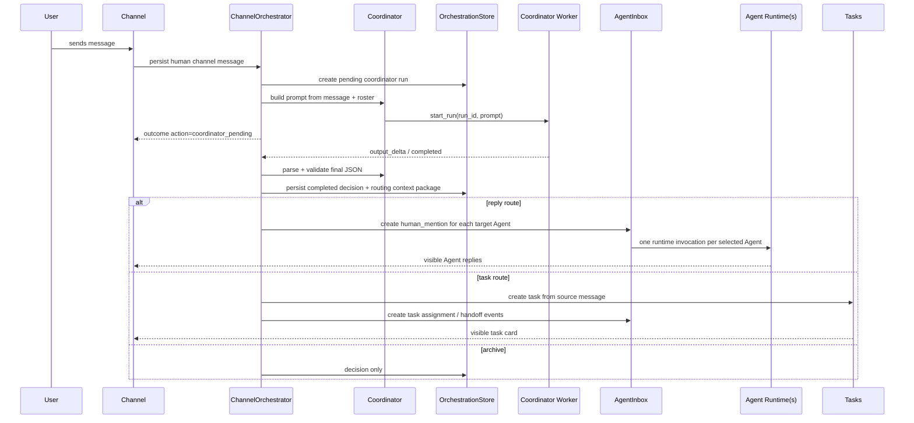

# Channel Coordinator Multi-Target Routing Spec

## Requirement

The channel Coordinator must autonomously decide whether a channel message should route to one Agent or multiple Agents.

The system must not route every reply request to the first ready Agent by default. The first ready Agent can still be the selected primary target for normal single-target cases, but that must be an explicit decision outcome, not the only routing mode.

## Architecture

The Coordinator is a control-plane actor. It observes channel messages, starts an asynchronous routing run, persists routing decisions, creates tasks or inbox events after the run completes, and prepares context for target Agents. It never posts a visible answer as itself.



## Coordinator Runtime Protocol

Coordinator decisions are asynchronous. `send_channel_message` must not block waiting for a model response, and it must not invent a local route while waiting.

Runtime states:

- `pending`: the source channel message exists, a Coordinator run has been started, and no downstream Agent has been invoked yet.
- `completed`: the Coordinator run returned valid JSON, the validated decision was persisted, and side effects were applied.
- `failed`: the Coordinator run failed, timed out, or returned malformed/invalid JSON. A diagnostic `needs_manual_assignment` decision was persisted and no downstream Agent was invoked.

Initial channel send outcome:

```json
{
  "messageId": "msg_123",
  "action": "coordinator_pending",
  "coordinatorRunId": "coord_run_456",
  "decisionStatus": "pending",
  "assigneeAgentIds": []
}
```

Worker event contract:

- `output_delta` events for `coordinatorRunId` append to the pending run output buffer.
- `completed` for `coordinatorRunId` parses the accumulated output as Coordinator JSON.
- `failed` for `coordinatorRunId` persists a failed diagnostic decision.
- Events for Agent DM runs continue through the existing Agent DM event path; Coordinator run ids must be correlated before handling.

Idempotency:

- Re-sending with the same idempotency key while the Coordinator run is pending returns the same `coordinatorRunId` and `coordinator_pending` outcome.
- Re-sending after completion returns the completed outcome derived from the persisted decision.
- Completion handling must be idempotent: repeated `completed` events do not duplicate inbox events, task cards, or routing context packages.

## Coordinator Prompt Contract

Routing policy lives in the Coordinator prompt, not in hard-coded string matching. Code must not decide that a message is a broadcast, task command, consultation, or explicit mention based on local `contains(...)` rules. This matters because mentions and intent can appear anywhere in the message, for example `这个方案怎么看 @alice`, `Alice 和 Coda 都看看`, or `尾部 @coda`.

The Orchestrator gives the Coordinator a structured input package:

- `message`: source message id, author id, body, channel id, channel name.
- `channelMembers`: all channel members with `agentId`, `name`, `handle`, `role`, `agentKind`, and readiness.
- `availableActions`: fixed action enum values.
- `taskPolicy`: current task model supports one primary assignee plus optional collaborator target ids.
- `contextRefs`: safe summaries or refs, not a raw unrestricted channel log.

The Coordinator prompt defines the responsibilities:

1. Never answer the user visibly as the Coordinator.
2. Decide whether the message should be archived, answered by one or more Agents, or converted into a task.
3. Interpret explicit mentions semantically, wherever they appear in the text.
4. Interpret broadcast or group intent semantically, not by fixed keywords alone.
5. Choose only non-coordinator channel members as downstream targets.
6. For task commands, return task metadata and target/collaboration ids instead of turning the task request into an ordinary chat reply.
7. Return only valid JSON in the schema below.

Coordinator output schema:

```json
{
  "intent": "consultation | task_command | status_update | noise | ambiguous",
  "action": "request_agent_reply | create_task_and_assign | needs_manual_assignment | archive_only",
  "routeMode": "explicit | broadcast | semantic | task | none",
  "primaryAssigneeAgentId": "agent_alice",
  "targetAgentIds": ["agent_alice", "agent_coda"],
  "task": {
    "title": "实现导出功能",
    "summary": "用户要求实现导出功能",
    "assigneeAgentId": "agent_alice",
    "collaboratorAgentIds": ["agent_coda"]
  },
  "reason": "User explicitly asked Alice and Coda to review the proposal.",
  "confidence": 0.86
}
```

Nullability rules:

- `primaryAssigneeAgentId` is `null` when there is no selected primary target.
- `targetAgentIds` is always an array, possibly empty.
- `task` is present only for task actions; otherwise it is `null`.
- `assigneeAgentId` compatibility fields in API responses are derived from `primaryAssigneeAgentId`.

## Code Responsibilities

The code validates and executes the Coordinator JSON; it does not replace the Coordinator's routing judgment.

Validation rules:

- JSON must parse and match the schema.
- `action`, `intent`, and `routeMode` must be known enum values.
- `targetAgentIds`, `primaryAssigneeAgentId`, and task assignee/collaborator ids must refer to existing channel members.
- Coordinator system Agents are rejected as downstream targets.
- Duplicate targets are deduped preserving Coordinator order.
- Invalid/malformed decisions do not fall back to “first ready Agent”; they become a diagnostic/manual-assignment outcome.
- Non-ready explicit targets are preserved when the Coordinator selected them; delivery state is represented by inbox events.

## Context Contract

Each selected Agent should receive a target-specific context envelope. The envelope is not a raw chat log; it is the minimal context needed to answer or act safely.

Required fields:

- `sourceMessageId`: the persisted human channel message id.
- `channelId` and `channelName`: where the request came from.
- `targetAgentId`: the Agent receiving this invocation.
- `primaryAssigneeAgentId`: the first target, kept for compatibility and task assignment.
- `targetAgentIds`: all selected non-coordinator target Agents.
- `intent`: `consultation`, `task_command`, `status_update`, `noise`, or `ambiguous`.
- `action`: `coordinator_pending`, `request_agent_reply`, `create_task_and_assign`, `needs_manual_assignment`, or `archive_only`.
- `assignmentReason`: Coordinator reason text.
- `sourceBody`: the user-visible message body.
- `relatedMessageIds`: at minimum the source message id; later this can include task thread or previous channel context ids.
- `taskId`: present when a task was created.
- `safeMemoryRefs`: only memory/document references considered safe to inject.
- `workspaceMounts`: project paths mounted on the channel.

Runtime prompt shape:

```text
你被频道协调员路由来回复 #channel 里的用户消息。
目标 Agent: @target
同批路由目标: @alice, @coda
请直接回答用户，不要解释路由过程。

用户消息:
...
```

## Task Conversion

Task conversion is separate from visible Agent replies:

1. The Coordinator classifies task-command language in its prompt; code must not classify task intent from local keyword rules.
2. The Orchestrator creates one task root from the source message using the existing stable source-message relationship.
3. The validated Coordinator JSON `task.assigneeAgentId`, or `primaryAssigneeAgentId` when the task object omits an assignee, becomes `assignee_id`.
4. Readiness affects the created inbox/delivery state; it must not cause code to retarget a valid Coordinator-selected Agent.
5. If no valid primary Agent is selected in the Coordinator JSON, the task is created with `needs_assignment = true`.
6. If multiple Agents are relevant, this slice records all target ids on the decision/context package and creates handoff/inbox events where appropriate, but does not yet remodel tasks into multi-assignee tasks.
7. Task thread replies keep existing behavior: explicit `@agent` in a reply creates task-scoped handoff events for those Agents.

## Compatibility

Existing clients using `assigneeAgentId` should continue to work. New clients should use `assigneeAgentIds` for full multi-Agent routing.

Compatibility rule:

- `coordinator_pending` is a non-final action. Clients should render the human message normally and may show a lightweight routing-pending state, but they must not start an Agent reply locally.
- `coordinatorRunId` is present only while the decision is pending or when reporting a pending replay.
- `decisionStatus` is `pending`, `completed`, or `failed` when available.
- `assigneeAgentId` is the primary target.
- When `assigneeAgentIds` is non-empty, `assigneeAgentId === assigneeAgentIds[0]`.
- If `assigneeAgentIds` is missing from older stored decisions, consumers fall back to `[assigneeAgentId]` when present.

## Non-Goals

- Do not make the Coordinator visibly answer channel messages.
- Do not rebuild task storage into full multi-assignee tasks in this slice.
- Do not inject entire channel history into each Agent prompt.
- Do not auto-select unavailable or memory-failed Agents for broadcast/consultation routing.
- Do not select coordinator Agents as reply targets.
- Do not silently retarget an explicit `@agent` mention just because that Agent is not ready; preserve the target and let inbox delivery state express whether it is runnable, pending, or blocked.
