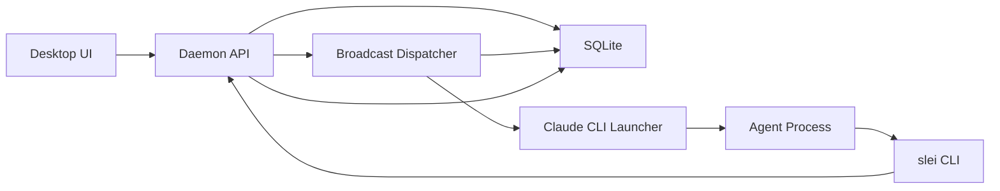
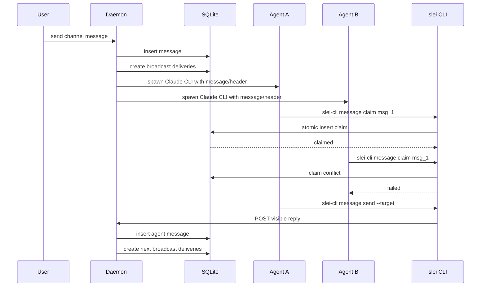

# Slei 广播 Claim Agent 架构设计

## 背景

当前 Slei 的频道协作以 daemon/coordinator 为控制面：频道消息先落库，显式 `@agent` 走快速路径，无显式目标或部分任务消息会启动 coordinator runtime，由 coordinator 输出 JSON 决定路由、建任务或人工分配。普通 Agent 只在 daemon 选中后被启动。

新的目标架构改为广播和自主认领：

- daemon 仍然是产品状态、持久化、幂等、reset 和诊断的唯一控制面。
- coordinator 角色从新流转中移除。
- 频道消息广播给频道内所有普通 Agent。
- Agent 根据 system prompt、消息 header、`@mention`、自身职责和按需读取的历史自主判断是否 claim。
- 任何可见发言、任务创建、任务回复和状态更新都必须通过 `slei-cli` CLI 触发 daemon API。
- 旧 coordinator 数据不兼容；需要改 schema 时可以清空旧生产状态并重新建表。

本文档记录目标设计。后续实现必须同步更新长期架构文档，尤其是：

- `docs/architecture/0005-channel-routing-and-multi-agent-flow.md`
- `docs/architecture/0006-task-source-message-card.md`

旧 coordinator 相关 spec 可保留为历史资料，但新 ADR 必须明确 supersede 它们，避免后续实现继续把 coordinator 当作 guardrail。

## 当前实现差异

当前仓库里有几条关键路径需要替换：

- `workers/claude-agent/src/worker.ts` 使用 `@anthropic-ai/claude-agent-sdk` 的 `query()` 启动 Claude Code；目标架构要求改为 spawn Claude CLI。
- `crates/slei-daemon/src/services/channel_orchestrator_service.rs` 在无显式目标时创建 `coordinator_runtime_runs`，等待 coordinator JSON，再创建 inbox、task 或 Agent run；目标架构要求改为广播投递和 claim。
- `workers/claude-agent/src/slei-tools.ts` 只有少量 MCP 产品工具；目标架构要求提供完整 `slei-cli` CLI 能力。
- `coordinator_decisions`、`coordinator_runtime_runs`、`routing_context_packages` 等表承载旧路由语义；目标架构不再依赖它们。

## 核心原则

1. daemon 管状态，Agent 管判断。
2. UI 不做路由、claim、任务判断或 mock 兜底。
3. 频道消息先落 SQLite，再广播给频道成员。
4. human 消息和 Agent 消息在广播、claim、后续流转上同权。
5. 后续协作必须通过可见 `@mention` 接力。
6. claim 是 daemon/SQLite 原子操作，Agent 不能靠本地判断独占消息或任务。
7. 默认只注入单条触发消息；历史由 Agent 通过 `slei` 按需拉取。
8. 跨会话状态依赖 SQLite、`MEMORY.md` 和 notes，不依赖 Agent 进程内存。
9. 旧数据不兼容；reset 或 migration 可以清空旧业务状态。

## 目标架构



职责边界：

- Desktop UI 只发送消息、展示 daemon DTO、显示 loading/error/empty 状态。
- daemon API 负责鉴权、幂等、消息落库、广播投递、claim、任务、诊断、reset。
- Broadcast Dispatcher 为每个频道普通成员创建可恢复投递记录，并决定是否唤醒 Agent。
- Claude CLI Launcher 按需 spawn 短生命周期 Claude CLI 进程。
- Agent 通过 system prompt 和 `slei-cli` CLI 自主完成判断和后续动作。

## 消息格式

每条注入给 Agent 的消息使用统一 header：

```text
[target=#all msg=abc12345 time=2026-06-15T10:20:30Z type=human] @lei-lee: @alice-win 帮我设计架构
```

Agent 发言后生成的新消息同样写入频道并广播：

```text
[target=#all msg=def67890 time=2026-06-15T10:25:00Z type=agent] @alice-win: @coda-win 请开始编码
```

字段含义：

- `target`: 频道、线程或任务目标。频道为 `#channel`，线程可用 `#channel:msgId`。
- `msg`: 当前消息稳定短 ID，用于 claim、around context 和线程引用。
- `time`: daemon 生成的消息时间。
- `type`: `human`、`agent` 或 `system`。
- `@sender`: 可见发送者 handle。
- body: 原始可见正文，包含 `@mention`、任务描述和协作接力信息。

Agent 不应依赖隐藏路由。需要让其他 Agent 接手时，必须发出可见 `@agent`。

## Agent System Prompt 合同

daemon 启动 Agent 时必须注入固定结构的 system prompt。内容可以随 Agent 和运行时动态生成，但区块必须稳定。

### 角色定义

包含 Agent 名称、handle、职责、能力边界和适合处理的任务类型。例如：

- Cindy
- `@cindy-win`
- onboarding 助手
- 负责引导用户创建成员、理解频道协作、解释 Slei 的基础工作流

### `slei` 命令说明

完整列出 Agent 可调用命令、参数、输出含义和失败语义。命令名统一为 `slei`，旧命令名不进入新 prompt。

### 消息格式规范

解释 header 字段、target 写法、线程 target、任务 target、sender handle、`@mention`、claim 需要使用的 msg id。

### 行为约定

至少包含：

- 如果消息明确 `@我`，应尝试 claim；claim 失败则静默退出。
- 如果消息明确 `@别人` 且没有 `@我`，不得 claim。
- 如果没有明确 mention，但内容是频道需要处理的开放请求，且我有职责或值守关系，可以尝试 claim。
- 如果要让别的 Agent 接力，必须发出可见 `@agent`。
- 任何可见发言、任务创建、任务回复、任务状态更新和 Agent 操作进展上报都必须通过 `slei-cli` CLI 完成。
- 需要历史、线程或任务上下文时，主动用 `slei-cli message read/search` 和 `slei-cli task thread/list` 拉取。
- 重要长期信息写入 `MEMORY.md` 或 notes；不要把长期记忆只留在进程上下文里。
- 处理长任务、等待用户确认、交接给其他 Agent、遇到 blocker、完成阶段性工作或即将退出前，应判断是否需要更新 `MEMORY.md` 的 `Active Context`。
- `Active Context` 只保存恢复当前任务所需的最小状态。由于同一个 Agent 可能同时被拉进多个频道处理事项，应按频道记录最近最多 3 个活动上下文；新频道或新事项超过上限时淘汰最旧项。

### 运行时上下文

包含当前运行实例元数据：

- Agent ID、handle、workspace path、cwd
- Server ID / daemon ID
- Computer / node 信息、hostname、OS、daemon 版本
- Channel ID、channel name、workspace mounts
- 可访问路径和权限模式

## `slei-cli` CLI 合同

CLI 是 Agent 和 daemon 交互的主接口。第一版必须覆盖消息、历史、任务、Agent 操作进展和状态。

### 消息认领和发言

```bash
slei-cli message claim <msg-id> --agent <agent-id>
slei-cli message send --target "#channel" --agent <agent-id>
```

`message claim` 必须是 SQLite 原子操作。同一消息同一 claim scope 只能有一个成功者。claim 失败时 CLI 返回明确失败状态，Agent 必须静默。

`message send` 从 stdin 读取正文，写入频道消息表，然后触发新一轮广播。

### 历史读取

历史读取能力要足够丰富，支撑少注入历史的运行方式。

```bash
# 读取频道最近 N 条
slei-cli message read --channel "#channel-name" --limit 20

# 读取特定线程
slei-cli message read --channel "#channel:msgId"

# 按时间或序号锚点
slei-cli message read --channel "#channel" --after <seqNo>
slei-cli message read --channel "#channel" --before <seqNo>

# 以某条消息为中心读取上下文
slei-cli message read --channel "#channel" --around <msgId>

# 搜索
slei-cli message search --query "关键词"
```

返回结果也应使用统一 header，保证 Agent 可以直接复制 target/msg 引用继续操作。

### 任务操作

```bash
slei-cli task create --source-message <msg-id>
slei-cli task claim <task-id> --agent <agent-id>
slei-cli task reply <task-id> --agent <agent-id>
slei-cli task update <task-id> --status in_progress
slei-cli task update <task-id> --status in_review
slei-cli task update <task-id> --status done
slei-cli task list --channel "#channel"
slei-cli task thread <task-id>
```

任务 root 仍绑定 source message。任务卡片是源消息的展示状态，不新增 `task_card` 消息。

`task claim` 是独立于 `message claim` 的原子锁。一个 Agent 可以先 claim 消息，再创建并 claim 任务；也可以只回复普通频道消息。

### Agent 状态

```bash
slei-cli agent status --agent <agent-id> --state working --phase reading_history
slei-cli agent status --agent <agent-id> --state working --phase checking_tasks
slei-cli agent status --agent <agent-id> --state working --phase claiming_message
slei-cli agent status --agent <agent-id> --state working --phase updating_memory
slei-cli agent status --agent <agent-id> --state idle
slei-cli agent status --agent <agent-id> --state blocked --reason "等待用户确认"
```

这是 Agent 主动上报操作进展的能力，用于 UI 和诊断展示，不参与路由决策。当前 UI 只有单一“正在思考”状态；新架构应允许 Agent 在关键步骤调用 CLI 展示更细粒度的状态。

建议第一版 phase：

- `reading_history`: 正在读取频道、线程或 around context。
- `searching_messages`: 正在搜索历史消息。
- `checking_tasks`: 正在查询任务列表或任务线程。
- `claiming_message`: 正在认领消息。
- `claiming_task`: 正在认领任务。
- `working`: 正在执行正文工作。
- `sending_message`: 正在发送频道回复。
- `replying_task`: 正在发送任务回复。
- `updating_task`: 正在更新任务状态。
- `updating_memory`: 正在更新 `MEMORY.md` 或 notes。
- `waiting_user`: 正在等待用户确认、输入或审批。
- `blocked`: 被权限、缺失信息、运行失败或外部依赖阻塞。

Agent prompt 应鼓励在耗时或用户可感知的阶段调用 `slei-cli agent status`，但不要为极短步骤频繁刷屏。daemon 应持久化最新状态，并把每次状态/phase 上报追加到该 Agent 的操作日志；UI 只展示 daemon 返回的状态，不自行推断 Agent 在做什么。

操作日志要求：

- 每个 Agent 保留最近 100 条操作日志。
- 日志按 `created_at` 或单调递增 sequence 排序。
- 新日志写入后，如果该 Agent 超过 100 条，daemon 删除最旧记录。
- 日志至少包含 Agent ID、run ID、channel/message/task 引用、state、phase、reason、created_at。
- 操作日志用于 debug 和最近活动展示，不参与路由决策或 claim 判断。
- 重要失败仍应同时写入 `diagnostic_events`。

## 广播和 Claim 流转



多 Agent 协作链完全由可见消息驱动：

```text
@lei-lee -> @alice-win claim 并出方案
@alice-win -> @coda-win claim 并编码
@coda-win -> @nancy-win claim 并审查
@nancy-win -> @lei-lee 请求确认
```

发起者是 human 还是 Agent 不改变广播和 claim 机制。Agent 只根据 prompt 规则、`@mention`、职责和上下文判断是否参与。

## 并发与进程生命周期

每次被唤醒处理一条新消息时，daemon spawn 一个新的 Claude CLI 进程。进程处理完这条消息后退出。下一条新消息到达时再次 spawn 新进程。

```text
消息 1 到达 -> spawn claude 进程 A -> 处理消息 1 -> 退出
消息 2 到达 -> spawn claude 进程 B -> 处理消息 2 -> 退出
消息 3 到达 -> spawn claude 进程 C -> 处理消息 3 -> 退出
```

单次处理内部可以有多轮工具调用。Agent 在同一个进程里可以读取历史、读写文件、执行命令、claim、发消息、创建任务和更新 MEMORY；这些工具调用不会导致重复 spawn。只有下一条新消息才触发新的 spawn。

这个约束的影响：

- 优点：Agent 进程无状态，崩溃不影响下一次消息处理；资源用完即释放。
- 代价：每次启动都需要从 system prompt、`MEMORY.md`、notes 和按需读取的历史恢复上下文，有冷启动开销。
- 长任务处理：如果任务需要多次来回，例如等待用户确认，Agent 处理完当前一步后退出。下一次用户或 Agent 回复到达时，daemon spawn 新进程，Agent 通过线程历史和 `MEMORY.md` 的 `Active Context` 恢复上下文。

多次 `@mention` 同一 Agent：

- 普通消息：每条独立 claim 和回复。
- 同一任务的多条消息：写入同一任务 thread，通过 task/thread id 排序和去重。
- 任务 claim 竞争：SQLite 原子操作，只有第一个成功。
- 多条新消息短时间内到达：每条消息都有独立 run 和独立 claim；daemon 不依赖单个长驻 Agent 进程合并处理。

进程生命周期：

```text
消息到达 -> daemon 落库并创建广播投递 -> daemon 唤醒相关 Agent
  -> spawn Claude CLI
  -> 注入 system prompt + 单条 trigger message
  -> Agent 调用 slei CLI 读取历史/context、claim、回复/更新任务、必要时更新 MEMORY
  -> Agent 退出

下次消息 -> 重新 spawn，全新进程
```

Agent 进程不保留产品状态。跨会话状态来自 SQLite、`MEMORY.md`、`Active Context` 和 notes。

## MEMORY 和 Active Context

默认 Agent 资源必须把 `Active Context` 作为跨 spawn 恢复当前工作的核心机制。当前模板已经有 `## Active Context` 段落，但新架构需要把它从单一状态升级为多频道活动上下文。

`MEMORY.md` 应至少包含：

```markdown
## Active Context
- Channel: #channel-a
  Time: 2026-06-15T10:20:30Z
  Item: 当前处理事项
  Progress: 已完成什么、正在等什么或下一步是什么

- Channel: #channel-b
  Time: 2026-06-15T10:25:00Z
  Item: 当前处理事项
  Progress: 已完成什么、正在等什么或下一步是什么
```

约束：

- 最多保留 3 个频道/事项条目。
- 每个条目必须包含 `Channel`、`Time`、`Item`、`Progress`。
- 同一频道同一事项有新进展时，更新原条目并刷新 `Time`。
- 新频道或新事项超过 3 个条目时，删除 `Time` 最旧的条目。
- 如果没有活动工作，写 `- State: idle; waiting for the next user request.`。
- 不记录聊天流水、完整历史或可通过 `slei-cli message read/search` 便宜恢复的信息。

何时应更新 `Active Context`：

- Agent claim 了一个需要多步处理的消息或任务。
- Agent 完成阶段性工作，但还需要等待用户确认、审批、输入或下一条回复。
- Agent 把工作交接给另一个 Agent，并需要未来能恢复自己负责的上下文。
- Agent 遇到 blocker、运行失败、权限不足或外部依赖缺失。
- Agent 即将退出前，发现当前进程内有未来继续工作必需的信息。
- Agent 完成任务并不再需要保持上下文时，应移除对应频道/事项条目；没有其他活动条目时把 `Active Context` 置为 idle。

需要同步完善：

- `resources/default-agent-assets/MEMORY.md.template`
- `resources/default-agent-assets/skills/memory/SKILL.md.template`
- daemon 注入的 system prompt

memory skill 必须明确：更新 `Active Context` 是为了让下一次短生命周期 spawn 可以恢复当前任务，不是记录聊天流水。

## 数据模型

新架构建议围绕以下生产表重建。旧数据可以清空，不需要兼容迁移旧 coordinator 语义。

| 表 | 用途 |
| --- | --- |
| `messages` / `channel_messages` | human 和 Agent 可见消息、session、target、header 字段 |
| `message_deliveries` | 每条消息广播给哪些 Agent、投递状态、是否 pending |
| `message_claims` | 消息 claim 锁、claiming agent、claim status、时间 |
| `agent_runs` | 每次 Claude CLI spawn 的 run 状态、输入摘要、退出状态、诊断引用 |
| `tasks` | source message 绑定的任务 root |
| `task_claims` | 任务 claim 锁、owner、claim status |
| `task_replies` | 任务线程回复 |
| `agent_statuses` | 可选 Agent 工作状态 |
| `agent_activity_logs` | 每个 Agent 最近 100 条状态/phase/操作进展日志 |
| `diagnostic_events` | runtime、claim、CLI、reset、失败诊断 |

可以删除或停止使用：

- `channel_coordinators`
- `coordinator_decisions`
- `coordinator_runtime_runs`
- 旧 routing context package 语义
- 新增路径里的 `task_card` control message

如果实现中保留旧表用于过渡，必须明确它们不参与新业务流转，并在 reset 时清空。

## 任务语义

`docs/architecture/0006-task-source-message-card.md` 的核心原则保留：

- 任务卡片是源消息展示状态。
- 不新增 `kind = task_card` 消息。
- source message 和 task root 必须可重启恢复。

变化点：

- 任务不再由 coordinator 创建或指派。
- Agent 通过 `slei-cli task create --source-message <msg-id>` 把消息转为任务。
- Agent 通过 `slei-cli task claim` 认领任务。
- Agent 通过 `slei-cli task reply` 写任务线程。
- Agent 通过 `slei-cli task update` 更新状态。
- 如果需要其他 Agent 接力，任务回复正文中必须可见 `@agent`，新回复会广播并触发下一轮 claim。

## 运行器替换

目标形态是 daemon 直接或通过极薄 launcher spawn Claude CLI，而不是通过 Claude SDK 查询。

要求：

- 保留现有 cwd / workspace mount / overlay 逻辑。
- System prompt 由 daemon 生成并注入。
- Agent 通过本机 `slei-cli` CLI 与 daemon 通信。
- Claude CLI stdout 不再被当作可见回复的唯一来源；可见产品动作必须来自 `slei-cli` CLI。
- CLI 退出非 0 或超时写入 `agent_runs.status=failed` 和诊断，不伪造频道回复。

实施可以分阶段：

1. 先建立 `slei-cli` CLI 和 claim API。
2. 再把频道流转从 coordinator 改为广播 claim。
3. 最后把 worker 内部从 SDK 改成 spawn Claude CLI，或移除 worker 外壳。

## Reset 和旧数据策略

本次架构不兼容旧生产数据。开发 reset 和必要 migration 可以：

- 清空消息、任务、任务回复、claim、delivery、run、diagnostic 等可变产品表。
- 删除运行期生成的 `agents/` workspace。
- 清空 coordinator 相关旧表。
- 保留 schema migrations、内置默认 Agent 资源、静态 skill/template 资源。

不得为了旧数据恢复 coordinator 路由、旧 task_card control message 或前端 mock 兼容。

## 文档更新要求

后续实现必须同步更新长期文档：

### `0005-channel-routing-and-multi-agent-flow.md`

改写为广播 claim 架构：

- coordinator 路由控制面被 daemon 广播 + Agent claim 取代。
- daemon 不做 AI 路由判断，只做广播、锁、持久化、reset 和诊断。
- human 和 Agent 消息进入同一广播链。
- 协作接力依赖可见 `@mention`。
- Agent system prompt 和 `slei-cli` CLI 是路由规则的表达位置。
- Drift guardrails 必须禁止重新引入 UI 路由、daemon 关键词兜底、coordinator JSON 路由。

### `0006-task-source-message-card.md`

保留源消息任务卡片原则，替换 coordinator 建任务语义：

- `asTask` 或 Agent CLI 创建任务都绑定 source message。
- 任务 claim 和状态更新来自 `slei-cli task` 命令。
- 任务线程中的可见 `@mention` 触发后续协作。

### 旧 coordinator specs

保留为历史，但新文档必须标记已被广播 claim 架构 supersede。

## 测试计划

后续实现至少覆盖：

- 频道消息写入后为所有普通成员创建广播投递。
- coordinator runtime 不再启动。
- 多个 Agent 同时 claim 同一消息，只有一个成功。
- 明确 `@别人` 且没有 `@我` 的 Agent 不应 claim。
- 无 mention 开放请求允许一个合适或值守 Agent claim。
- Agent A 发出 `@Coda` 后，新消息广播，Coda 可以 claim 并继续流转。
- `slei-cli message read/search` 能返回可用于判断的 header 和上下文。
- `slei-cli task create/claim/reply/update` 全部落 SQLite。
- `slei-cli agent status --phase ...` 能持久化并让 UI 展示阅读历史、查询任务、更新记忆等细粒度进展，而不是只有单一 thinking 状态。
- `slei-cli agent status --phase ...` 每次调用都会写入 Agent 操作日志，且每个 Agent 只保留最近 100 条，超过后删除最旧记录。
- 任务 source message 原地升级为任务卡片，不新增 `task_card` 消息。
- 每条新消息触发独立 Agent run，单次 run 内允许多轮工具调用。
- `Active Context` 在长任务、等待用户和交接场景中可被更新，并能帮助下一次 spawn 恢复上下文。
- reset 清空旧 coordinator 数据、claim、delivery、run 和运行期 workspace。

建议验证命令在 implementation plan 中细化，至少包含：

```bash
cargo fmt --all -- --check
cargo test -p slei-storage
cargo test -p slei-daemon
pnpm --filter @slei/desktop test
pnpm --filter @slei/desktop lint
```

## 非目标

- 不在 UI 中实现路由、claim、任务判断或本地 mock 回复。
- 不兼容旧 coordinator 生产数据。
- 不保留新路径里的 `task_card` control message。
- 不让 Claude stdout 自动变成频道消息；可见动作必须走 `slei-cli` CLI。
- 不在 daemon 中用关键词规则替代 Agent 自主判断。
